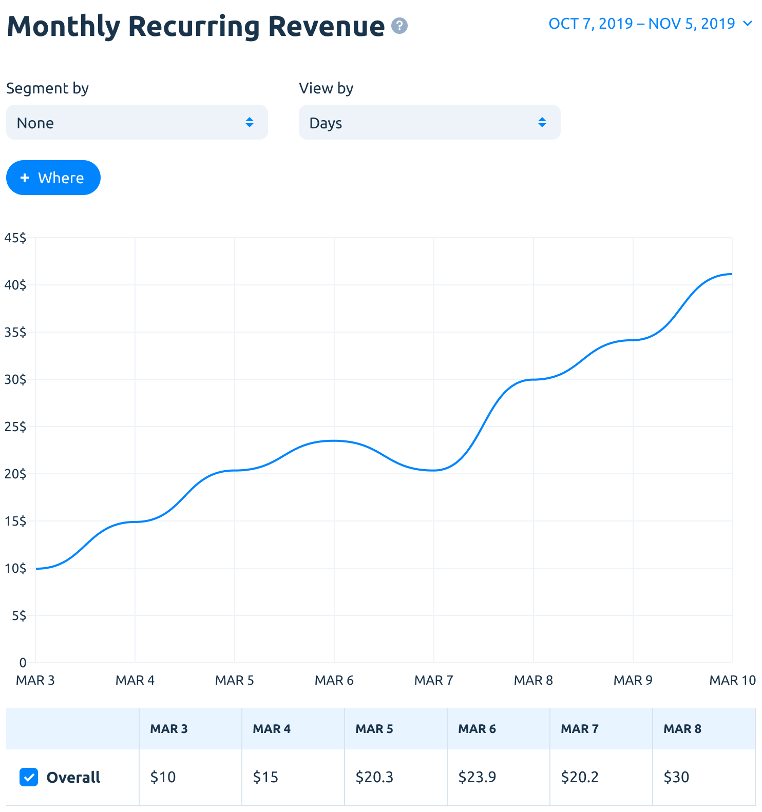
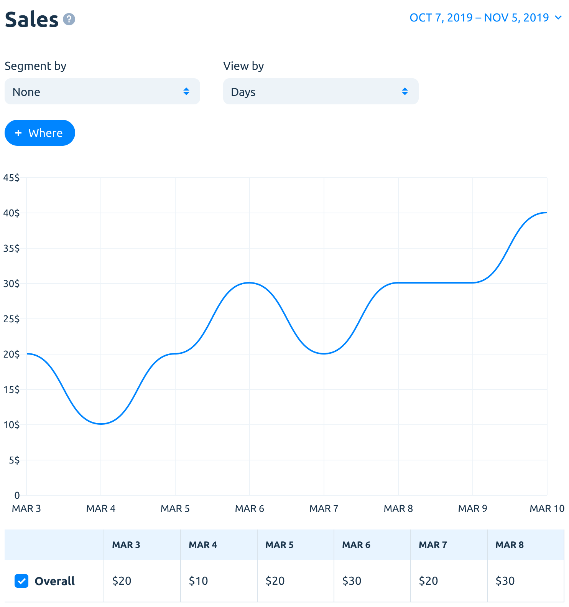
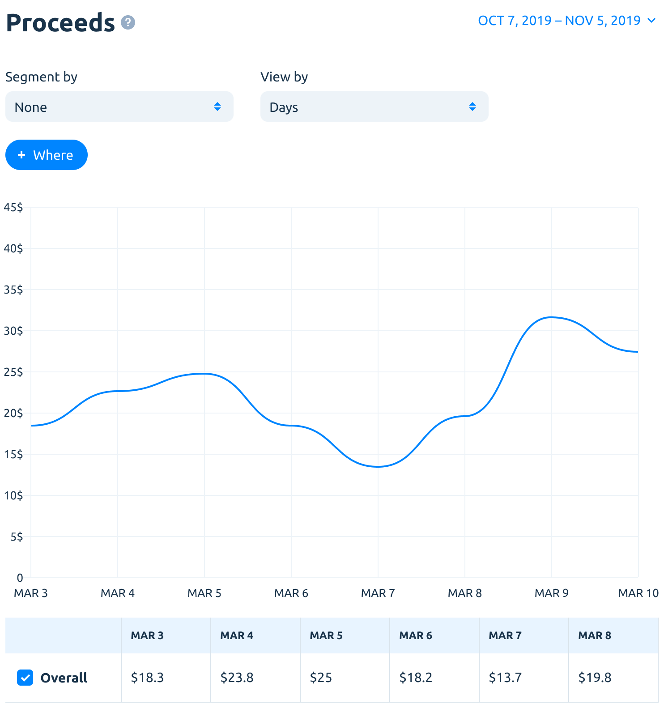
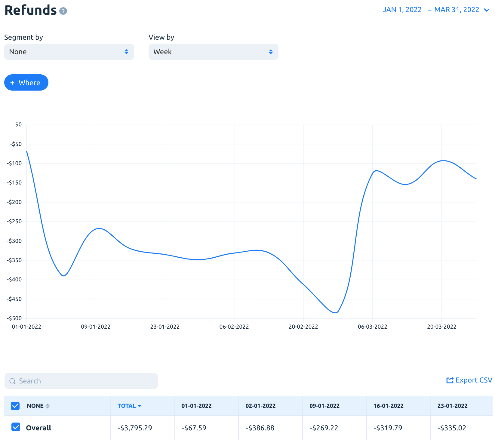
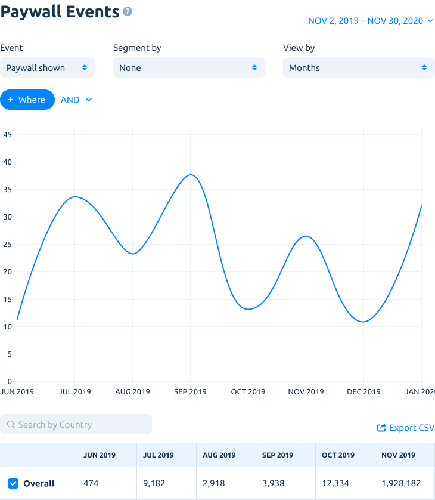

# Charts

## MONEY

### MRR

**Cohorts:** No.

MRR is recurring proceeds revenue normalized in to a monthly amount. It's calculated as a sum of the monthly fee paid by each paying customer with a deduction of Apple comission.

For example, If you have 10 customers paying $10 per month. MRR will be equal to:

_MRR = 10 subscribers × $10 per month - 30%(or 15%) Apple Comission = $70._

All non-monthly subscription plans are being normalized in to a monthly plan. For example, annual subscription that costs $120 per year will be normalized in to $10 per month.

### Gross revenue

**Cohorts:** No.

Gross revenue is a total amount billed to customers for purchasing subscriptions prior to refunds, taxes and Apple’s commission.

### Sales

**Cohorts:** No.

Total amount billed to customers for purchasing in-app purchases. Sales = Gross Revenue - Refunds.

### Proceeds

**Cohorts:** No.

Estimated revenue developer receives after deducting Store commission and [VAT](about-analytics.md#value-added-tax-deduction).

### Refunds

Refunds amount during selected period. This includes both refunds through Customer Care and refunds during subscription upgrade with partial refund.

### Refund Rate

**Cohorts:** No.

The percentage of the total transactions that were completely refunded during a period of time.

Formula is the following:

_**Refund Rate = Refunded Transactions / All Transactions by the Period \* 100%**_

### ARPU

.png>)

**Cohorts:** Yes.

APRU is **Average Revenue Per User**.

Calculated on a cohort basis. The cohort is users, that have installed the app within the selected period. They can be segmented and filtered by country, products, marketing campaigns (depending on what was selected in segments and filters).

We calculate ARPU for the users’ lifetime. This means that ARPU for the given cohort will be calculated by dividing the summarized users' revenue by the total number of users who have installed the app within the selected time frame.

You can choose whether to calculate ARPU using Sales or Proceeds.

**Calculate users by events**&#x20;

_User created_ – count all new users in the selected cohort for ARPU calculation.


_For example, we have 100 new users created within the selected period. These users have paid $10 by now. ARPU is equal to $10 / 100 = $0.1 (per user)._


_Trial started_ – calculate an average revenue only among those new users, who have started a trial.


_For example, we have 100 new users created within the selected period. And 50 of them have started a trial. These users have paid $10 by now. ARPU is equal to $10 / 50 = $0.2 (per trial user)._


**Cohort period**&#x20;

Default value - Max. Number of the days (0-365) or Max (no limitation). Day 0 is the 24 hours from the moment when user is created. Day 1 is the next 24 hours and so on.

This setting might be used to understand the average revenue to the Nth day of user life. So you can estimate the moment when the paid installs are paying off.


_For example, if ARPU for new users by the Day 3 is $0.1, this means that an average user brings $0.1 to the 4th day of his/her lifetime._


**Why ARPU is important?**

One of the main goals of any mobile business is to maximize revenue. ARPU is one of two critical values for calculating your ROI along with CPI (cost per install).

Knowing the ARPU of different groups of users will let you optimize your marketing efforts and focus on high-performing user acquisition campaigns. ARPU-driven measurement help to point out which media sources could bring the top paying users and which are under-performing and should be stopped.

Understanding who is your high LTV users can help to find more like them through lookalike campaigns and leads you to boost total app revenue.

### ARPPU

.png>)

**Cohorts:** Yes.

ARPPU is **Average Revenue Per Paying User**.

It's pretty much the same as ARPU, except there are only paying users counted within the selected time period.&#x20;

You can choose whether to calculate ARPPU using Sales or Proceeds.

**Calculate users by events**&#x20;

_Purchase_ – count all new paying users in the selected cohort for ARPPU calculation.


_For example, we have 100 new paying users created within the selected period. These users have paid $200 by now. ARPU is equal to $200 / 100 = $2 (per user)._


_Trial converted_ – calculate an average revenue only among those new paying users, who have converted from a trial.


_For example, we have 100 new paying users, created within some selected period. And 50 of them have converted from a trial. These users have paid $200 by now. ARPPU is equal to $200 / 50 = $4 (per free trial user converted into customer)._


**Cohort period**

Default value - Max. Count of the days (0-365) or Max (no limitation). Day 0 is the 24 hours from the user’s creation. Day 1 is the next 24 hours and so on.

This setting might be used to understand the average revenue to the Nth day of the paying user life. So you can estimate the moment when the paid installs are paying off.


_For example, if ARPPU for new paying users by the Day 3 is $1, this means that an average paying user brings $1 to the 4th day of his/her lifetime._


**Additional notes**


Both ARPU/ARPPU are calculated without refunds. Downgrades (partial refunds) difference is counted.



ARPPU will be usually much higher than ARPU because only paying users included in cohorts (a smaller part of all users in the app).


### ARPAS

ARPAS is the **Average Revenue Per Activated Subscription**.&#x20;

It’s calculated as the average revenue from subscribers plus users, who have started a trial within the selected time period.

**Cohorts:** Yes.

You can choose whether to calculate ARPAS using Sales or Proceeds.

<figure><figcaption></figcaption></figure>

### Cumulative LTV

<figure><figcaption></figcaption></figure>

**Cohorts:** Yes.

The Cumulative LTV chart shows a cumulative (accumulative) revenue (as ARPPU – an average revenue per paying user) for selected cohort up to 365 days.&#x20;

This is a cumulative dynamics of how the average revenue from a selected group of paying users grows within the selected cohort period (i.e. days after install).

## CHURN

### Subscriptions churn

**Cohorts:** No.

This metric shows how many subscriptions were lost during the selected period.

_Subscriptions Churn = (Number of subscriptions expired during the period) / (Number of paid subscriptions at the start of the period) \* 100%_


_Number of paid subscriptions at the start of the period_ means that any new subscriptions, that could happen inside the period are not included.


Churn also can be negative. This may happen if your app allows customers to have more than one subscription at the same time and the user adds a purchase to existing ones. It's called "expansion". Negative churn is a signal that your app has a strong value to your customers.

### Churned revenue

**Cohorts:** No.

This metric shows how much revenue was lost during the selected period.

_Churned revenue = (MRR Lost to Downgrades + MRR expirations in the period) / (MRR at the start of period) \* 100%_


MRR at the start of the period means that any new MRR inside the period is not included.


Churned revenue especially helpful to ensure that you're not losing the most valuable customers (subscriptions churn can be relatively low while churned revenue is high).

Like subscriptions churn, revenue churn also can be negative if users upgrade subscriptions or subscribe more within your app. And, of course, it's a good signal too.

## USERS

### New users

**Cohorts:** No.

Yes, these are just new users of the app. By the way, you can filter them, using custom User Properties (if you send any).


Pay attention that new users counted when they were recorded by Apphud SDK (not actual install date). In 99% of cases, these dates are nearly identical.


### Active Subscriptions

Active Subscriptions chart shown as the number of the regular (unexpired) paid in-app subscriptions at the end of each selected period.

**Cohorts:** No.

You can segment by the renewal type to learn the trend of the renewal enabled / disabled subscriptions.

<figure><figcaption></figcaption></figure>

## CONVERSIONS

All charts in this group represented as funnels with particular steps (based on events).

New users are calculated as cohorts. It means that users are "grouped" by the initial event date (i.e. users, who have installed the app on a particular date).

For example, if we have a row with a date of Jan, 28, then trial conversions are summarised by users who had installed the app on Jan, 28 and then converted to regular subscribers any day after install and trial start (not only on Jan, 28).


Note that all conversion events are grouped by new users.

So, if your app allows two simultaneous subscriptions (say, with a trial period), then it will be counted as the single user who started a trial (not two trials).

The same works for trial conversion events – if there are two trials that were converted to regular subscriptions by the user within the app, we'll show this as a single user who converted from the trial(s) to subscriber.


### Trial conversion

**Cohorts:** Yes.

New users, who started a trial and then converted to regular subscribers. Users who converted without a trial period are not counted.

### Regular subs. conversion

**Cohorts:** Yes.

New users, who converted to regular subscribers (trial conversions are not included).

### Paid intro conversion

**Cohorts:** Yes.

New users, who started a paid intro offer and then converted to regular subscribers.

### Promo offer conversion

**Cohorts:** Yes.

New users, who started a promo offer and then converted to regular subscribers.

### Non-renewing purchase conversion

.png>)

**Cohorts:** Yes.

New users, who purchased a non-renewing in-app product.

### Segments


You can segment conversion charts by the second additional parameter to get more meaningful results.


### View parameters

For example, you have 100 new users, 10 of them started a trial and 2 were converted to a subscription.&#x20;

**% of total**

Shows drop-off in each funnel step calculated as a percent of total (first step) count.

In this case, the total count (new users) will be 100%, the trial started – 10%, and converted – 2%.

**% of previous**

Shows drop-off in each funnel step calculated as a percent of the previous step.

New users will be 100%, the trial started – 10% and converted – 20% (because started trials are considered as 100% in this case).

**User count**

Shows absolute users count in each step.

### Exclude refunds

**Default:** disabled.

Note that, we calculate all values including transactions with refunds by default. If you want to analyze only "successful" conversions, turn on _Exclude refunds_ option.

Keep in mind, that you can see lower conversions in this case.

## EVENTS

### Trial subscriptions

**Cohorts:** No.

Analyze events related to trials:

* Trial started
* Trial expired
* Trial converted
* Trial cancelled

### Regular subscriptions events

**Cohorts:** No.

Analyze regular subscriptions:

* Subscription started
* Subscription renewed
* Subscription cancelled
* Subscription expired
* Subscription refunded

### Paid intro offers

**Cohorts:** No.

Analyze paid intro subscriptions:

* Intro started
* Intro renewed
* Intro converted
* Intro expired
* Intro refunded

### Promo offers

**Cohorts:** No.

Analyze promo offer subscriptions:

* Promo started
* Promo renewed
* Promo converted
* Promo expired
* Promo refunded

### Non renewing purchases

**Cohorts:** No.

Analyze Non renewing purchase events:

* Non renewing purchase
* Non renewing purchase refunded

### Paywall events

**Cohorts:** No.

Analyze paywall events:

* Paywall shown
* Paywall closed
* Paywall checkout initiated
* Paywall payment canceled

### Other events

**Cohorts:** No.

Analyze other events:

* Autorenew enabled
* Billing issue
