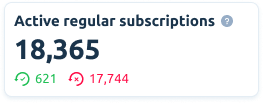

# Dashboard

View metrics of your app in a convenient dashboard.

> #### About Currencies
>
> US Dollar is a base currency in Apphud. All transactions are automatically converted to USD by the exchange rates at the time of event using [OpenExchangeRates](https://openexchangerates.org/).

## Dashboard metrics

### Monthly Recurring Revenue (MRR)

MRR is recurring proceeds revenue normalized in to a monthly amount. It's calculated as a sum of the monthly fee paid by each paying customer with a deduction of Apple comission.

#### Example

If you have 10 customers paying $10 per month. MRR will be equal to:

_MRR = 10 subscribers × $10 per month - 30%(or 15%) Apple Comission = $70._

All non-monthly subscription plans are being normalized in to a monthly plan. For example, annual subscription that costs $120 per year will be normalized in to $10 per month.

### Active Regular Subscriptions

Number of currently active regular subscriptions. Trials, introductory and promotional offers **are excluded** from this amount.

Here you can also see a number of regular subscriptions with autorenewal enabled and disabled.

### Active Trials

Number of currently active subscriptions in trial period.

### Active Intro Offers

Number of currently active subscriptions in introductory period.

### Active Promo Offers

Number of currently promotional offers.

### In Billing Grace Period

Number of subscriptions that are currently in Billing Grace Period.

### In Billing Retry Period

Number of subscriptions that are currently in Billing Retry Period.

> #### What is the difference between “In Billing Grace Period” and “In Billing Retry Period”?
>
> Billing Grace Period is Apple’s new feature. With Billing Grace Period turned on, Apple tries to charge subscriber within 16 days maximum. Developer must grant premium access to subscriber during this time. Once subscriber enters grace period, his subscription goes to _Grace_ state, and Apphud SDK  `isActive()` method still returns `true`. With Billing Grace Period turned off, subscription goes to _Expired_ state and `isActive()` method returns `false`. However, Apple still attempts to recover subscription within up to 60 days but less aggressively. In both cases when subscription is reactivated, it will change to _Regular_ state. You can manage Billing Grace Period feature in your app’s “Features” tab in App Store Connect.

### Gross revenue

Gross revenue is a total amount billed to customers for purchasing subscriptions prior to refunds, taxes and Apple’s commission.

### Refunds

Number of subscription refunds within the selected period.

### Refund Rate

The percentage of the total transactions that were completely refunded during a period of time.

### Sales

Total amount billed to customers for purchasing in-app purchases. Sales = Gross Revenue - Refunds.

### Proceeds

Estimated revenue developer receives after deducting Store commission and [VAT](about-analytics.md#value-added-tax-deduction).


&#x20;You can read more about how Apple calculates commission [here](https://developer.apple.com/app-store/subscriptions/#revenue-after-one-year).


### Failed Charges

Number of subscription suspensions due to billing issue within the selected period.

### ARPU

ARPU is **Average Revenue Per User**.

Calculated on a cohort basis. The cohort is users, that have installed the app within the selected period.&#x20;

We calculate ARPU for the users’ lifetime. This means that ARPU for the given cohort will be calculated by dividing the summarised users' revenue by the total number of users who have installed the app within the selected time frame.


We ignore revenue generated before user is first seen in Apphud in ARPU calculation.



ARPU in the Dashboard is calculated using Proceeds.


### ARPPU

ARPPU is **Average Revenue Per Paying User**.

It's pretty much the same as ARPU, except there are only paying users counted within the selected time period.&#x20;


We ignore revenue generated before user is first seen in Apphud in ARPPU calculation.



ARPPU in the Dashboard is calculated using Proceeds.


### New Regular Subscriptions

Number of new regular subscriptions that became active within the selected period.

### New Trials

Number of trials started within the selected period.

### New Trial Conversions

Number of trials converted to a paid subscription within the selected period.

### New Intro Offers

Number of introductory offers activated within the selected period.

### New Promo Offers

Number of promotional offers activated within the selected period.

### New Users

Number of new users registered by Apphud within the selected period.
