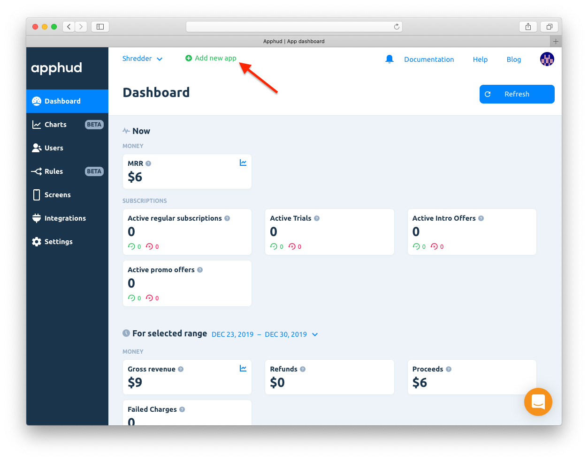
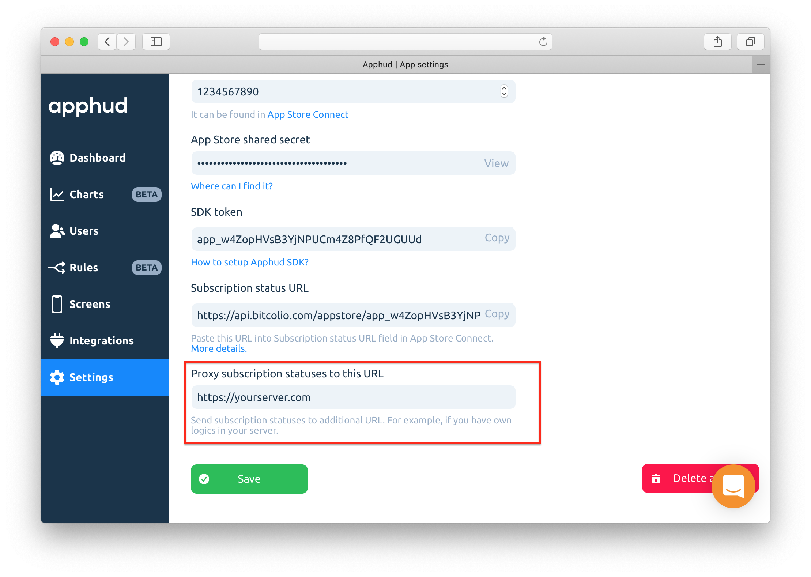
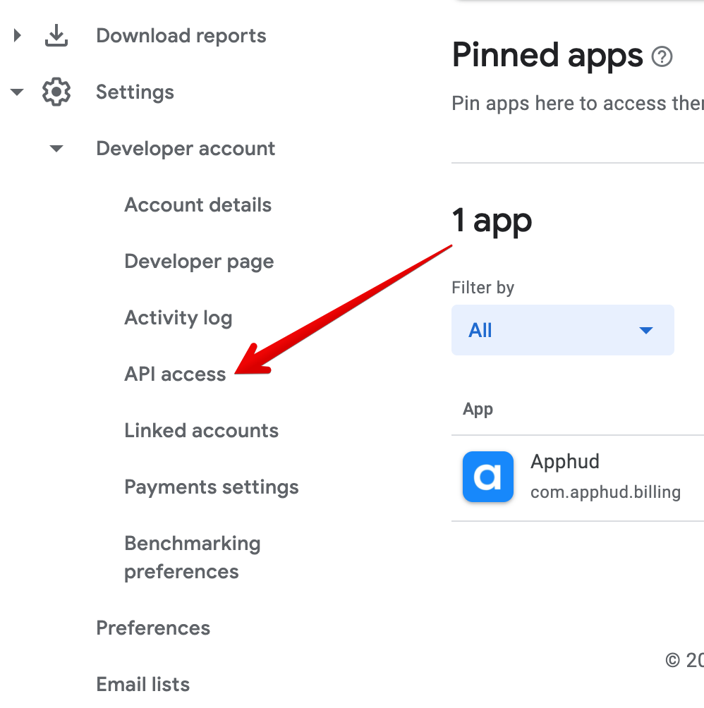
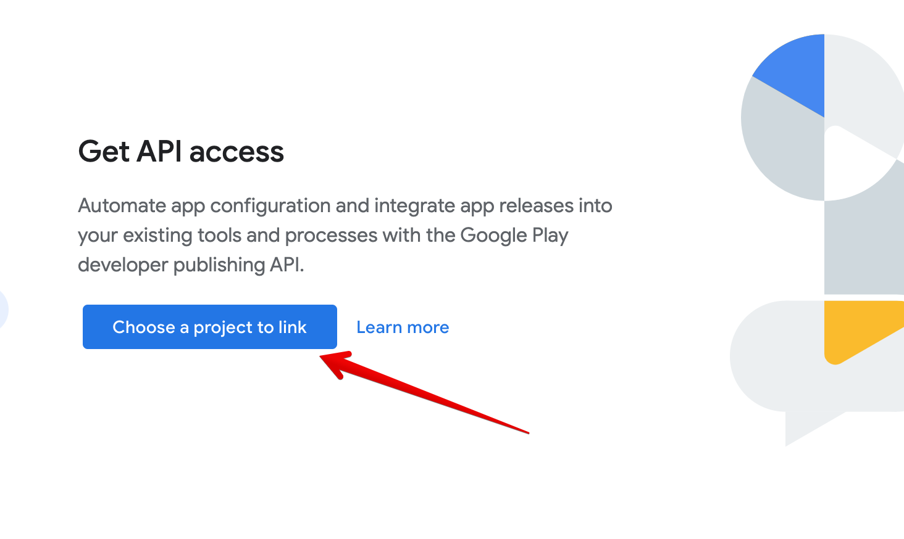
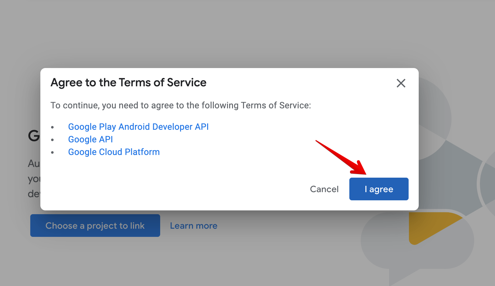
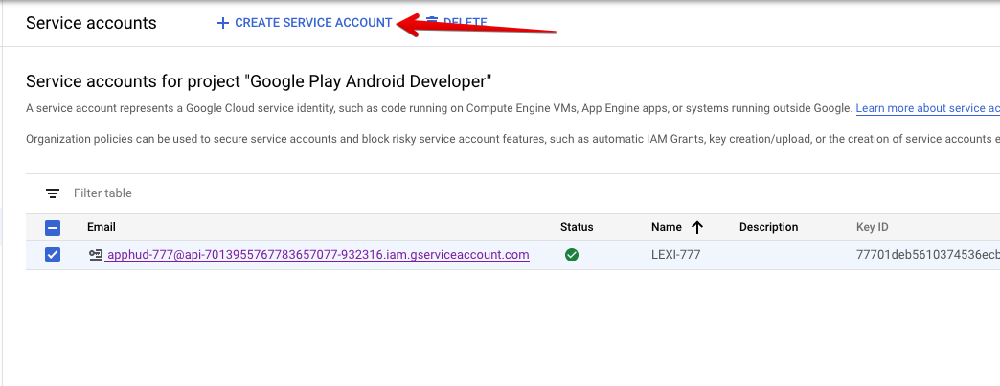
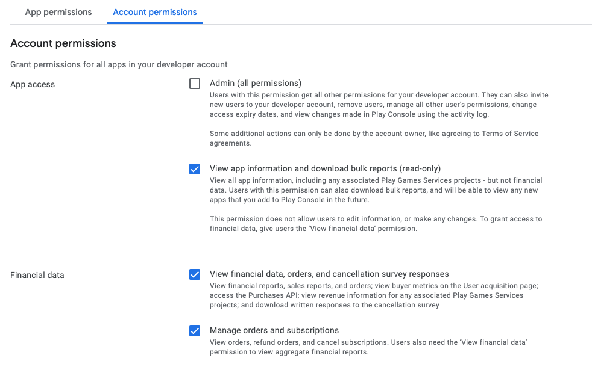
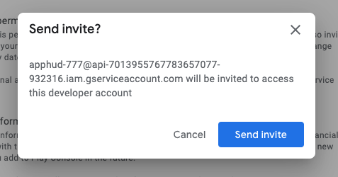
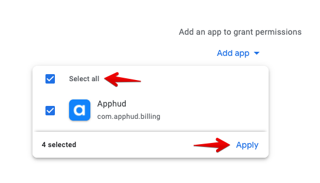
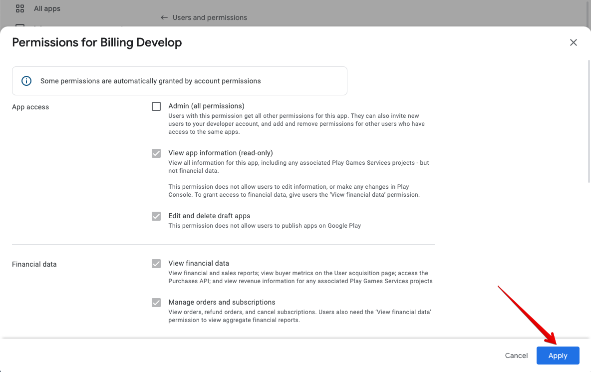

# Adding New App

To add a new app, click on "Add new app" at the top:

Or just register and application create screens will show automatically. Fill the information about the app.

### App Name

This is a name of the app that will be used in reports.

Then you will have options to configure iOS and Android apps accordingly.

## Add iOS App

### Bundle ID

To get Bundle ID open [App Store Connect](https://appstoreconnect.apple.com/), go to _"My Apps"_ and choose your app. At the app page find _“Your Bundle ID”_.

### App Store Shared Secret

To get _Shared Secret_:

1. Open [App Store Connect](https://appstoreconnect.apple.com/), go to my "_My Apps_" and choose your app.
2. Select "_Manage_" under the In-App Purchases heading.
3. Click on the "App-Specific Shared Secret" link on the right.
4. Create and copy the _Shared Secret_.


Please make sure that App Store Shared Secret you pasted to Apphud is correct.


## Add Android App

### Package Name

Enter your app's package name.

### Service Account JSON

Please provide contents of your Google Play Service Account JSON as described [here](creating-app.md#google-play-service-credentials).

## App Store Server Notifications

Providing App Store Server Notifications URL is important. It helps to detect cancellations, refunds and other events in real-time.


&#x20;In App Store Server Notifications in the server URL window choose the "**v1"** option for your notifications.


1. Copy your URL for App Store Server Notifications from Apphud. It can be found when adding new app in a wizard or in Apphud > Settings > iOS app settings.
2. Open [App Store Connect](https://appstoreconnect.apple.com/), go to _“My Apps”_ and choose your app.
3. Under _"App Information_**"** find _"App Store Server Notifications"_, paste generated URL under **Production Server URL** and choose **Version 1 Notifications**.


Already using App Store Notifications? Not a problem, take a look at our App Store Server Notifications [Proxy](creating-app.md#app-store-server-notifications-proxy) feature.



If _App Store Server Notifications_ block __ is missing in App Store Connect, try to create in-app purchases first.


If everything is set up correctly, you should see in Apphud Settings last time when notification is received from Apple. You can read more about App Store Notifications [here](https://developer.apple.com/documentation/appstoreservernotifications).

.png>)

## App Store Server Notifications Proxy

If you already use App Store Server Notifications and can't paster URL provided by Apphud, you can use App Store Server Notifications Proxy feature. Apphud will automatically send all incoming server-to-server webhooks from Apple to your server.

1. Configure [App Store Server Notifications URL](creating-app.md#app-store-server-notifications) for your app.
2. Go to _"App Settings"_ in Apphud.
3. Paste your subscription status URL into _"Proxy App Store Server Notifications to this URL" f_ield:

## Google Play Service Credentials

This is a difficult process but it is required in order for us to validate in-app purchases in Google Play.

### Link account to a Google Developer Project

Go to Settings page in your [Google Play Console](https://play.google.com/console) and Open API Access tab:

Click on a "Choose a project to link" button:

Agree to Terms:

Next let's create a service account.

### Create Service Account

Click on "Create new service account":

Navigate via link to Google Cloud Platform:

Click on "CREATE SERVICE ACCOUNT" button:

Enter the name of your service account and click "CREATE":

Select "Owner" for this account permissions:

Next you will need to create a new private key for this account:

Select "JSON" key type and click "CREATE":

After that you will need to grant financial access to this account.

### Grant Permissions to Service Account

Click on "Grant permissions" button:

Select "Account permissions" and grant the following permissions:

* View app information and download bulk reports (read-only)
* View financial data, orders, and cancellation survey responses
* Manager orders and subscriptions

Click on "Invite User" and "Send Invite".

### Grant Permissions to your App

In the Users and Permissions page in App permissions tab select your app and Apply permissions:

Your App permissions should be automatically granted by account permissions. Click on "Apply":

### Upload Service Account JSON to Apphud

Upload Service Account JSON file or enter JSON contents to Apphud when creating new app or if you already have created app, then in "Settings > Android app settings" page:

.png>)

You're done!

## Google Real-time Developer Notifications

Configuring Google Real-time Developer Notifications is important. It helps to detect cancellations, refunds and other events in real-time.



Ensure that Cloud Pub/Sub API is enabled for your project. You can check [here](https://console.cloud.google.com/flows/enableapi?apiid=pubsub).

.png>)



Ensure Google Play Service Credentials are correctly [set up](creating-app.md#google-play-service-credentials).

.png>)



In Apphud Settings > Android app settings page click **Connect to Google** button. After that copy Topic name value show up. **Copy** entire Topic string.




Go to Google Play Console > Your app > Monetization setup and paste Topic into Topic name field. Click on **Send test Notification**.




Go back to Apphud settings. If everything set up correctly you should see **Last received at** date. All done!




