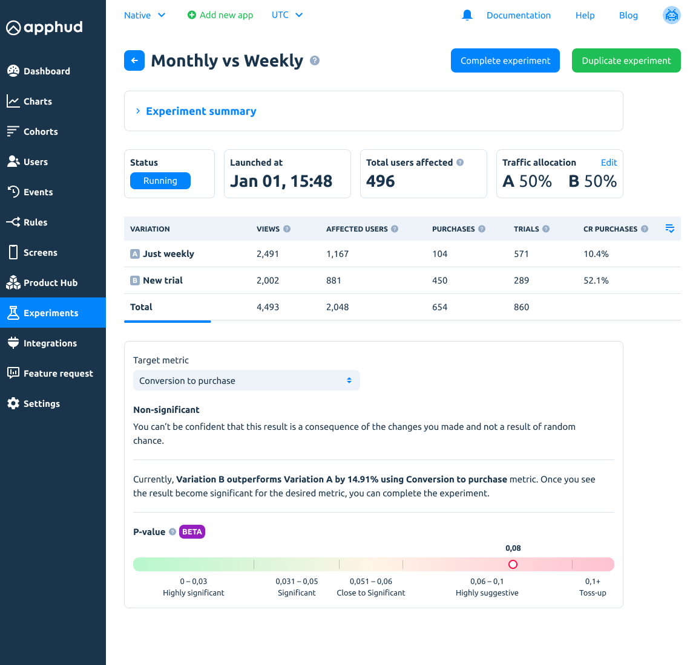
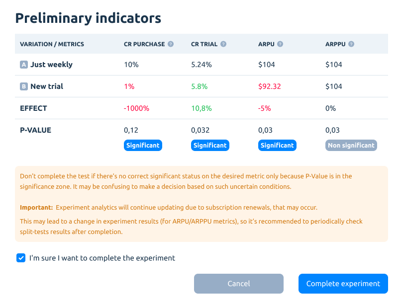

# Experiments

Run A/B experiments to maximize app revenue. Find the most profitable combination of products on a paywall. Discover the price for each in-app purchase that maximizes app revenue.

Also, test any paywall configurations via a custom JSON Config.

## Main Features

* More than two variations support, i.e. A/B/C test.
* Custom JSON config for each variation, for example, to modify your UI.
* Get variation name and experiment name for current user from SDK.
* Base variation (aka variation A) editing.
* Custom traffic allocation for each variation.
* Run experiments for custom audience, for example, targeted for specific country, app version or other filters.

## Using Experiments in Observer Mode

You can use A/B experiments on paywalls even in Observer mode. If you don't use Apphud SDK to purchase subscriptions, you need to specify paywall identifier which was used to purchase a product. If you pass paywall identifier correctly, experiment analytics will work as expected.


**Important Note:** on iOS you need specify paywall identifier before a purchase, however on Android you can do it after the purchase.




```swift
Apphud.willPurchaseProductFromPaywall("test_paywall")
YourClass.purchase(product) { result in 
 ...
}
```



```kotlin
YourClass.purchase(product) { success ->
  Apphud.syncPurchases("test_paywall")
}
```



## Create Experiment

While creating the experiment, you can set up a bunch of parameters. Read the detailed explanation below.

#### Main Settings


Here you can put the test name and description (optional).&#x20;

_Platform_ – An experiment can be run only for one selected platform at one time. If your app has only an iOS or Android platform (not both), this selection will be hidden.

_Target paywall_  – choose the paywall, that is being used as a baseline (control) variation. One of your existing paywalls should be used.


You can run several experiments on the paywall at one time by choosing a different audience for each test. In case of overlapping audiences, such users will be marked to the one experiment only, the earliest by its creation date.&#x20;


#### Variations


Variations are paywalls to test.&#x20;

_Variation A_ is a copy of the target paywall with all products and config of its parent. Can't be modified.

_Variation B_ is the second (modified) option to test. Can be created as a fully custom paywall, build from existing products. Another option here is to create the variation from the existing paywall. It's up to you.


If you use the "Use existing paywall" option, the Variation B paywall can't be modified. Product and JSON Config will be migrated from the parent paywall.


_Traffic allocation_ **–** determine traffic (users) distribution between the variants. By default, it's 50/50. Can be changed during the experiment.

#### Audience


Audiences are the new remarkable entity, that allows to group users by different criteria (such as new/existing ones, country, app version, etc.). [Read more](../users/audiences.md).

You can choose between one of the existing (default) audiences for the experiment or create a custom audience with desired parameters.

## Run Experiment

After you filled in all the experiment settings, click on the "Run experiment" button to run the test. A preview screen will be shown to do a final check and overview of the settings.


If everything is okay, click the "Run Experiment" button again. Otherwise, edit the experiment.

## Save Experiment


You may want to not run the test immediately. In such case, the experiment will be saved as a draft. The draft can be edited and launched later.

## Duplicate Experiment


Click "Duplicate" in the context menu on the experiment in the list to create its copy. All experiment settings (such as target paywall, variations, and audience) will move to the new test.

## Analyze Experiment

After the experiment is started, it will accumulate users data and all related metrics.



**Views**\
****A number of overall variant paywall views (every repetitive view is counted).

**Marked Users** \
A number of unique users, marked (related) to a particular paywall variant. May not view the paywall.

**Affected Users** \
A number of unique marked users have seen the paywall.

**Trials** \
Count of started trials.

**CR Trials** \
Conversion from paywall view to trial start.

**CR Trial-Purchase** \
Conversion from a trial to an in-app purchase.

**Purchases** \
Count of initial purchases (non-renewals), trials are included.

**CR Purchases** \
Conversion from paywall view to purchase.

**Last Purchase** \
Last in-app purchase date for the variant.

**Sales**\
Total amount billed to customers for purchasing in-app purchases from the paywall variant. \
Sales = Gross Revenue - Refunds.

**Proceeds**\
****Estimated amount you receive on sales of subscriptions. It excludes refunds and Apple’s commission.

**Refunds**\
****A number of purchases refunds.

**ARPU**\
****Average Revenue Per Users. Calculated on a cohort basis. The cohort is users, who have installed the app and were marked to the paywall variant.

**ARPPU**\
****Average Revenue Per Paying Users. Calculated on a cohort basis. The cohort is users, who have installed the app and were marked to the paywall variant.


Since ARPU/ARPPU will change during the time due to refunds and renewals, experiment results for these metrics may change.


**Target Metrics**

_Conversion to purchase_\
__Understand which variation is better in terms of conversion from a paywall view to purchasing.

_Conversion to trial_\
__Understand which variation is better in terms of conversion from paywall view to a trial start.


We calculate conversions by views by default. It's strictly recommended to use logPaywallShown() method in SDK. Otherwise, we will have to calculate conversions by marked users and it's not so accurate.


_ARPU_\
__Understand which variation is better in terms of ARPU.


ARPU in experiments is calculated as Paywall Proceeds / Paywall Marked Users


_ARPPU_\
__Understand which variation is better in terms of ARPPU.


ARPPU in experiments is calculated as Paywall Proceeds / Paywall Paying Users


**Effect**

The effect shows the relative change between the selected metric on Variation B compared to Variation A.

_Example:_ if Variation A purchase conversion is 5% and Variation B is 10%, then Effect = +50%, i.e. Variation B outperforms A by 50%.

**P-value**\
****It's a statistical value, a number between 0 and 1, which is used to test a hypothesis. It is used to determine whether the result obtained in an experiment is random.

For our experiments, we define a significance threshold of 5% (or P-value = 0.05).

Statistically significant (and allowing to reject the [null hypothesis](https://en.wikipedia.org/wiki/Null\_hypothesis)) in this case is the result whose P-Value is equal to the significance level or less than it (P-value ≤ 0.05).

When we assure the result of the test is significant in terms of P-value, we’ll inform you.

## Complete and Evaluate

When you see the significant results on the desired target metric, you can complete the experiment.



If you don't see significance on the metric for continuous time, it's a good signal to re-think the experiment conditions and to run another test with more differences in the prices and paywall parameters (to increase the potential effect of these changes).


