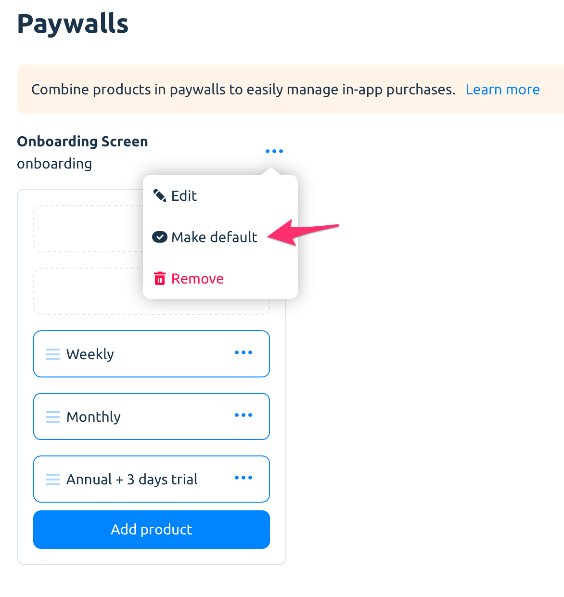

# Paywalls

A paywall is a product array with custom JSON. The array is ordered and may be used to display products on your in-app purchase screen.


Insert any parameters you need into custom JSON. It could be titles, descriptions, localisations, font, background and color parameters, URLs to media content, etc. Parameters count are not limited.


### Adding products to paywalls

Select a product from the list of all products.

You cannot add the same product twice to the paywall, but one product can be added to several paywalls.

### Sort products

Drag and drop products within the paywall to change its order.


SDK always returns paywall products in a strict and defined order. So, you can put the list of corresponding products on the payment screen buttons.


### Delete product from paywall

To delete product from paywall, select _"Remove product"_ option.

### Delete paywall

.png>)

To delete the paywall, select the _"Remove"_ option.


Make sure you are not removing the active paywall that is being used in your app. If you do that, your payment screen logic and purchases will be broken.



If you delete the paywall flagged as _default_, no other paywall will be set as a default one.


### Default paywall

It's possible to make a paywall _default_ – it's a special alias name, that can be assigned to only ONE paywall at one time.

After setting some paywall as _default_ you can retrieve it using this special alias (and not its identifier). This is a great tool to switch your paywalls dynamically without app updates and run simple price tests


There can be no default paywalls at all. It's up to you whether you want to have them or not.


