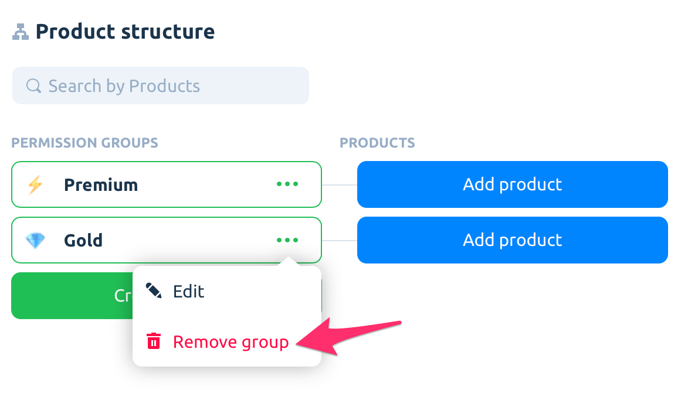

# Permission Groups

Permission groups – a simple and remarkable way to manage access to a paid content within your apps. You don't need to hard-code product IDs anymore.

Just add them to the permission group and unlock premium content/feature when a user purchased one of the products. It works just fine, and you can use it for giving access across iOS/Android apps too. Brilliant!

Good news – all-new apps already have a default "Premium" group. Again, just add the products and that's it!


In most cases, you will need only one permission group.

Don't create new permission groups without a reason. This will make your logic messy and increases the risk of in-app purchase issues occur.


### Create permission group

Extremely simple – just put a group name and select the associated icon.&#x20;


Give your groups meaningful names. For example, "Gold" or "Premium" would fit.


If you have (consumable or non-consumable) non-renewing in-app purchases, it may be great to have separate permission groups for each of them.

### Move product to another permission group

.png>)

Select the "Move to group" option to assign a product to a new permission group.

### Delete permission group

Make sure you REALLY need this!&#x20;

All products belonging to this group will be removed and product IDs will be moved to the “Uncategorized products” section.&#x20;

If you have products from this group in paywalls, they will be deleted from there.
