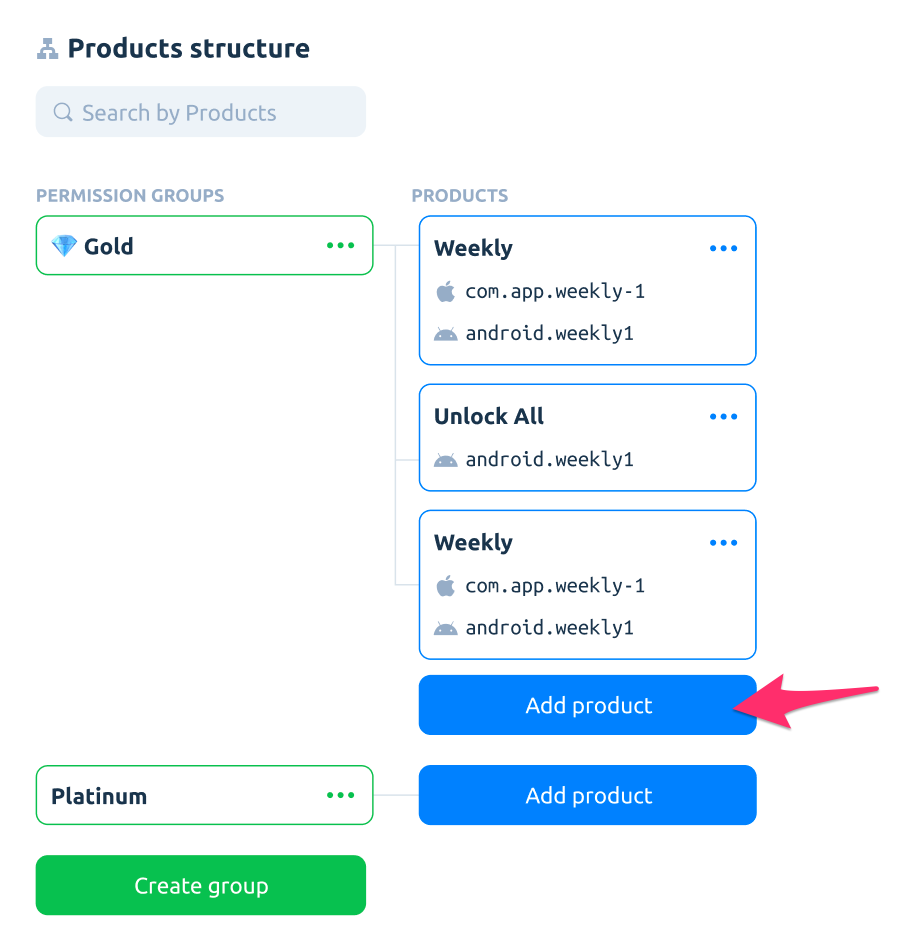
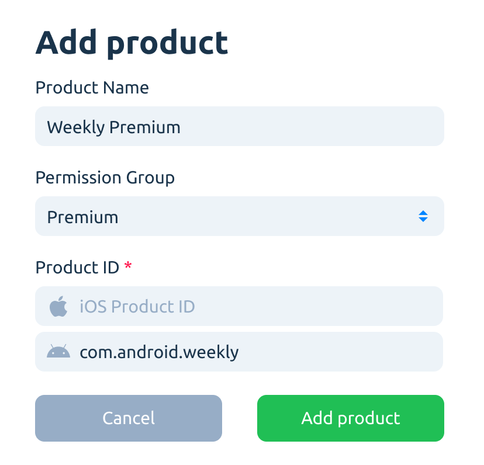
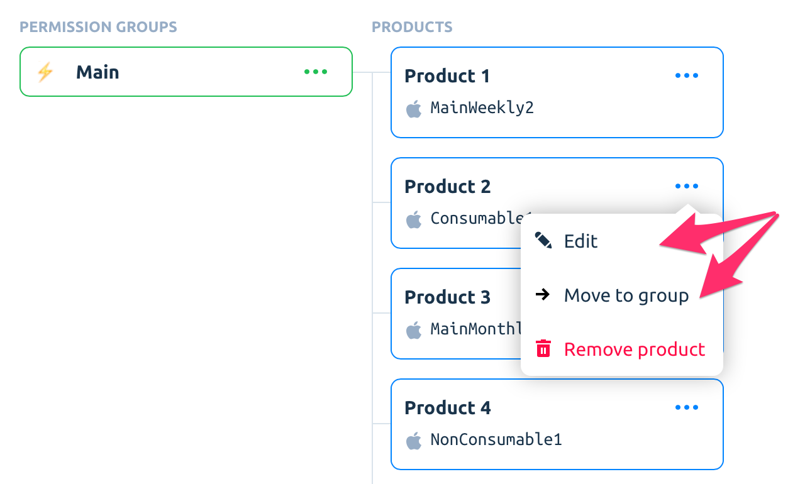
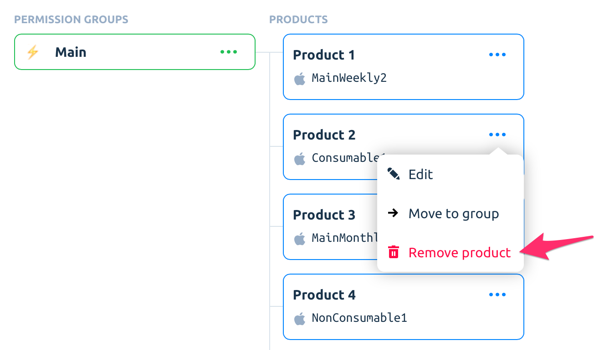

# Products

### Adding Products

So, let's start and create your first product. It's a great idea to give the new product a simple and clear name. Like on a screen below.

New products support cross-platform apps – you can put both iOS/Android Product IDs in there. We strongly encourage you to use products within your apps.

Doing that you can change it anytime in Apphud Product Hub. No app update is required!


If you add new products at App Store Connect or Google Play Console, don't forget to add them to Apphud.

Also, it's not recommended to change subscription prices in iOS after SDK integration as it may show incorrect revenue in some cases. You can create a new product with a new price instead.


### Edit Product

To edit an existing product, select _"Edit"_ in the context menu.

If you have several permission groups, you can move a product to another group with the context menu _"Move to group"_ option.

### Search Products

In case you have a bunch of products, it's easy to navigate through them. Use the search field to reach out to required products.

### Delete Product

In order to delete a product, select _"Remove product"_  in the context menu.

### Uncategorized Product IDs

It's strongly recommended to add all of your in-app purchases as products into Apphud. But in some (we hope, rare) cases these "orphaned" Product IDs may be found.

This can happen if you forget to add some new products to Apphud, or in case of old subscription renewals (we will get them in with Apple server notifications).

So, if you have such Product IDs, get rid of them as soon as possible and convert them to normal products.

### Deprecated structure

Before the latest changes, we had a simple structure, reflecting the iOS subscriptions hierarchy with particular product IDs (Store SKUs) and "subscription groups".

What is the main problem with that? It has a few drawbacks:

* Old groups were not very functional. Although we recommended you to match App Store subscriptions groups to these groups within Apphud, it does not add any specific functionality.
* The second thing is old products. You had to hard-code specific product SKUs into your paywalls. So, it was impossible to change the products on the fly and run A/B-experiments.
