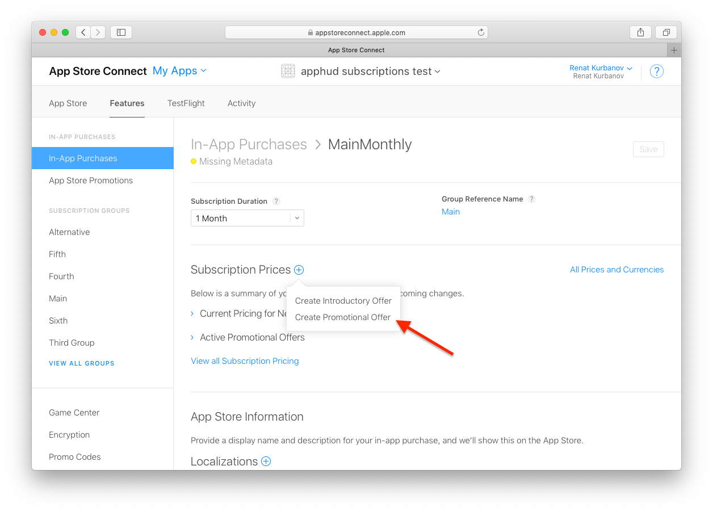
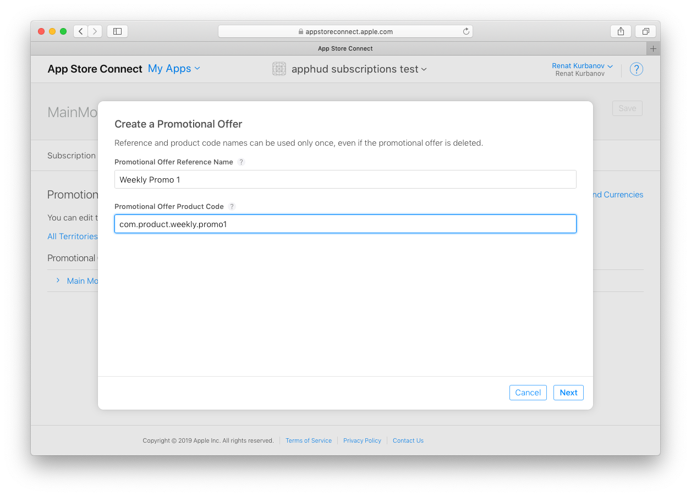
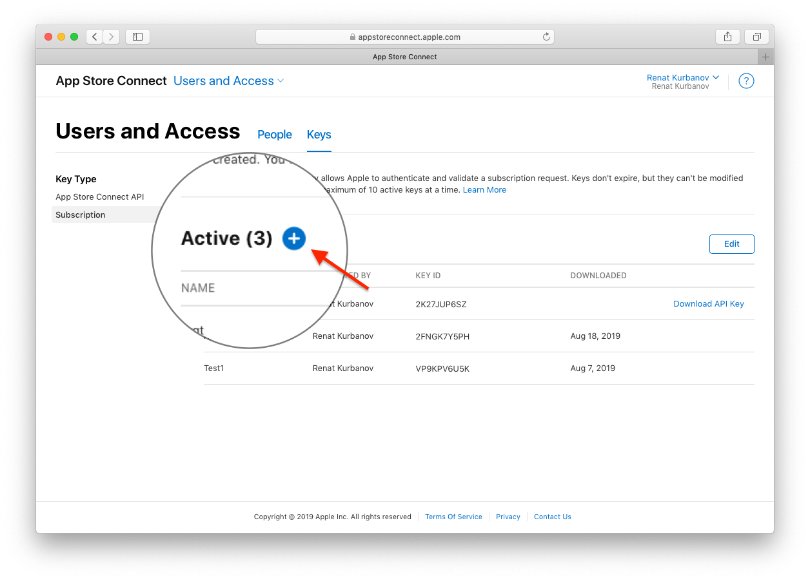
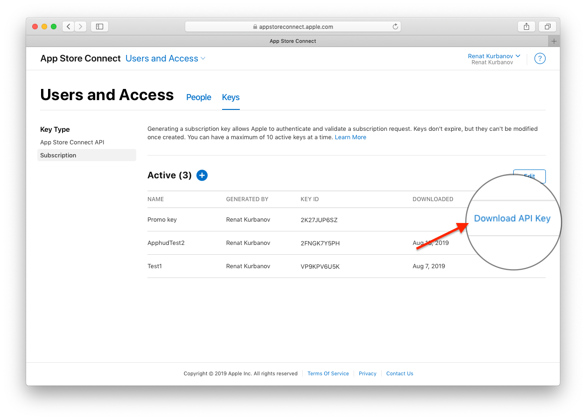

# Promotional Offers

Apps with auto-renewable subscriptions can offer a discounted price or free period for existing or lapsed customers. This feature is called subscription offers and is available for users with iOS 12.2 or higher. Unlike introductory offer, subscription offers can be applied as many times as you decide but requires generating a signature on your server before purchasing. Apphud does the job for you.

## Set up Subscription Offers in App Store Connect

To create a new subscription offer go to [App Store Connect](https://appstoreconnect.apple.com/), then go to your app's subscription product page. Click on the "+" option under _Subscription Prices_ and then click on _Create Promotional Offer:_



You will need to specify Reference Name, which is just a title, and Promotional Offer Product Code, which is actually your offer's identifier_:_



Then you will need to specify pricing and promotional offer type. Offer types are the same as in introductory offers:

* pay as you go;
* pay up front;
* free.

Don't forget to save changes.

## Subscription Keys

As being said above, a special signature must be generated before purchasing subscription offer. Apphud will do the job, but you will need to create subscription key and upload it to Apphud.

Go to _"Users and Access"_ section, then select _Keys_ tab. If you don't have any subscription keys, click on _"Generate Subscription Key"_. You will be prompted to enter its name.



Once created, click on _"Download API Key"_ and move downloaded file to the safe place. You will need to upload it to Apphud.


Subscription Key file name has the following format: `SubscriptionKey_[KEY_ID].p8`, where `KEY_ID` is your Key Identifier.&#x20;



Please do not rename Subscription Key file.




## Upload Subscription Key to Apphud

Go to [Apphud](https://app.apphud.com/) and open _"App settings"_, there click on _"Products"_ tab. There you will see _"Upload"_ button for subscription key file. Just upload your Subscription Key file here_:_

.png>)

## Redeem Subscription Offer

You decide the criteria for which subscribers qualify for an offer. In your app, the details of the offers you set up in App Store Connect will appear in the `discounts` array in `SKProduct` object.

You may check user eligibility to purchase promotional offer using this SDK call:

```swift
// Checking eligibility for promotional offer
Apphud.checkEligibilityForPromotionalOffer(product: myProduct) { result in
  if result {
    // User is eligible to purchase promotional offer
  }
}
```

To initiate a purchase, just call following method:

```swift
// inside your purchase method, where discountID is identifier of SKProductDiscount object
Apphud.purchasePromo(product, discountID: discountID) { result in
    // handle result
}
```

This method automatically submits App Store receipt to Apphud, so you don't need to call `submitReceipt` method.
