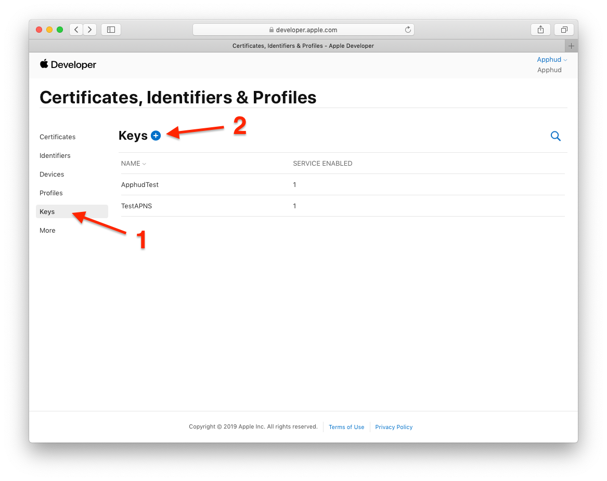
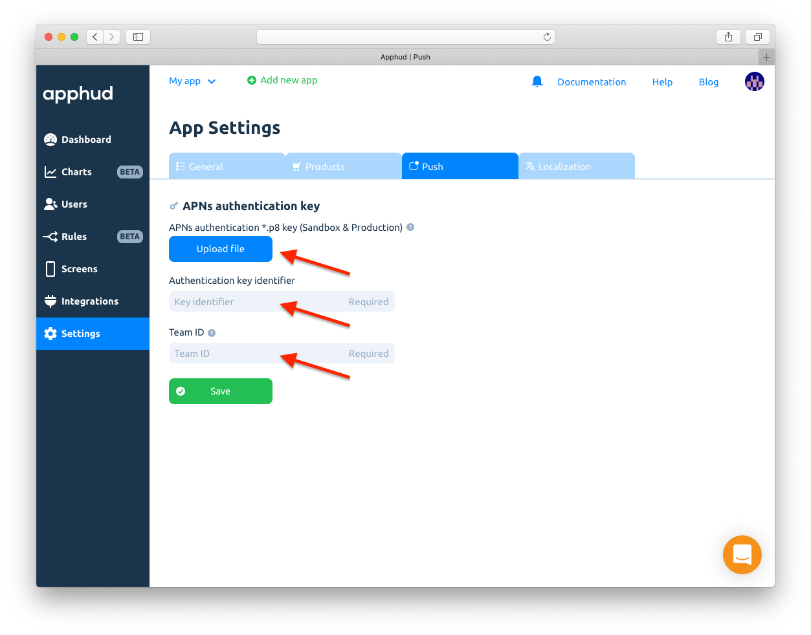
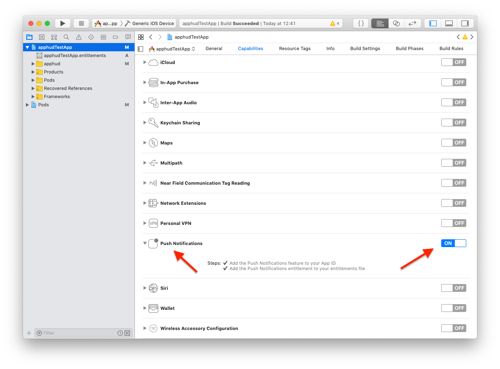

# Push Notifications

Integrating Push notifications in your app will let you to use Rules – a powerful feature that lets you increase your app revenue by automatically offering a discount to a user at the specified moment.

## Generate Push Notifications Auth Key

Go to the [Apple Developer Center](https://developer.apple.com/account/ios/profile/), then go to _"Keys"_ page, then create a new key by entering a name and choosing _"Apple Push Notifications service (APNs)":_



Once created, download the file and move it to the safe place. You will need to upload it to Apphud. Also, copy your team ID somewhere which can be found in your [Developer Account Membership](https://developer.apple.com/account/#/membership) page. We will need it later.


Auth Key file name has the following format: `AuthKey_[KEY_ID].p8`, where `KEY_ID` is your Key Identifier.

By using auth key, Apphud will be able to send Push notifications to all of your apps within the same account and to both sandbox and production environments. That means, you can use the same auth key file for your another app.


## Upload Auth Key to Apphud

Go to [Apphud Dashboard](https://app.apphud.com) and open _"App settings"_, select _"Push"_  tab. There you will see _Upload_ button for APNs auth key file. Just upload your Key file there. Also enter your Team ID and make sure key identifier is also entered_:_



## \[Required] Set up Push Notifications in iOS app

Please follow all the steps below.

### Add Push Notifications Capability

Make sure that Push Notifications are turned on in _"Capabilities"_ section of your app target:



### Register for Notifications

Let's write some code in your `AppDelegate`. First, register for notifications:



```swift
import UserNotifications

func application(_ application: UIApplication, didFinishLaunchingWithOptions launchOptions: [UIApplication.LaunchOptionsKey: Any]?) -> Bool {
  Apphud.start(apiKey: YOUR_API_KEY)
  registerForNotifications()
  //... the rest of your code
}

func registerForNotifications(){
    UNUserNotificationCenter.current().delegate = self
    UNUserNotificationCenter.current().requestAuthorization(options: [.alert, .badge, .sound])    { (granted, error) in            
        // handle if needed
    }        
    UIApplication.shared.registerForRemoteNotifications()
}
```



```objectivec
#import <UserNotifications/UserNotifications.h>

- (BOOL)application:(UIApplication *)application didFinishLaunchingWithOptions:(NSDictionary *)launchOptions {
    // Override point for customization after application launch.
    [Apphud startWithApiKey:@"APPHUD_API_KEY" userID:nil];
    [self registerForNotifications];
}

- (void)registerForNotifications{
    UNUserNotificationCenter.currentNotificationCenter.delegate = self;
    [UNUserNotificationCenter.currentNotificationCenter requestAuthorizationWithOptions:(UNAuthorizationOptionAlert | UNAuthorizationOptionBadge | UNAuthorizationOptionSound) completionHandler:^(BOOL granted, NSError * _Nullable error) {
        // handle if needed
    }];
    [[UIApplication sharedApplication] registerForRemoteNotifications];
}
```



### Pass Device Token to Apphud

Then you will need to submit device token to Apphud:



```swift
func application(_ application: UIApplication, didRegisterForRemoteNotificationsWithDeviceToken deviceToken: Data) {
    Apphud.submitPushNotificationsToken(token: deviceToken, callback: nil)
}

func application(_ application: UIApplication, didFailToRegisterForRemoteNotificationsWithError error: Error) {
    // error occurred. Probably you have signing issues or push notifications capabilities are    // turned off
}
```



```objectivec
- (void)application:(UIApplication *)application didRegisterForRemoteNotificationsWithDeviceToken:(NSData *)deviceToken{
    [Apphud submitPushNotificationsTokenWithToken:deviceToken callback:nil];
}

- (void)application:(UIApplication *)application didFailToRegisterForRemoteNotificationsWithError:(NSError *)error{
    // error occurred. Probably you have signing issues or push notifications capabilities are turned off
}
```



We should handle incoming Push notification payload after. This is done with two methods: one handles payload when app is in background or not launched, another – handles payload when app is running.

### Handle Incoming Push Payload



```swift
func userNotificationCenter(_ center: UNUserNotificationCenter, didReceive response: UNNotificationResponse, withCompletionHandler completionHandler: @escaping () -> Void) {
    if Apphud.handlePushNotification(apsInfo: response.notification.request.content.userInfo) {
        // Push Notification was handled by Apphud, probably do nothing
    } else {
        // Handle other types of push notifications
    }
    completionHandler()
}

func userNotificationCenter(_ center: UNUserNotificationCenter, willPresent notification: UNNotification, withCompletionHandler completionHandler: @escaping (UNNotificationPresentationOptions) -> Void) {
    if Apphud.handlePushNotification(apsInfo: notification.request.content.userInfo) {
        // Push Notification was handled by Apphud, probably do nothing
    } else {
        // Handle other types of push notifications
    }
    completionHandler([]) // return empty array to skip showing notification banner
}
```



```objectivec
- (void)userNotificationCenter:(UNUserNotificationCenter *)center didReceiveNotificationResponse:(UNNotificationResponse *)response withCompletionHandler:(void (^)(void))completionHandler {
    [Apphud handlePushNotificationWithApsInfo:response.notification.request.content.userInfo];
}

- (void)userNotificationCenter:(UNUserNotificationCenter *)center willPresentNotification:(UNNotification *)notification withCompletionHandler:(void (^)(UNNotificationPresentationOptions))completionHandler {
    [Apphud handlePushNotificationWithApsInfo:notification.request.content.userInfo];
}
```



That's it. Run the app and make sure that `deviceToken` is successfully sent to Apphud.

Apphud SDK handles payload and returns `true` if it was successfully handled in `Apphud.handlePushNotification(apsInfo: userInfo)` method.

Now you are ready to receive Push notifications.

## Push Notification Payload

Here is example of Push Notification Payload

```
aps =    {
    alert =         {
        body = TEST;
            title = "Paywall!";
        };
        "mutable-content" = 1;
        sound = default;
    };
    custom =     {
        a =         {
        };
    };
    "rule_id" = "5242761d-918d-42ae-a49b-f155b1402c2b";
    "rule_name" = "Paywall Custom Rule";
    "screen_id" = "0f8b832e-65d3-4777-a303-ba89750763c9";
    "screen_name" = "your_screen_name";
}
```

> "custom"  subjson added to payload, but it is not used. This is an internal subjson, which was added to handle conflicts with OneSignal SDK, if available.

## Troubleshooting

**Push notification doesn't arrive.**

1. Double check that _Auth Key_ is uploaded to App Settings in Apphud and both _Key ID_ and _Team ID_ values are set.
2. Make sure that Apphud receives device tokens from your iOS app, i.e. double check that `Apphud.submitPushNotificationsToken(token: deviceToken, callback: {_ in})` method is being called.
3. View your Apphud User page – it should contain push token value.

**Push notification arrives but it's not being handled.**

1. Make sure that `Apphud.handlePushNotification(apsInfo: userInfo)` method is being called.
2. Make sure that `UNUserNotificationCenterDelegate` is correctly set.
3. If you are using OneSignal or custom `UINotificationServiceExtension` , debug in Xcode and make sure that `Apphud.handlePushNotification(apsInfo: userInfo)` method is called.

## Using both OneSignal and Apphud Push Notifications

Please see [this](../integrations/marketing/onesignal.md#using-both-onesignal-and-apphud-push-notifications) guide.
