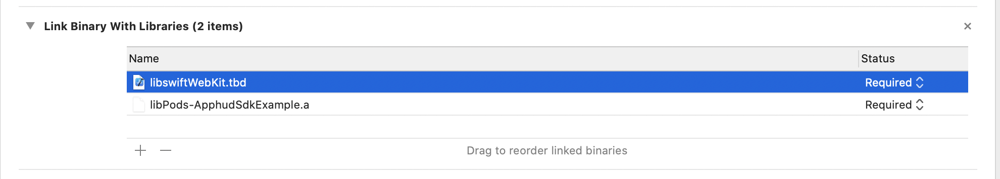

# React Native

## Installation

React Native Apphud SDK can be installed via `npm`:

```
$ npm install @apphud/react-native-apphud-sdk
```


In case you have issues with pod dependencies add `use_modular_headers!` to `Podfile`.


## Usage

```
import ApphudSdk from "@apphud/react-native-apphud-sdk"
```

## Initialize SDK

To initialize Apphud SDK you will need API Key. It is a unique identifier of your Apphud application. You can get it in your Apphud application settings under General tab.

Basic initialization looks like this:

```
await ApphudSdk.start({ apiKey: "your_api_key" });
```

Initialization options:

| Property     | Type   | Platform     | Is required |
| ------------ | ------ | ------------ | ----------- |
| apiKey       | String | iOS, Android | yes         |
| userId       | String | iOS, Android | no          |
| deviceId     | String | Android      | no          |
| observerMode | Bool   | iOS          | no          |

You can also initialise SDK with custom Device ID. This should be used if you plan to use logout / login features. This method can also be used for user uniqueness to be by your own User ID.\
&#x20;You can safely pass the same identifier to Device ID and User ID:

```
await ApphudSdk.startManually({ apiKey: "your_api_key", deviceId: "CUSTOM_USER_ID", userId: "CUSTOM_USER_ID" });
```


More information regarding User ID uniqueness and User merging can be found [here](common.md).


Log out method will clear all saved data and reset SDK to basic state:

```
await ApphudSdk.logout();
```

## Purchase using Apphud SDK

To make a purchase call:

```
await ApphudSdk.purchase(productIdentifier);
```

## Purchases in Observer Mode (Android)

If you use your own billing on Android then you should sync purchases each time user makes any purchase or restoration. Just call after purchase or restore:

```
await ApphudSdk.syncPurchases();
```


Keep in mind, that you are responsible for acknowledging or consuming all purchases in observer mode!


## Purchase in Observer Mode (iOS)

Apphud SDK automatically intercepts purchases on iOS and passes receipt data to Apphud servers. No additional code required.

## Check Subscription Status

```
await ApphudSdk.hasActiveSubscription();
```

Returns `true` if user has active subscription. Use this method to determine whether to unlock premium functionality to the user.

## Get Products

Apphud automatically fetches `SKProduct` / `SKUDetails` objects upon launch. Make sure products identifiers are added in Apphud products. To get your products call:

```
await ApphudSdk.products();
```

## Get Subscription Details

To get subscription object (which contains expiration date, auto-renewal state, status, etc.) use the following method:

```
await ApphudSdk.subscription();
```

## Check Non-renewing Purchase Status

Use this method to check whether the user has purchased in-app purchase and it's not refunded. Returns false if was never purchased or is refunded.

```
await ApphudSdk.isNonRenewingPurchaseActive(productIdentifier)
```

## Get Non-renewing Purchase Details

To get non-renewing purchases, which contain purchase date, product identifier and cancellation date, use the following method:

```
await ApphudSdk.nonRenewingPurchases();
```

## Get User ID

To get user id you can use this method:

```
await ApphudSdk.userId();
```

## Integrations

Submit attribution data to Apphud from your attribution network provider.

```
await ApphudSdk.addAttribution(options);
```

## Restore Purchases (iOS)

If your app doesn't have a login system, which identifies a premium user by his credentials, then you need a "restore" mechanism:

```
await ApphudSdk.restorePurchases();
```

Basically it just sends App Store Receipt to Apphud and returns subscriptions (or nil, if subscriptions are never purchased), non-renewing purchases (or nil, if there are no any) and an optional error.

## Migrate existing purchases

Please read [here](../data-migration-guide.md).

## Troubleshooting

#### Build failed (xCode >= 12.0)


`Undefined symbol: __swift_FORCE_LOAD_$_swiftWebKit`


In Build Phases tab add **libswiftWebKit.tbd** to **Link Binary with Libraries**.



