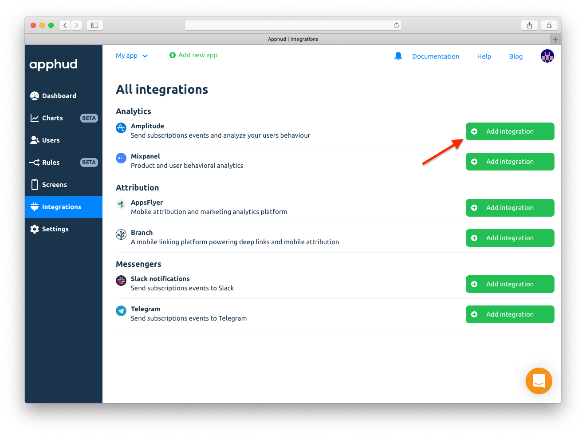
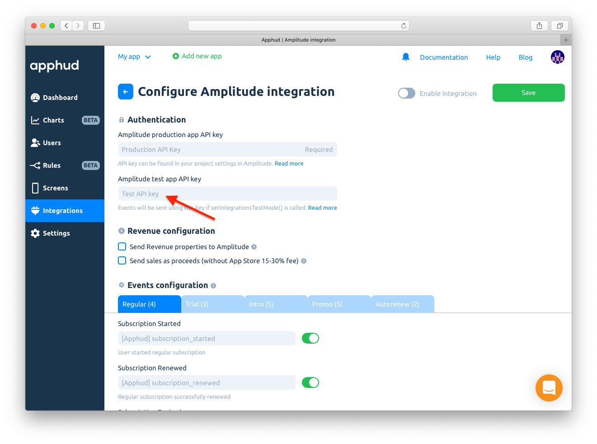
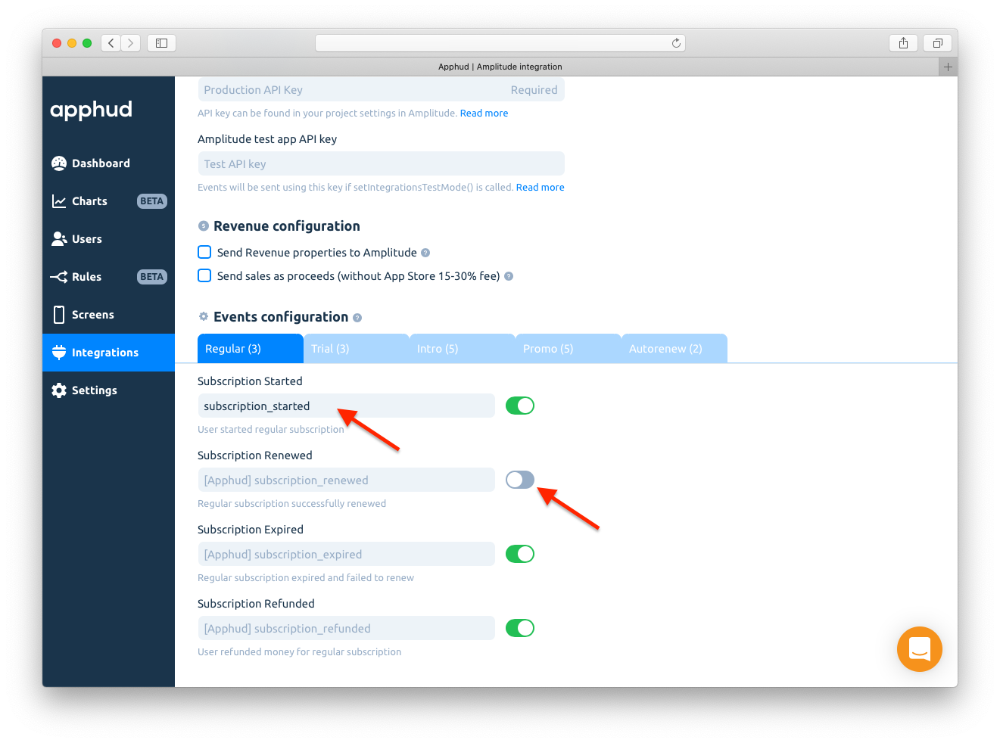
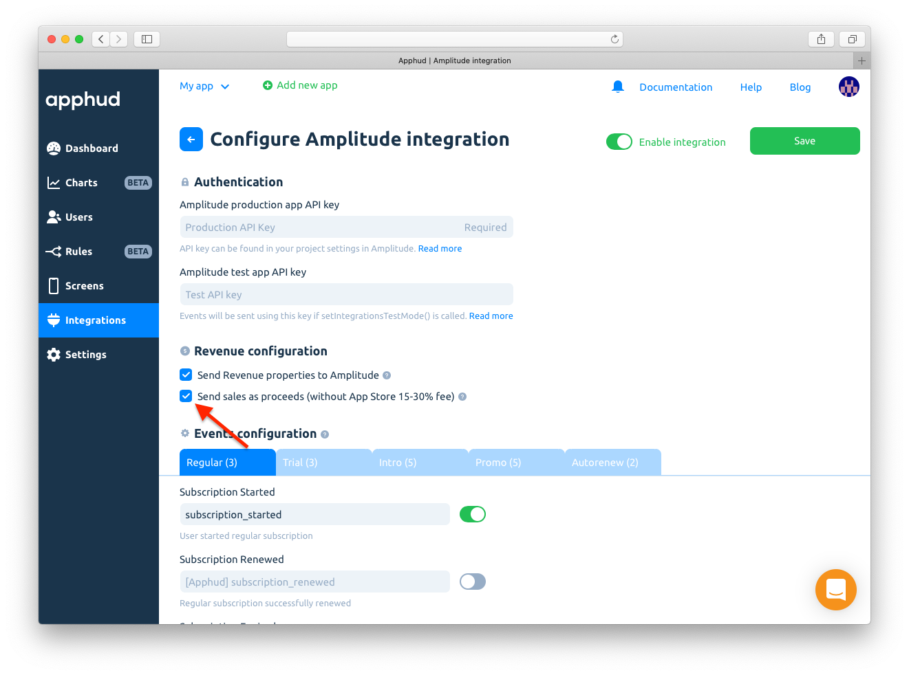
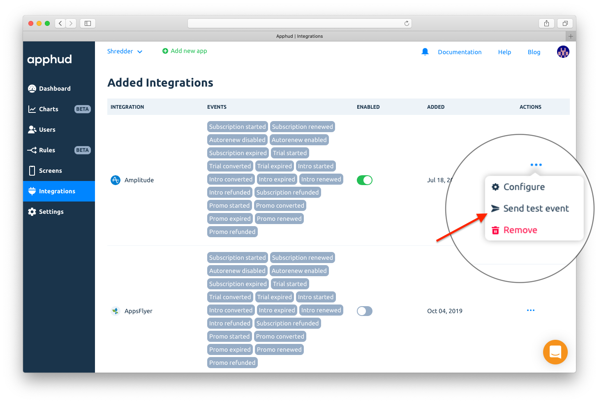
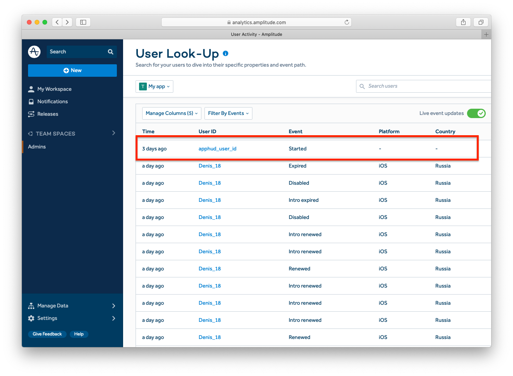

# Amplitude

[Amplitude](https://amplitude.com) is a powerful mobile analytics service. Send events to Amplitude via Apphud, analyze your users behavior and make necessary decisions.

## How to Add Integration?



* [Integrate](../../getting-started/sdk-integration/#configure-apphud-sdk) Apphud SDK.
* [Integrate](https://help.amplitude.com/hc/en-us/articles/115002278527#installation) Amplitude SDK.
* [Match User IDs](amplitude.md#match-user-ids) between Apphud and Amplitude. If you set your custom User ID keep in mind that Amplitude requires user id to be **minimum 5 characters**.



At [Apphud](https://app.apphud.com/) go to _"Integrations"_ section and add Amplitude:





Enter _Amplitude API Key_ at the _"Amplitude production app API Key"_ field:





You may have one more app created in Amplitude used for testing purposes not to mix test and live data. If you have such app you can paste it's _Amplitude API Key_ into _"Amplitude test app API key"_ field.





You can enter your custom event names or disable some:





Enable integration and Save:

.png>)



## Match User IDs

Here is an example of initialising both SDKs with User IDs matching.



```swift
func application(_ application: UIApplication, didFinishLaunchingWithOptions launchOptions: [UIApplication.LaunchOptionsKey: Any]?) -> Bool {

    Apphud.start(apiKey: "YOUR_API_KEY")
    Apphud.setDelegate(self)
    
    Amplitude.instance()?.initializeApiKey("AMPLITUDE_API_KEY", userId: Apphud.userID())

    return true
}

func apphudDidChangeUserID(_ userID: String) {
    // Match again
    Amplitude.instance()?.setUserId(userID)
}
```



```objectivec
[Apphud startWithApiKey: @"API_KEY"];
[[Amplitude] instance] initializeApiKey:@"API_KEY" userId:[Apphud userID]];
```



```kotlin
Apphud.start(apiKey: "YOUR_API_KEY")
Amplitude.getInstance().initialize(this, "AMPLITUDE_API_KEY", Apphud.userID());
```



```java
Apphud.start(apiKey: "YOUR_API_KEY");
Amplitude.getInstance().initialize(this, "AMPLITUDE_API_KEY", Apphud.userID());
```



## Events Cheat Sheet

This is a list of all possible events and their parameters that are being sent to Amplitude.&#x20;


You can read more about subscription events [here](../../events/events.md) and about parameters [here](../../events/parameters-and-properties.md).




### Trial period started

_Default event name:_ `[Apphud] trial_started`

_Parameters:_

* `product_id`: String
* `unit`: String
* `units_count`: Integer

### Successful conversion from trial period to regular subscription

_Default event name:_ `[Apphud] trial_converted`

_Parameters:_

* `product_id`: String
* `local_price`: Float
* `currency`: String
* `usd_price`: Float

### Failed conversion from trial period to regular subscription

_Default event name:_ `[Apphud] trial_expired`

_Parameters:_

* `product_id`: String
* `reason`: String



### Trial Canceled

&#x20;_Default event name:_ `[Apphud] trial_canceled`

_Parameters:_

* `product_id`: String

### Subscription Canceled

&#x20;_Default event name:_ `[Apphud] subscription_canceled`

_Parameters:_

* `product_id`: String

### Autorenew disabled (Deprecated)

&#x20;_Default event name:_ `[Apphud] autorenew_disabled`

_Parameters:_

* `product_id`: String

### Autorenew enabled

_Default event name:_ `[Apphud] autorenew_enabled`

_Parameters:_

* `product_id`: String



### Introductory offer started

&#x20;_Default event name:_ `[Apphud] intro_started`

_Parameters:_

* `product_id`: String
* `local_price`: Float
* `currency`: String
* `usd_price`: Float
* `offer_type`: String
* `unit`: String
* `units_count`: Integer

### Introductory offer renewed

_Default event name:_ `[Apphud] intro_renewed`

_Parameters:_

* `product_id`: String
* `local_price`: Float
* `currency`: String
* `usd_price`: Float
* `offer_type`: String
* `unit`: String
* `units_count`: Integer

### Successful conversion from introductory offer to regular subscription

_Default event name:_ `[Apphud] intro_converted`

_Parameters:_

* `product_id`: String
* `local_price`: Float
* `currency`: String
* `usd_price`: Float
* `offer_type`: String

### Failed conversion from introductory offer to regular subscription or failed renew

_Default event name:_ `[Apphud] intro_expired`

_Parameters:_

* `product_id`: String
* `reason`: String
* `offer_type`: String

### Refund during introductory offer

_Default event name:_ `[Apphud] intro_refunded`

_Parameters:_

* `product_id`: String
* `local_price`: Float
* `currency`: String
* `usd_price`: Float
* `reason`: String
* `offer_type`: String



### Subscription started

&#x20;_Default event name:_ `[Apphud] subscription_started`

_Parameters:_

* `product_id`: String
* `local_price`: Float
* `currency`: String
* `usd_price`: Float

### Subscription renewed

_Default event name:_ `[Apphud] subscription_renewed`

_Parameters:_

* `product_id`: String
* `local_price`: Float
* `currency`: String
* `usd_price`: Float

### Subscription expired

_Default event name:_ `[Apphud] subscription_expired`

_Parameters:_

* `product_id`: String
* `reason`: String

### Subscription refunded

_Default event name:_ `[Apphud] subscription_refunded`

_Parameters:_

* `product_id`: String
* `local_price`: Float
* `currency`: String
* `usd_price`: Float
* `reason`: String



### Promotional offer started

&#x20;_Default event name:_ `[Apphud] promo_started`

_Parameters:_

* `product_id`: String
* `offer_id`: String
* `local_price`: Float
* `currency`: String
* `usd_price`: Float
* `offer_type`: String
* `unit`: String
* `units_count`: Integer

### Promotional offer renewed

_Default event name:_ `[Apphud] promo_renewed`

_Parameters:_

* `product_id`: String
* `offer_id`: String
* `local_price`: Float
* `currency`: String
* `usd_price`: Float
* `offer_type`: String
* `unit`: String
* `units_count`: Integer

### Successful conversion from promotional offer to regular subscription

_Default event name:_ `[Apphud] promo_converted`

_Parameters:_

* `product_id`: String
* `offer_id`: String
* `local_price`: Float
* `currency`: String
* `usd_price`: Float
* `offer_type`: String

### Failed conversion from promotional offer to regular subscription or failed renew

_Default event name:_ `[Apphud] promo_expired`

_Parameters:_

* `product_id`: String
* `offer_id`: String
* `reason`: String
* `offer_type`: String

### Refund during promotional offer

_Default event name:_ `[Apphud] promo_refunded`

_Parameters:_

* `product_id`: String
* `offer_id`: String
* `local_price`: Float
* `currency`: String
* `usd_price`: Float
* `reason`: String
* `offer_type`: String



### Non renewing purchase

&#x20;_Default event name:_ `[Apphud] non_renewing_purchase`

_Parameters:_

* `product_id`: String
* `local_price`: Float
* `currency`: String
* `usd_price`: Float

### Non renewing purchase refunded

_Default event name:_ `[Apphud] non_renewing_purchase_refunded`

_Parameters:_

* `product_id`: String
* `local_price`: Float
* `currency`: String
* `usd_price`: Float
* `reason`: String

### Billing issue

&#x20;_Default event name:_ `[Apphud] billing_issue`

_Parameters:_

* `product_id`: String

### Billing issue Resolved

&#x20;_Default event name:_ `[Apphud] billing_issue_resolved`

_Parameters:_

* `product_id`: String



These events:

* `[Apphud] trial_converted`,
* `[Apphud] intro_started`,
* `[Apphud] intro_renewed`,
* `[Apphud] intro_converted`,
* `[Apphud] intro_refunded`,
* `[Apphud] subscription_started`&#x20;
* `[Apphud] subscription_renewed`,
* `[Apphud] subscription_refunded`,
* `[Apphud] promo_started`,
* `[Apphud] promo_renewed`,
* `[Apphud] promo_converted`,
* `[Apphud] promo_refunded`,

can be optionally sent to Amplitude with additional parameters. You can enable Amplitude's **built-in revenue tracking events**. More information can be found [here](https://help.amplitude.com/hc/en-us/articles/115002278527#tracking-revenue). Using this you will be able to use Amplitude's built-in revenue tracking reports. Revenue tracking is **off by default**, but you can enable this feature in integration settings.

.png>)

You can also choose between sending revenue as sales or proceeds (without Apple or Google 15%-30% commission).




&#x20;You can read more how Apple calculates commission [here](https://developer.apple.com/app-store/subscriptions/#revenue-after-one-year).


&#x20;These are parameters that are sent with these events:

| Parameter     | Type    | Description                                                                                                                                                                                                                                                                                                                                                                                                                                            |
| ------------- | ------- | ------------------------------------------------------------------------------------------------------------------------------------------------------------------------------------------------------------------------------------------------------------------------------------------------------------------------------------------------------------------------------------------------------------------------------------------------------ |
| `productID`   | String  | Product ID                                                                                                                                                                                                                                                                                                                                                                                                                                             |
| `quantity`    | Integer | Quantity of products. _Always equals 1_                                                                                                                                                                                                                                                                                                                                                                                                                |
| `price`       | Float   | The price of purchase in US dollars.                                                                                                                                                                                                                                                                                                                                                                                                                   |
| `revenueType` | String  | <p>Name of event. Possible value:<br><code>trial_converted</code>,<br><code>intro_started</code>,<br><code>intro_renewed</code>,<br><code>intro_converted</code>,<br><code>intro_refunded</code>,<br><code>subscription_started</code>,<br><code>subscription_renewed</code>,<br><code>subscription_refunded</code>,<br><code>promo_started</code>,<br><code>promo_renewed</code>,<br><code>promo_converted</code>,<br><code>promo_refunded</code></p> |

## User Properties

In the table below you can see the list of user properties that are sent to Amplitude.


More information about user properties can be found [here](../../events/parameters-and-properties.md).


| Parameter                       | Type    |
| ------------------------------- | ------- |
| `[Apphud] status-group_name`    | String  |
| `[Apphud] autorenew-group_name` | Boolean |
| `[Apphud] total_spent`          | Float   |
| `[Apphud] paying`               | Boolean |
| `[Apphud] payments_count`       | Integer |

## Sending Test Event

You may send test event to Amplitude to check if integration is set up correctly. Click _"…"_ and click on _"Send test event"_:



You will see new user under _"User Look-Up"_ report:


