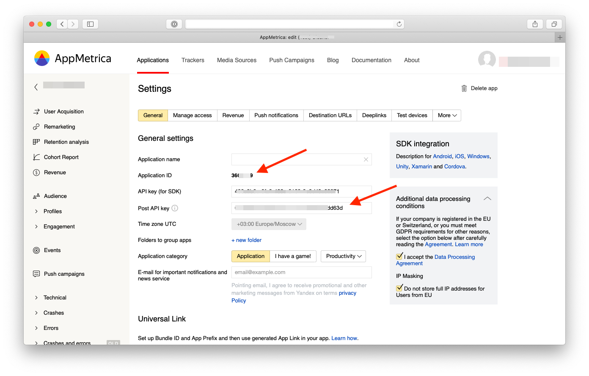
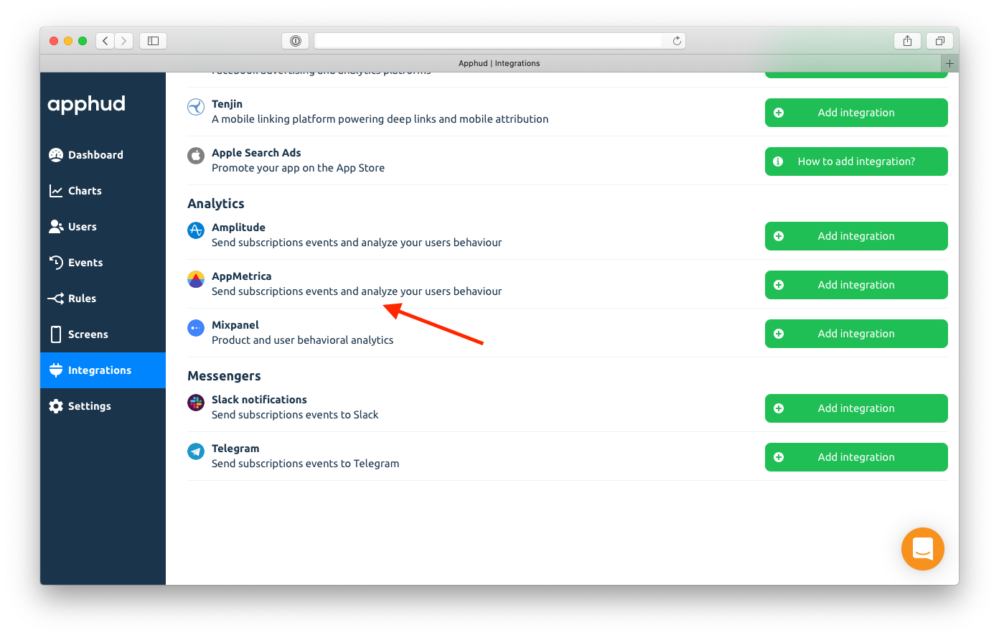
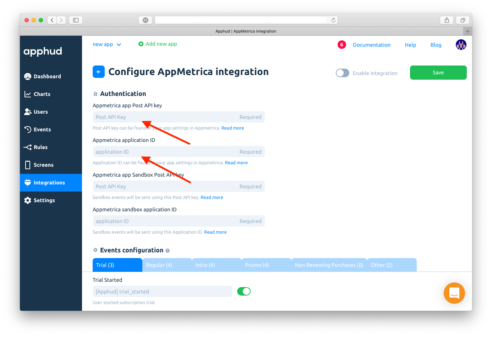
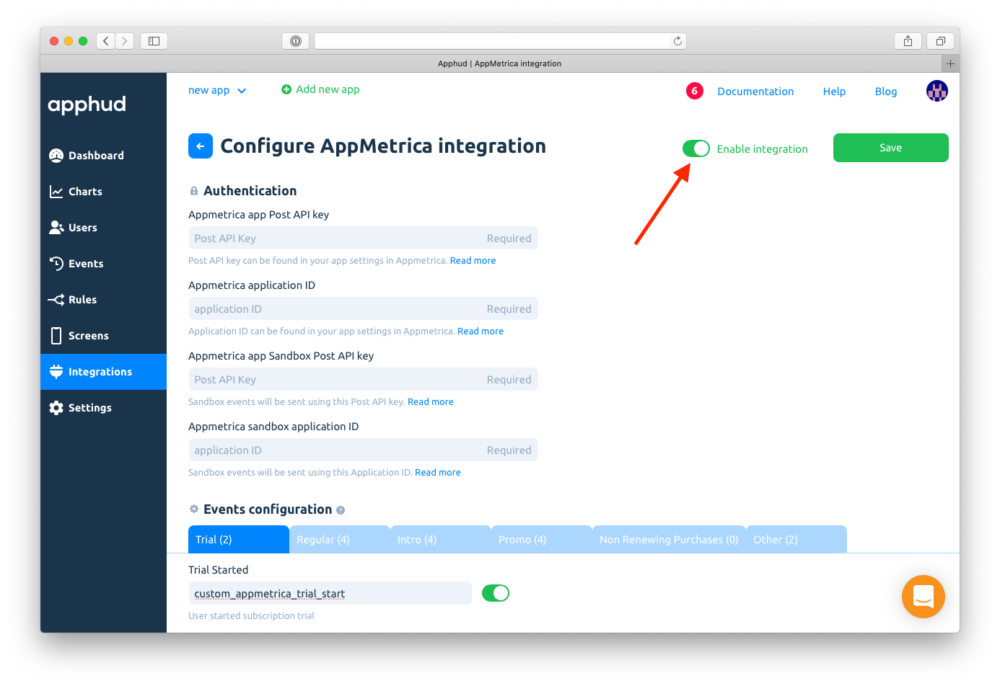

# AppMetrica

[AppMetrica](https://appmetrica.yandex.ru/) is a free real-time ad tracking and mobile app analytics solution.

Since AppMetrica doesn't support "fake" sessions so far, all events are being sent in **background** mode. So, they won't appear in the User profile, but you can see these in Devices events instead.

As soon as AppMetrica release "fake" sessions for server-to-server events, we will change it back to **foreground** mode.

Currently, POST API events are unavailable in Profiles. Looking forward AppMetrica will implement this (no particular date).

Keep in mind, that the data sent from the AppMetrica Post API is [synchronized every 4 hours](https://appmetrica.yandex.ru/docs/mobile-api/post/about.html).


Sending built-in revenue in AppMetrica is not yet supported due to limitations of their Server-to-Server API. Currently, we send all revenue values as custom parameters: `usd_price` __ and `local_price`


## How to Add Integration?



* [Integrate](../../getting-started/sdk-integration/#configure-apphud-sdk) Apphud SDK.
* [Integrate](https://appmetrica.yandex.ru/docs/mobile-sdk-dg/concepts/mobilesdk-about.html) AppMetrica.
* [Match User IDs](appmetrica.md#match-user-ids) between AppMetrica and Apphud.



* Open [AppMetrica](https://appmetrica.yandex.com) and go to Settings of your app.
* Copy **Application ID** and **Post API Key** fields (_not API key!_).





At [Apphud](https://app.apphud.com) go to _"Integrations"_ section and add AppMetrica:





Enter _Post API Key_ and _Application ID_ values into their corresponding fields:





You can enter your custom event names or disable some:





Enable integration and click Save:





## Match User IDs

Here is an example of initialising both SDKs with User IDs matching.



```swift
func application(_ application: UIApplication, didFinishLaunchingWithOptions launchOptions: [UIApplication.LaunchOptionsKey: Any]?) -> Bool {

    Apphud.start(apiKey: "YOUR_API_KEY")
    Apphud.setDelegate(self)
    
    if let configuration = YMMYandexMetricaConfiguration.init(apiKey: "AppMetrica-API-Key") {
        YMMYandexMetrica.activate(with: configuration)
        YMMYandexMetrica.setUserProfileID(Apphud.userID())
    }

    return true
}

// implement ApphudDelegate
func apphudDidChangeUserID(_ userID: String) {
    // Match again
    YMMYandexMetrica.setUserProfileID(Apphud.userID())
}
```



```kotlin
Apphud.start(apiKey: "YOUR_API_KEY")
val config: YandexMetricaConfig = YandexMetricaConfig.newConfigBuilder(Constants.Appmetrica_API_KEY).build()
YandexMetrica.activate(applicationContext, config)
YandexMetrica.setUserProfileID(Apphud.userId())
YandexMetrica.enableActivityAutoTracking(this)
```



```java
Apphud.start(apiKey: "YOUR_API_KEY")
YandexMetricaConfig config = YandexMetricaConfig.newConfigBuilder(API_key).build();
YandexMetrica.activate(getApplicationContext(), config);
YandexMetrica.setUserProfileID(Apphud.userId());
YandexMetrica.enableActivityAutoTracking(this);
```



## Events Cheat Sheet

This is a list of all possible events and their parameters that are being sent to AppMetrica.&#x20;


You can read more about subscription events [here](../../events/events.md) and about parameters [here](../../events/parameters-and-properties.md).




### Trial period started

_Default event name:_ `[Apphud] trial_started`

_Parameters:_

* `product_id`: String
* `unit`: String
* `units_count`: Integer

### Successful conversion from trial period to regular subscription

_Default event name:_ `[Apphud] trial_converted`

_Parameters:_

* `product_id`: String
* `local_price`: Float
* `currency`: String
* `usd_price`: Float

### Failed conversion from trial period to regular subscription

_Default event name:_ `[Apphud] trial_expired`

_Parameters:_

* `product_id`: String
* `reason`: String



### Trial Canceled

&#x20;_Default event name:_ `[Apphud] trial_canceled`

_Parameters:_

* `product_id`: String

### Subscription Canceled

&#x20;_Default event name:_ `[Apphud] subscription_canceled`

_Parameters:_

* `product_id`: String

### Autorenew disabled (Deprecated)

&#x20;_Default event name:_ `[Apphud] autorenew_disabled`

_Parameters:_

* `product_id`: String

### Autorenew enabled

_Default event name:_ `[Apphud] autorenew_enabled`

_Parameters:_

* `product_id`: String



### Introductory offer started

&#x20;_Default event name:_ `[Apphud] intro_started`

_Parameters:_

* `product_id`: String
* `local_price`: Float
* `currency`: String
* `usd_price`: Float
* `offer_type`: String
* `unit`: String
* `units_count`: Integer

### Introductory offer renewed

_Default event name:_ `[Apphud] intro_renewed`

_Parameters:_

* `product_id`: String
* `local_price`: Float
* `currency`: String
* `usd_price`: Float
* `offer_type`: String
* `unit`: String
* `units_count`: Integer

### Successful conversion from introductory offer to regular subscription

_Default event name:_ `[Apphud] intro_converted`

_Parameters:_

* `product_id`: String
* `local_price`: Float
* `currency`: String
* `usd_price`: Float
* `offer_type`: String

### Failed conversion from introductory offer to regular subscription or failed renew

_Default event name:_ `[Apphud] intro_expired`

_Parameters:_

* `product_id`: String
* `reason`: String
* `offer_type`: String

### Refund during introductory offer

_Default event name:_ `[Apphud] intro_refunded`

_Parameters:_

* `product_id`: String
* `local_price`: Float
* `currency`: String
* `usd_price`: Float
* `reason`: String
* `offer_type`: String



### Subscription started

&#x20;_Default event name:_ `[Apphud] subscription_started`

_Parameters:_

* `product_id`: String
* `local_price`: Float
* `currency`: String
* `usd_price`: Float

### Subscription renewed

_Default event name:_ `[Apphud] subscription_renewed`

_Parameters:_

* `product_id`: String
* `local_price`: Float
* `currency`: String
* `usd_price`: Float

### Subscription expired

_Default event name:_ `[Apphud] subscription_expired`

_Parameters:_

* `product_id`: String
* `reason`: String

### Subscription refunded

_Default event name:_ `[Apphud] subscription_refunded`

_Parameters:_

* `product_id`: String
* `local_price`: Float
* `currency`: String
* `usd_price`: Float
* `reason`: String



### Promotional offer started

&#x20;_Default event name:_ `[Apphud] promo_started`

_Parameters:_

* `product_id`: String
* `offer_id`: String
* `local_price`: Float
* `currency`: String
* `usd_price`: Float
* `offer_type`: String
* `unit`: String
* `units_count`: Integer

### Promotional offer renewed

_Default event name:_ `[Apphud] promo_renewed`

_Parameters:_

* `product_id`: String
* `offer_id`: String
* `local_price`: Float
* `currency`: String
* `usd_price`: Float
* `offer_type`: String
* `unit`: String
* `units_count`: Integer

### Successful conversion from promotional offer to regular subscription

_Default event name:_ `[Apphud] promo_converted`

_Parameters:_

* `product_id`: String
* `offer_id`: String
* `local_price`: Float
* `currency`: String
* `usd_price`: Float
* `offer_type`: String

### Failed conversion from promotional offer to regular subscription or failed renew

_Default event name:_ `[Apphud] promo_expired`

_Parameters:_

* `product_id`: String
* `offer_id`: String
* `reason`: String
* `offer_type`: String

### Refund during promotional offer

_Default event name:_ `[Apphud] promo_refunded`

_Parameters:_

* `product_id`: String
* `offer_id`: String
* `local_price`: Float
* `currency`: String
* `usd_price`: Float
* `reason`: String
* `offer_type`: String



### Non renewing purchase

&#x20;_Default event name:_ `[Apphud] non_renewing_purchase`

_Parameters:_

* `product_id`: String
* `local_price`: Float
* `currency`: String
* `usd_price`: Float

### Non renewing purchase refunded

_Default event name:_ `[Apphud] non_renewing_purchase_refunded`

_Parameters:_

* `product_id`: String
* `local_price`: Float
* `currency`: String
* `usd_price`: Float
* `reason`: String

### Billing issue

&#x20;_Default event name:_ `[Apphud] billing_issue`

_Parameters:_

* `product_id`: String

### Billing issue Resolved

&#x20;_Default event name:_ `[Apphud] billing_issue_resolved`

_Parameters:_

* `product_id`: String


