# Firebase & Google Analytics (Beta)

You can send subscription renewal events as well as non-renewing events to Firebase and Google Analytics.


Due to [significant limitations](firebase.md#limitations) we recommend using this integration only to send events to Google Analytics for product analysis. Once Google updates this API, we will update limitations. Stay tuned.


## Limitations

* This integration is in Beta, because Google Analytics API is marked as Beta.
* Conversions export to Google Ads is **not currently supported**.
* Viewing events sent in A/B experiment results is **not currently supported**.
* Events are being processed in Firebase & Google Analytics within a few hours (usually 3-6 hours).
* Since Firebase SDK automatically tracks in-app purchases when app is running, you may see increased LTV value because it will be a sum of Firebase and Apphud tracked events. Unfortunately, there is **no way to disable automatic purchase events collection** from Firebase. So keep this in mind when adding an integration.&#x20;

## Requirements

* Apphud iOS SDK 2.2.0 or higher.
* Apphud Android SDK 1.2.0 or higher.
* Some code is required to properly match users sent from Firebase SDK and Apphud, see instructions below.

## How to Add Integration?



* [Integrate](../../getting-started/sdk-integration/) Apphud SDK.
* [Integrate](https://firebase.google.com/docs/guides) Firebase.
* [Match Users](firebase.md#required-match-user-ids) between Firebase and Apphud and pass instance ID to Apphud.



* Open [Google Analytics](https://analytics.google.com/) and go to **Admin settings** of your project.
* Go to **Data Streams** and open your App's Stream details page.

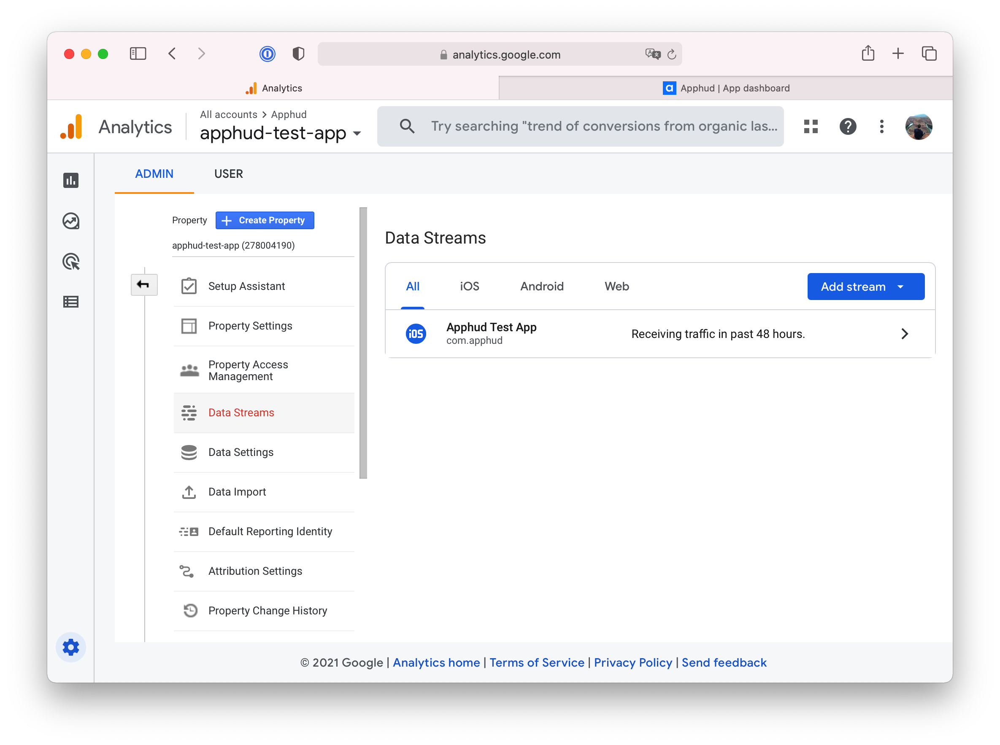



At App stream details page find and **copy** Firebase App ID field.

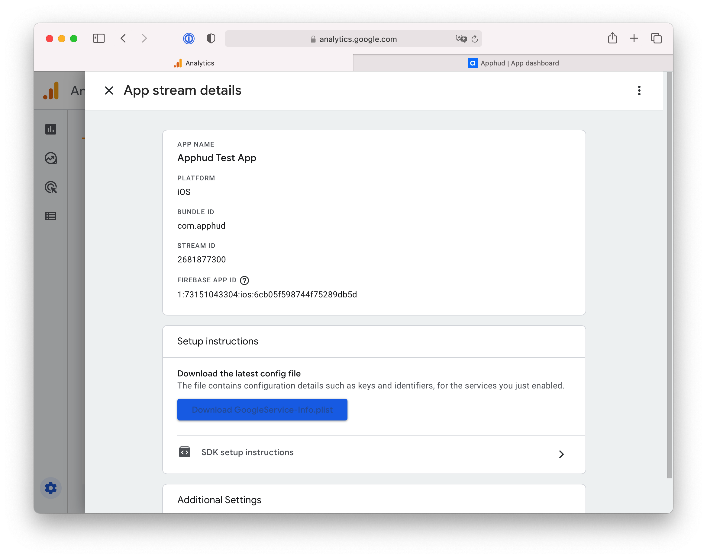



Under Additional settings go to **Measurement Protocol API secrets** page and create a new API Secret if it doesn't exist. **Copy** the value.

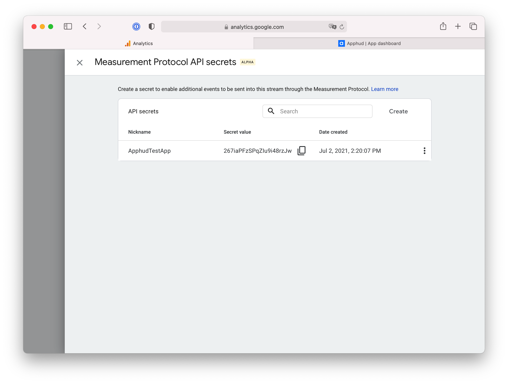



At [Apphud](https://app.apphud.com) go to _"Integrations"_ section and add Firebase:

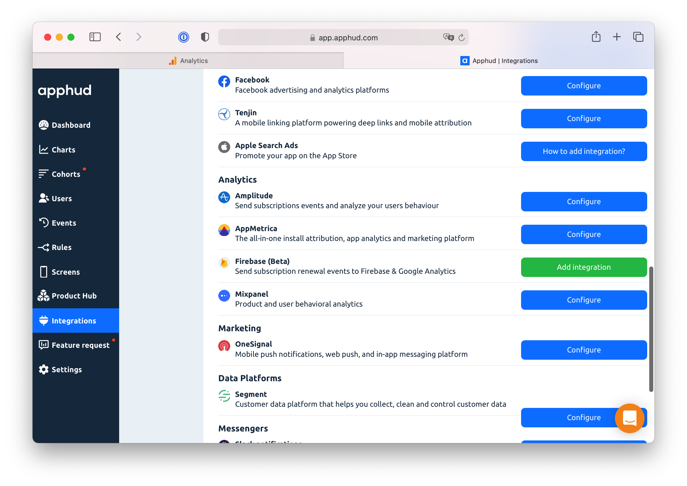



* Paste Firebase App ID.
* Paste Client API Secret.&#x20;

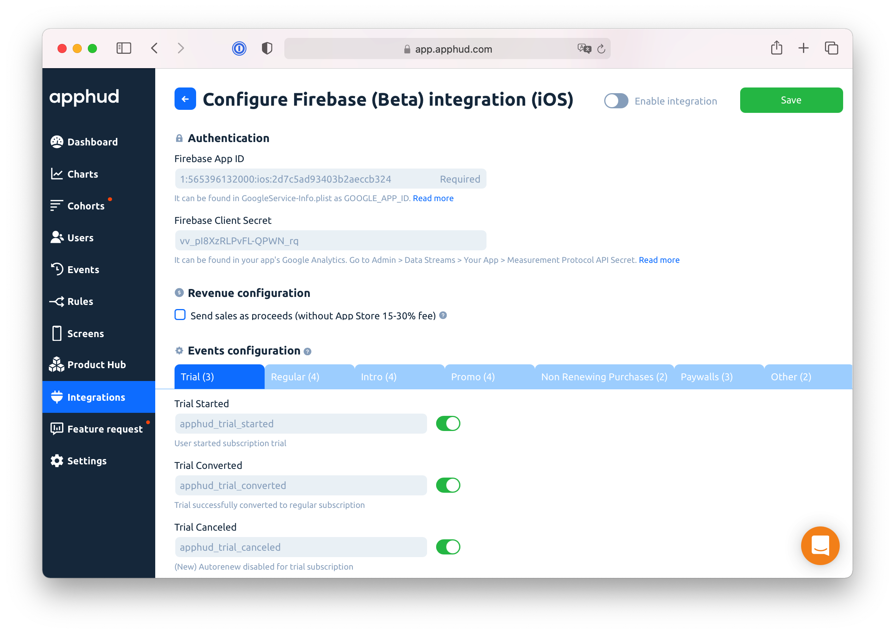



You can enable or disable each particular event:

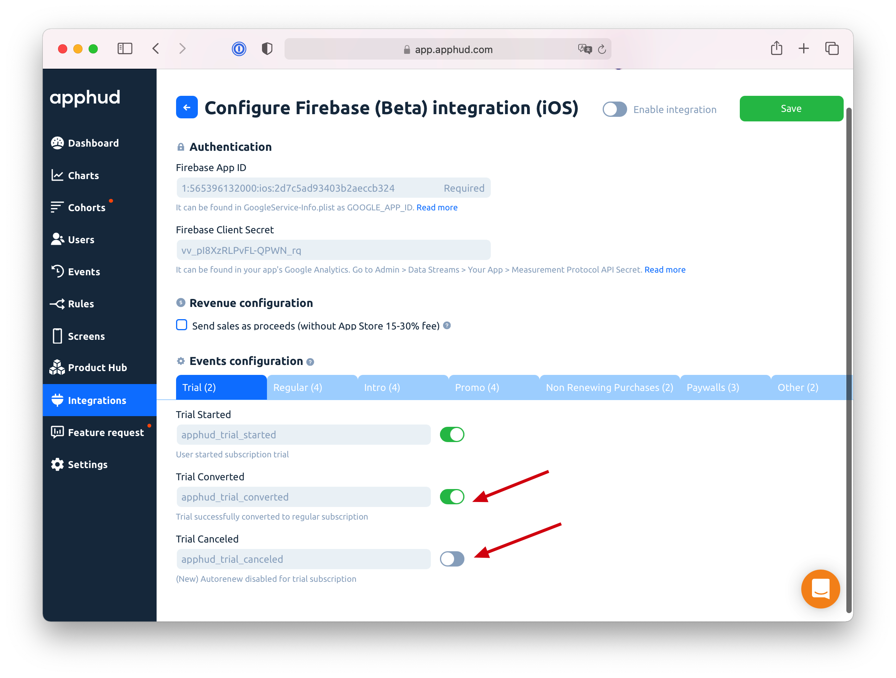

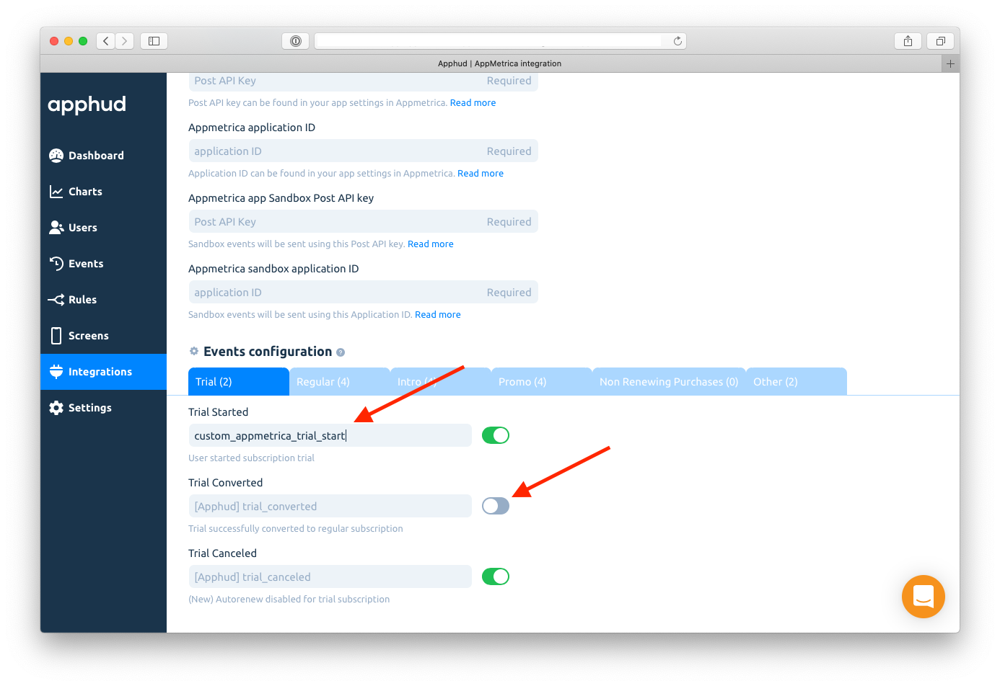



Enable integration and click Save:

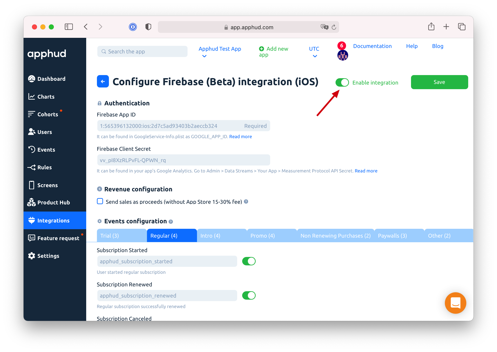



## \[Required] Match Users

To correctly collect events sent from both Firebase SDK and Apphud server, you need to match User IDs between Apphud and Firebase. Just call:



```swift
Analytics.setUserID(Apphud.userID())
if let instanceID = Analytics.appInstanceID() {
    Apphud.addAttribution(data: nil, from: .firebase, identifer: instanceID,  callback: nil)
}
```



```kotlin
FirebaseAnalytics.getInstance(this).setUserId(Apphud.userId())
FirebaseAnalytics.getInstance(this).appInstanceId.addOnSuccessListener { instanceID ->
    Apphud.addAttribution(ApphudAttributionProvider.firebase, null, instanceID)
}.addOnFailureListener {
    // Optional - Show some error
}.addOnCanceledListener {
    //Optional - Show some error
}
```



More information about User ID matching can be found [here](https://support.google.com/analytics/answer/9213390).

## Events Mapping

Events are mapped in the following way:

| Apphud Event Name                                                                               | Firebase Event Name                                                                                                                  |
| ----------------------------------------------------------------------------------------------- | ------------------------------------------------------------------------------------------------------------------------------------ |
| Trial Started                                                                                   | `apphud_trial_started`                                                                                                               |
| <p>Trial Converted, Subscription Started, <br>Subscription Renewed and other revenue events</p> | `purchase`                                                                                                                           |
| Trial Canceled, Subscription Canceled, Paywall Checkout Initiated, etc.                         | <p><code>apphud_trial_canceled, apphud_subscription_canceled,</code></p><p><code>apphud_paywall_checkount_initiated, etc.</code></p> |
| Subscription Refunded                                                                           | `refund`                                                                                                                             |

## User Properties


You **must have at least one** event to be successfully sent to Firebase. When event is processed by Firebase, User Properties will appear in desired selection. Keep in mind that events are being processed in Firebase & Google Analytics within a few hours (usually 3-6 hours).


Besides events, Apphud also sends User Properties to Firebase. This helps you to create custom audiences or Custom Definitions and target specific users in A/B tests or view analytics for specific audience. The list of User Properties and its values can be found [here](../../events/parameters-and-properties.md#user-properties).

### Custom Dimensions

In order to use User Properties in your analytics you should first assign them to a custom dimension.

* Open your Firebase Console > Custom Definitions > Create custom dimensions.
* While creating custom dimensions select _User scope._
* Enter name and description.
* Select User Property, for example, `apphud_payments_count`. Click Save.

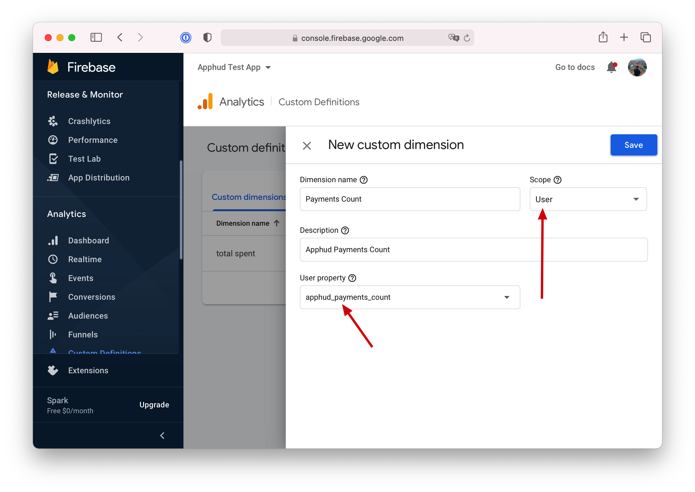

### Custom Audiences


In order to create custom audience using Apphud User Property you should first create **Custom Dimension**. See instructions above.


After creating a custom dimension, you can create custom audiences.

* Open your Firebase Console > Audiences > Create custom dimensions.
* Select Custom > your custom dimension name, for example, `apphud_total_spent`
* Edit condition on this property, for example, `> 0`. Click Save.
* Custom Audience is now available in both Firebase and Google Analytics.

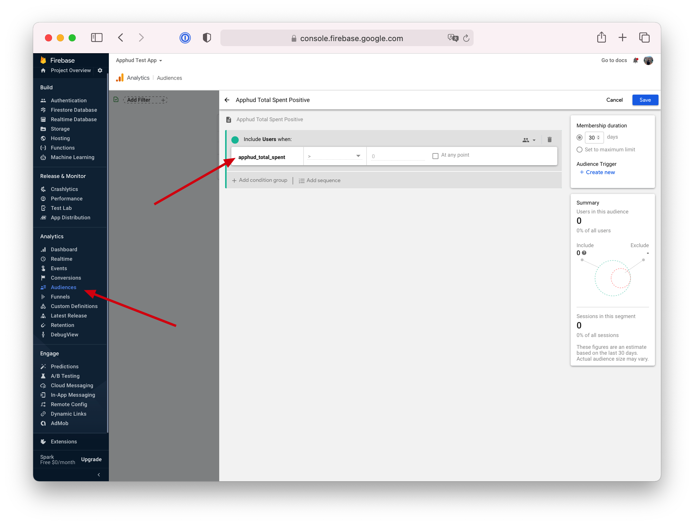

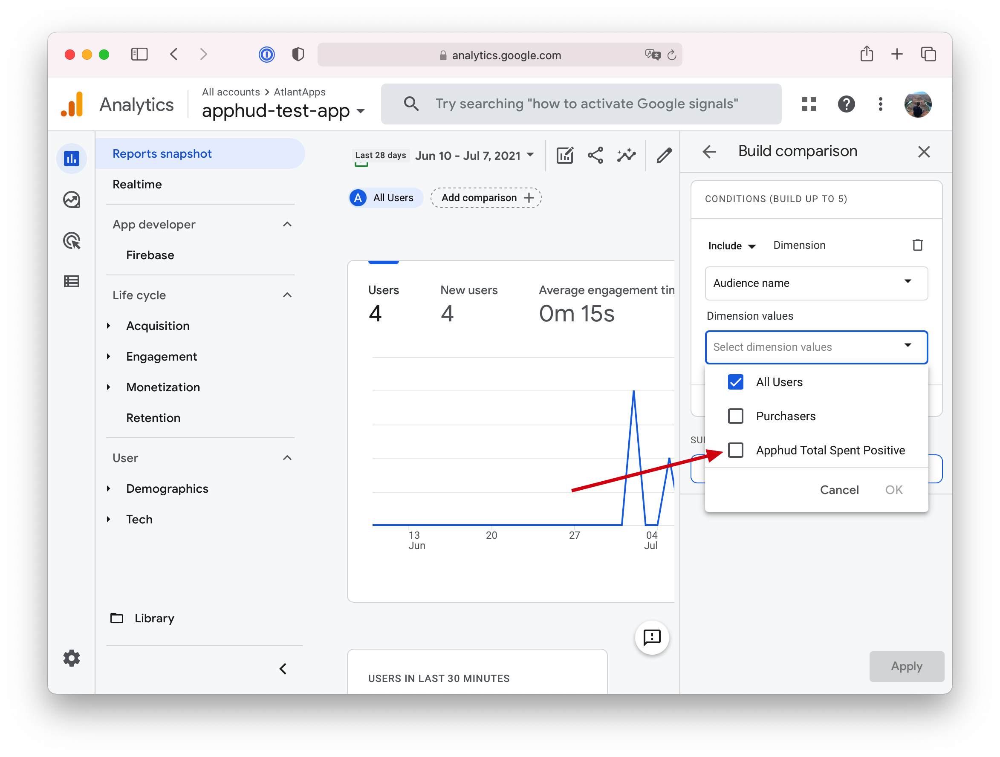

## View Firebase A/B test results in Apphud

You can view results of A/B tests in Apphud by sending remote config values to our service. You will be able to add filter of your test variant for every chart including cohort chart.

See [this](https://blog.apphud.com/analyzing-firebase-a-b-test-results-in-apphud-2/) great blog post for details.
