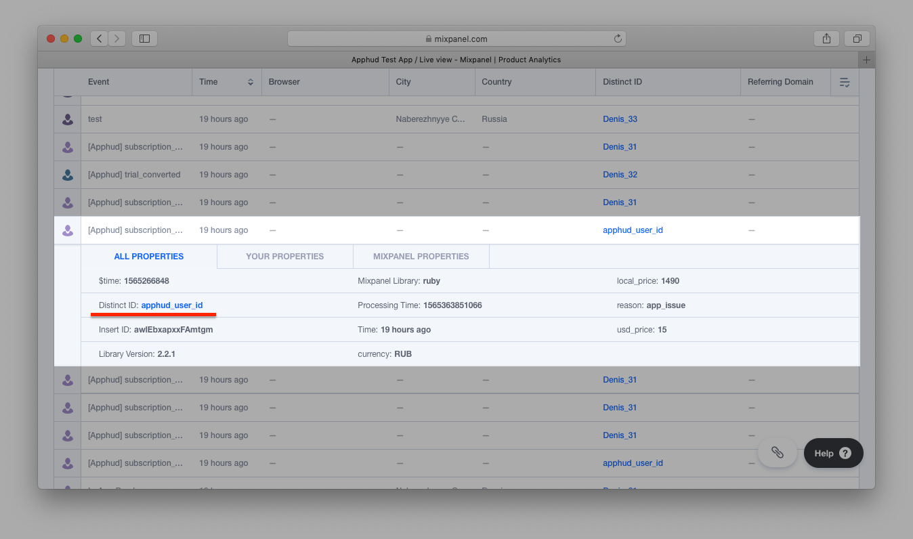

# Mixpanel

[Mixpanel](http://mixpanel.com) is a powerful mobile analytics service. Send events to Mixpanel via Apphud, analyze your users behavior and make necessary decisions.

## How to Add Integration?


Please make sure that Mixpanel Collection common mobile events is **Disabled**. See [here](https://help.mixpanel.com/hc/en-us/articles/115004596186-Default-Mobile-Events-Collection) for details.




* [Integrate](../../getting-started/sdk-integration/#configure-apphud-sdk) Apphud SDK.
* [Integrate](https://developer.mixpanel.com/docs/swift) Mixpanel SDK.
* [Match User IDs](mixpanel.md#match-user-ids) between Mixpanel and Apphud.
* Enable Service credentials for [importing historical events](mixpanel.md#undefined) (optional).



In order not to receive Mixpanel automatic In-App purchase events **disable collection common mobile events**. Otherwise, if user, for example, starts a trial period Mixpanel will consider this as a revenue. More details [here](https://help.mixpanel.com/hc/en-us/articles/115004596186-Default-Mobile-Events-Collection).





At [Apphud](https://app.apphud.com/) go to _"Integrations"_ section and add Mixpanel:&#x20;





Paste _Mixpanel Token_ into the _"Mixpanel production app token"_ field. The token is the same as you use in your app.





You may have one more app created in Mixpanel used for testing purposes not to mix test and live data. If you have such app you can paste it's _Mixpanel Token_ into _"Mixpanel test app token"_ field.





You can enter your custom event names or disable some:





Enable integration:





If you want to send Revenue information to Mixpanel, check _"Send Revenue properties to Mixpanel"_. Click _"Save"_:

.png>)



## Match User IDs

Here is an example of initialising both SDKs with User IDs matching.



```swift
func application(_ application: UIApplication, didFinishLaunchingWithOptions launchOptions: [UIApplication.LaunchOptionsKey: Any]?) -> Bool {

    Apphud.start(apiKey: "YOUR_API_KEY")
    Apphud.setDelegate(self)
    
    Mixpanel.initialize(token: mixpanel_token) 
    Mixpanel.mainInstance().identify(distinctId: Apphud.userID())

    return true
}

func apphudDidChangeUserID(_ userID: String) {
    // Match again
    Mixpanel.mainInstance().identify(distinctId: Apphud.userID())
}
```



```objectivec
- (BOOL)application:(UIApplication *)application didFinishLaunchingWithOptions:(NSDictionary *)launchOptions {
    // Override point for customization after application launch.
    
    [Apphud startWithApiKey:@"APPHUD_API_KEY" userID:nil];
    [Apphud setDelegate:self];
    
    [Mixpanel sharedInstanceWithToken:@"MIXPANEL_TOKEN"];
    [Mixpanel.sharedInstance identify:Apphud.userID];
    
    return YES;
}

- (void)apphudDidChangeUserID:(NSString *)userID {
    [Mixpanel.sharedInstance identify:Apphud.userID];
}
```



```java
Apphud.start(apiKey: "YOUR_API_KEY");
MixpanelAPI mixpanel = MixpanelAPI.getInstance(context, MIXPANEL_TOKEN);
mixpanel.identify(Apphud.userID());
```



## Importing Historical Events

You can specify service credentials for importing historical events (for example, renewals that occurred before Apphud SDK integration).

You will need to provide Project ID and Service Account credentials. See [here](https://developer.mixpanel.com/reference/service-accounts) for details.


## Events Cheat Sheet

This is a list of all possible events and their parameters that are being sent to Mixpanel.&#x20;


You can read more about subscription events [here](../../events/events.md) and parameters [here](../../events/parameters-and-properties.md).




### Trial period started

_Default event name:_ `[Apphud] trial_started`

_Parameters:_

* `product_id`: String
* `unit`: String
* `units_count`: Integer

### Successful conversion from trial period to regular subscription

_Default event name:_ `[Apphud] trial_converted`

_Parameters:_

* `product_id`: String
* `local_price`: Float
* `currency`: String
* `usd_price`: Float

### Failed conversion from trial period to regular subscription

_Default event name:_ `[Apphud] trial_expired`

_Parameters:_

* `product_id`: String
* `reason`: String



### Trial Canceled

&#x20;_Default event name:_ `[Apphud] trial_canceled`

_Parameters:_

* `product_id`: String

### Subscription Canceled

&#x20;_Default event name:_ `[Apphud] subscription_canceled`

_Parameters:_

* `product_id`: String

### Autorenew disabled (Deprecated)

&#x20;_Default event name:_ `[Apphud] autorenew_disabled`

_Parameters:_

* `product_id`: String

### Autorenew enabled

_Default event name:_ `[Apphud] autorenew_enabled`

_Parameters:_

* `product_id`: String



### Introductory offer started

&#x20;_Default event name:_ `[Apphud] intro_started`

_Parameters:_

* `product_id`: String
* `local_price`: Float
* `currency`: String
* `usd_price`: Float
* `offer_type`: String
* `unit`: String
* `units_count`: Integer

### Introductory offer renewed

_Default event name:_ `[Apphud] intro_renewed`

_Parameters:_

* `product_id`: String
* `local_price`: Float
* `currency`: String
* `usd_price`: Float
* `offer_type`: String
* `unit`: String
* `units_count`: Integer

### Successful conversion from introductory offer to regular subscription

_Default event name:_ `[Apphud] intro_converted`

_Parameters:_

* `product_id`: String
* `local_price`: Float
* `currency`: String
* `usd_price`: Float
* `offer_type`: String

### Failed conversion from introductory offer to regular subscription or failed renew

_Default event name:_ `[Apphud] intro_expired`

_Parameters:_

* `product_id`: String
* `reason`: String
* `offer_type`: String

### Refund during introductory offer

_Default event name:_ `[Apphud] intro_refunded`

_Parameters:_

* `product_id`: String
* `local_price`: Float
* `currency`: String
* `usd_price`: Float
* `reason`: String
* `offer_type`: String



### Subscription started

&#x20;_Default event name:_ `[Apphud] subscription_started`

_Parameters:_

* `product_id`: String
* `local_price`: Float
* `currency`: String
* `usd_price`: Float

### Subscription renewed

_Default event name:_ `[Apphud] subscription_renewed`

_Parameters:_

* `product_id`: String
* `local_price`: Float
* `currency`: String
* `usd_price`: Float

### Subscription expired

_Default event name:_ `[Apphud] subscription_expired`

_Parameters:_

* `product_id`: String
* `reason`: String

### Subscription refunded

_Default event name:_ `[Apphud] subscription_refunded`

_Parameters:_

* `product_id`: String
* `local_price`: Float
* `currency`: String
* `usd_price`: Float
* `reason`: String



### Promotional offer started

&#x20;_Default event name:_ `[Apphud] promo_started`

_Parameters:_

* `product_id`: String
* `offer_id`: String
* `local_price`: Float
* `currency`: String
* `usd_price`: Float
* `offer_type`: String
* `unit`: String
* `units_count`: Integer

### Promotional offer renewed

_Default event name:_ `[Apphud] promo_renewed`

_Parameters:_

* `product_id`: String
* `offer_id`: String
* `local_price`: Float
* `currency`: String
* `usd_price`: Float
* `offer_type`: String
* `unit`: String
* `units_count`: Integer

### Successful conversion from promotional offer to regular subscription

_Default event name:_ `[Apphud] promo_converted`

_Parameters:_

* `product_id`: String
* `offer_id`: String
* `local_price`: Float
* `currency`: String
* `usd_price`: Float
* `offer_type`: String

### Failed conversion from promotional offer to regular subscription or failed renew

_Default event name:_ `[Apphud] promo_expired`

_Parameters:_

* `product_id`: String
* `offer_id`: String
* `reason`: String
* `offer_type`: String

### Refund during promotional offer

_Default event name:_ `[Apphud] promo_refunded`

_Parameters:_

* `product_id`: String
* `offer_id`: String
* `local_price`: Float
* `currency`: String
* `usd_price`: Float
* `reason`: String
* `offer_type`: String



### Non renewing purchase

&#x20;_Default event name:_ `[Apphud] non_renewing_purchase`

_Parameters:_

* `product_id`: String
* `local_price`: Float
* `currency`: String
* `usd_price`: Float

### Non renewing purchase refunded

_Default event name:_ `[Apphud] non_renewing_refunded`

_Parameters:_

* `product_id`: String
* `local_price`: Float
* `currency`: String
* `usd_price`: Float
* `reason`: String

### Billing issue

&#x20;_Default event name:_ `[Apphud] billing_issue`

_Parameters:_

* `product_id`: String

### Billing issue Resolved

&#x20;_Default event name:_ `[Apphud] billing_issue_resolved`

_Parameters:_

* `product_id`: String



These events:

* `[Apphud] trial_converted`,
* `[Apphud] intro_started`,
* `[Apphud] intro_renewed`,
* `[Apphud] intro_converted`,
* `[Apphud] intro_refunded`,
* `[Apphud] subscription_started`&#x20;
* `[Apphud] subscription_renewed`,
* `[Apphud] subscription_refunded`,
* `[Apphud] promo_started`,
* `[Apphud] promo_renewed`,
* `[Apphud] promo_converted`,
* `[Apphud] promo_refunded`,

can be optionally sent to Mixpanel with Mixpanel's build-in **Revenue parameter** converted to USD. This option is **off by default**, but you can enable this feature in integration settings:

You can also choose between sending revenue as sales or proceeds (without Apple 15%-30% commission).


&#x20;You can read more how Apple calculates commission [here](https://developer.apple.com/app-store/subscriptions/#revenue-after-one-year).


## User Properties <a href="#user-properties" id="user-properties"></a>

In the table below you can see the list of user properties that are sent to Mixpanel.


More information about user properties can be found [here](../../events/parameters-and-properties.md).


| Parameter                       | Type    |
| ------------------------------- | ------- |
| `[Apphud] status-group_name`    | String  |
| `[Apphud] autorenew-group_name` | Boolean |
| `[Apphud] total_spent`          | Float   |
| `[Apphud] paying`               | Boolean |
| `[Apphud] payments_count`       | Integer |

## Sending Test Event <a href="#sending-test-event" id="sending-test-event"></a>

You may send test event to Mixpanel to check if integration is set up correctly.&#x20;

1. Click _"…"_ and then in dropdown click on _"Send test event"._
2. You will see new user in _"Live view"_ report:


