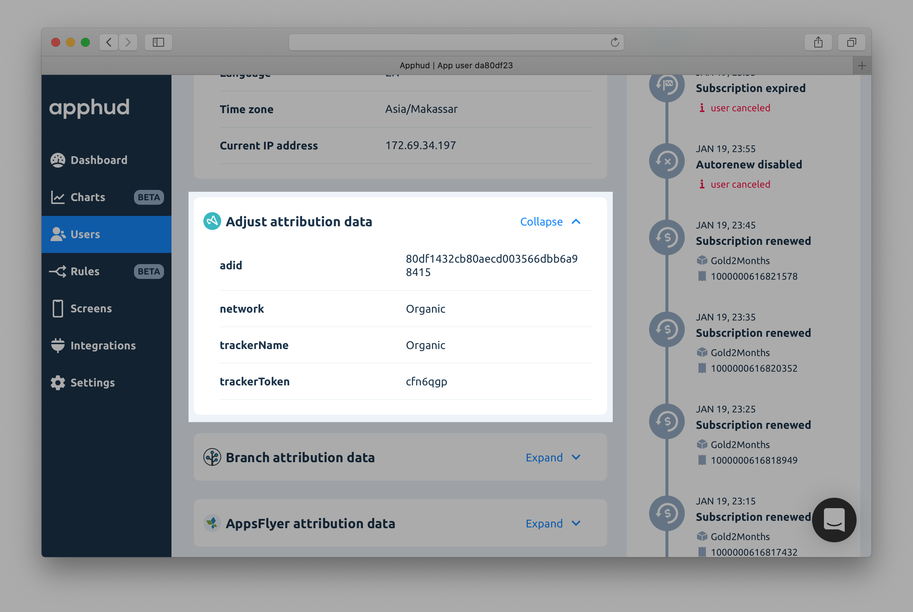
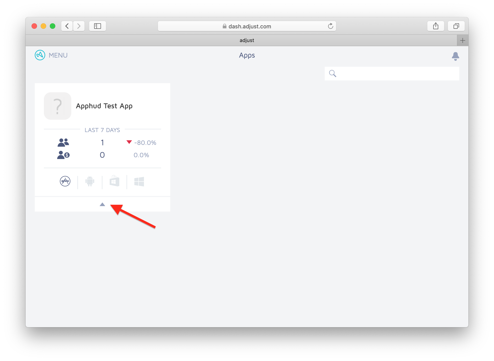
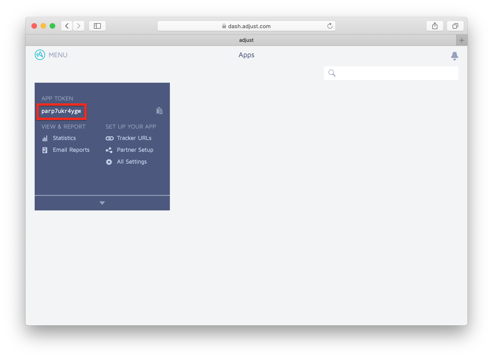
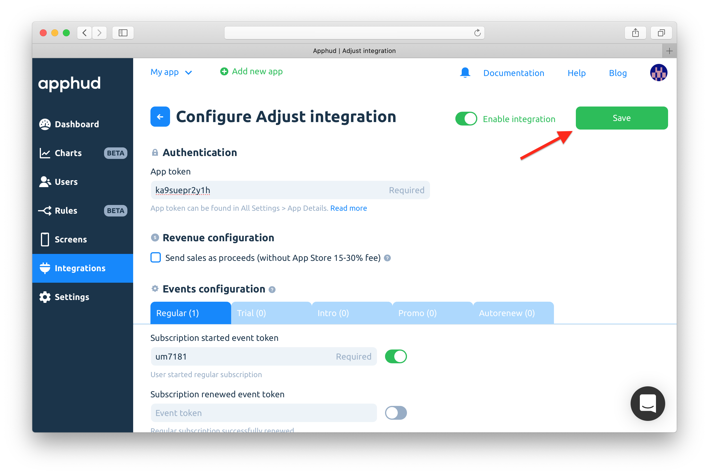
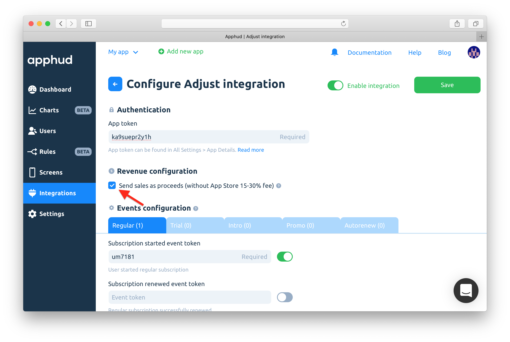

# Adjust

[Adjust](https://www.adjust.com/) is the industry leader in mobile measurement and fraud prevention.

## How does Integration Work? <a href="#how-does-integration-work" id="how-does-integration-work"></a>

This integration works in two ways.

### 1. Receive Attribution Data from Adjust <a href="#1-receive-attribution-data-from-appsflyer" id="1-receive-attribution-data-from-appsflyer"></a>

Once you successfully configured Adjust integration, Apphud will receive attribution data from it. You can view this data on user's page:



### 2. Send Subscription Events to Adjust

Apphud can also send all subscription events to Adjust. So you could view these events in Adjust dashboard and Adjust could pass this data to their partners. This will help to measure efficiency of your ad campaigns.

## How to Add Integration? <a href="#how-to-add-integration" id="how-to-add-integration"></a>



* [Integrate](http://help.adjust.com/getting-started) Adjust SDK.
* [Pass attribution data](adjust.md#pass-attribution-data-to-apphud-required) to Apphud (required).



Open [Adjust](https://dash.adjust.com/) and sign in.



Copy _App token._ Select your app and click here:



Copy _App token_:





Create desired subscription events in Adjust, for example, "trial\_started", "trial\_converted", "subscription\_renewed" etc. You can view the list of all available events [here](../../events/events.md). _**You can create event tokens only for events that you need, there is no need to add all events.**_

In Adjust open app's _"All Settings"_, go to "_Events"_ section and create necessary events. For each event, Adjust will generate unique _Event token_.

As a result, you will have something like this:





At [Apphud](https://app.apphud.com/) go to _"Integrations"_ section and add Adjust:

.png>)



Paste Adjust _App Token_ into _"App token"_ field:





Paste Adjust _Event tokens_ from step 4 into corresponding fields and turn on switches. Enable events that you need:

.png>)



Enable integration:





Save changes:





## Pass Attribution Data to Apphud (required)

Send attribution data to Apphud (or at least Adjust ID):



```swift
adjustConfig?.delegate = self
...

func adjustAttributionChanged(_ attribution: ADJAttribution?) {
    if let data = attribution?.dictionary() {
        Apphud.addAttribution(data: data, from: .adjust) { (result) in }
    } else if let adid = Adjust.adid() {
        Apphud.addAttribution(data: ["adid" : adid], from: .adjust) { (result) in }
    }
}

func adjustSessionTrackingSucceeded(_ sessionSuccessResponseData: ADJSessionSuccess?) {
    if let data = Adjust.attribution()?.dictionary() {
        Apphud.addAttribution(data: data, from: .adjust) { (result) in }
    } else if let adid = Adjust.adid() {
        Apphud.addAttribution(data: ["adid" : adid], from: .adjust) { (result) in }
    }
}
```



```objectivec
// set delegate to ADJConfig
config.delegate = self;
...

- (void)adjustAttributionChanged:(ADJAttribution *)attribution {
    [self sendAdjustAttribution:attribution];
}

- (void)adjustSessionTrackingSucceeded:(ADJSessionSuccess *)sessionSuccessResponseData {
    [self sendAdjustAttribution:Adjust.attribution];
}

- (void)sendAdjustAttribution:(ADJAttribution*)attribution {
    if (attribution != nil && attribution.adid != nil) {
            [Apphud addAttributionWithData:attribution.dictionary from:ApphudAttributionProviderAdjust identifer:nil callback:^(BOOL result) {
            }];
    } else if (Adjust.adid != nil) {
        [Apphud addAttributionWithData:@{@"adid" : Adjust.adid} from:ApphudAttributionProviderAdjust identifer:nil callback:^(BOOL result) {
            }];
    }
}
```



```kotlin
fun setupAdjust() {
    val listener = object : OnAttributionChangedListener {
        override fun onAttributionChanged(attribution: AdjustAttribution) {
            Apphud.addAttribution(ApphudAttributionProvider.adjust, attribution.convertToMap(), attribution.adid)
        }
    }
    val sessionListener = object : OnSessionTrackingSucceededListener {
        override fun onFinishedSessionTrackingSucceeded(sessionSuccessResponseData: AdjustSessionSuccess) {
            Apphud.addAttribution(ApphudAttributionProvider.adjust, null, sessionSuccessResponseData.adid)
        }
    }
    val env = AdjustConfig.ENVIRONMENT_PRODUCTION
    val config = AdjustConfig(this, "YOUR_ADJUST_TOKEN", env)
    config.setOnAttributionChangedListener(listener)
    config.setOnSessionTrackingSucceededListener(sessionListener)
    Adjust.onCreate(config)
}

fun AdjustAttribution.convertToMap() = mapOf<String, Any>(
    "trackerToken" to trackerToken,
    "trackerName" to trackerName,
    "network" to network,
    "campaign" to campaign,
    "adgroup" to adgroup,
    "creative" to creative,
    "clickLabel" to clickLabel,
    "adid" to adid
)
```




While configuring integration you can also choose between sending revenue as sales or proceeds (without Apple/Google 15%-30% commission).




&#x20;You can read more how Apple calculates commission [here](https://developer.apple.com/app-store/subscriptions/#revenue-after-one-year).



In order to receive Adjust attribution data from Facebook, you should accept Facebook’s "Advanced Mobile Measurement Agreement" using [this link](https://www.facebook.com/ads/manage/advanced\_mobile\_measurement/app\_based\_tos/).


## Request IDFA Consent (required)

Starting iOS 14.5 access to IDFA requires user consent. You should request IDFA manually using _AppTrackingTransparency framework_ and pass it to Apphud. Read more [here](../../getting-started/idfa-ios-14.md).

## Testing Adjust Integration (iOS) <a href="#sending-test-event" id="sending-test-event"></a>

To test Adjust integration from scratch you should do the following:

* Reset IDFA (Settings > Privacy > Advertising > Reset Advertising Identifier).
* Uninstall the app.
* Make sure you initialized Adjust SDK with `ADJEnvironmentSandbox` environment. Don't forget to change back to `ADJEnvironmentProduction` before release!
* Make sure `adjustAttributionChanged(_ attribution: ADJAttribution?)` delegate method is called.
* If _Adjust Attribution Data_ block exists in your user's page in Apphud, then integration is successful.
* When viewing events in Adjust Dashboard, make sure you enabled _Sandbox Mode_ in filter pane.&#x20;

## &#x20;Events Cheat Sheet

This is a list of all possible events and their parameters that can be sent to AppsFlyer.&#x20;


You can read more about subscription events [here](https://docs.apphud.com/events/events) and parameters [here](../../events/parameters-and-properties.md).




### Trial period started parameters

* `partner_params.product_id`: String

### Successful conversion from trial period to regular subscription parameters

* `partner_params.product_id`: String
* `revenue`: Float
* `currency`: String

### Failed conversion from trial period to regular subscription parameters

* `partner_params.product_id`: String
* `partner_params.reason`: String



### Trial Canceled parameters

* `partner_params.product_id`: String

### Subscription Canceled parameters

* `partner_params.product_id`: String

### Autorenew disabled parameters (Deprecated)

* `partner_params.product_id`: String

### Autorenew enabled parameters

* `partner_params.product_id`: String



### Introductory offer started parameters

* `partner_params.product_id`: String
* `partner_params.offer_type`: String
* `revenue`: Float
* `currency`: String

### Introductory offer renewed parameters

* `partner_params.product_id`: String
* `partner_params.offer_type`: String
* `revenue`: Float
* `currency`: String

### Successful conversion from introductory offer to regular subscription parameters

* `partner_params.product_id`: String
* `partner_params.offer_type`: String
* `revenue`: Float
* `currency`: String

### Failed conversion from introductory offer to regular subscription or failed renew parameters

* `partner_params.product_id`: String
* `partner_params.reason`: String
* `partner_params.offer_type`: String

### Refund during introductory offer parameters

* `partner_params.product_id`: String
* `partner_params.offer_type`: String
* `partner_params.reason`: String



### Subscription started parameters

* `partner_params.product_id`: String
* `revenue`: Float
* `currency`: String

### Subscription renewed parameters

* `partner_params.product_id`: String
* `revenue`: Float
* `currency`: String

### Subscription expired parameters

* `partner_params.product_id`: String
* `partner_params.reason`: String

### Subscription refunded parameters

* `partner_params.product_id`: String
* `partner_params.reason`: String



### Promotional offer started parameters

* `partner_params.product_id`: String
* `partner_params.offer_id`: String
* `partner_params.offer_type`: String
* `revenue`: Float
* `currency`: String

### Promotional offer renewed parameters

* `partner_params.product_id`: String
* `partner_params.offer_id`: String
* `partner_params.offer_type`: String
* `revenue`: Float
* `currency`: String

### Successful conversion from promotional offer to regular subscription parameters

* `partner_params.product_id`: String
* `partner_params.offer_id`: String
* `partner_params.offer_type`: String
* `revenue`: Float
* `currency`: String

### Failed conversion from promotional offer to regular subscription or failed renew parameters

* `partner_params.product_id`: String
* `partner_params.offer_id`: String
* `partner_params.offer_type`: String
* `partner_params.reason`: String

### Refund during promotional offer parameters

* `partner_params.product_id`: String
* `partner_params.offer_id`: String
* `partner_params.offer_type`: String
* `partner_params.reason`: String



### Non renewing purchase parameters

* `partner_params.product_id`: String
* `revenue`: Float
* `currency`: String

### Non renewing purchase refunded parameters

* `partner_params.product_id`: String
* `partner_params.reason`: String

### Billing issue parameters

* `partner_params.product_id`: String

### Billing issue resolved parameters

* `partner_params.product_id`: String



Please note: we don't send revenue properties with refund events. That's because Adjust API currently doesn't support sending revenue with a negative value.


For each event Apphud includes `environment`parameter depending on environment of the subscription.

