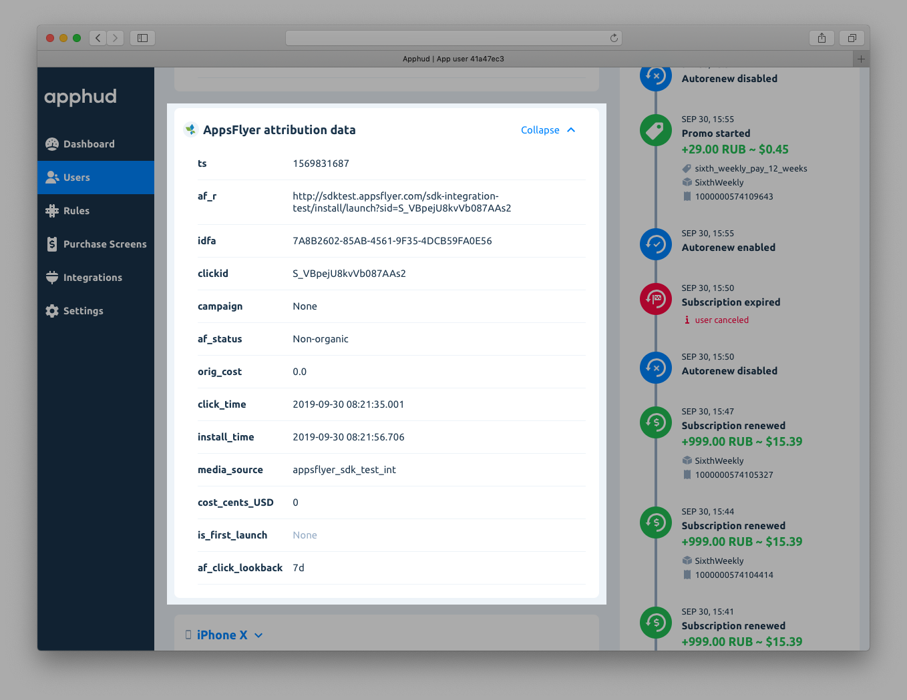
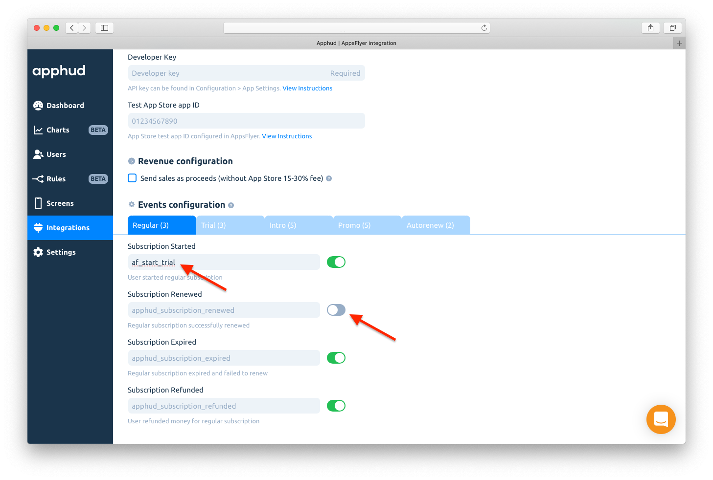
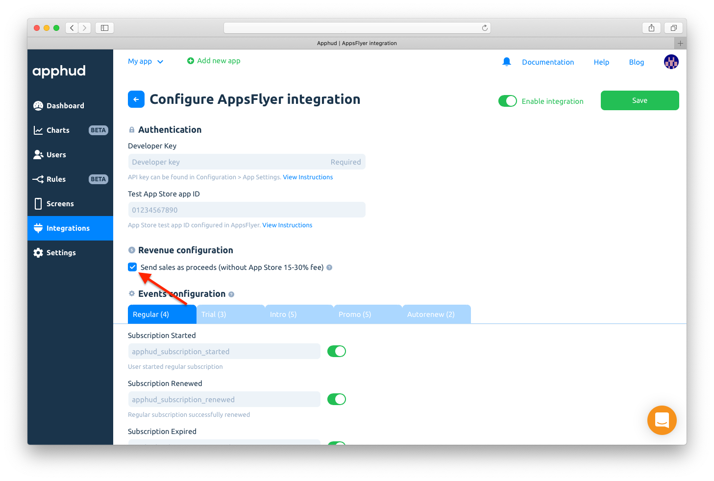
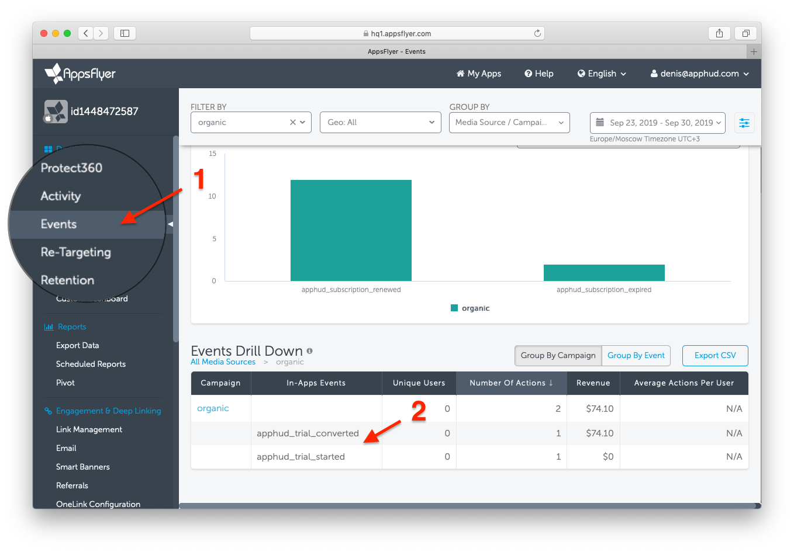

# AppsFlyer

[AppsFlyer](http://appsflyer.com) is the world's leading mobile attribution & marketing analytics platform, helping app marketers around the world make better decisions.

## How does Integration Work?

This integration works in two ways.

### 1. Receive Attribution Data from AppsFlyer

Once you successfully configured AppsFlyer integration, Apphud will receive attribution data from it. You can view this data on user's page:



### 2. Send Subscription Events to AppsFlyer

Apphud can also send all subscription events to AppsFlyer. So you could view these events in AppsFlyer dashboard and AppsFlyer could pass this data to their partners. This will help to measure efficiency of your ad campaigns.

## How to Add Integration? <a href="#how-to-add-integration" id="how-to-add-integration"></a>



* [Integrate](https://support.appsflyer.com/hc/en-us/categories/201114756-SDK-integration-) AppsFlyer SDK into your app.
* [Pass attribution data](appsflyer.md#pass-attribution-data-to-apphud-required) to Apphud (required).



At [Apphud](https://app.apphud.com/) go to _"Integrations"_ section and add AppsFlyer:&#x20;

.png>)



Paste _AppsFlyer Dev Key_ into _"Developer key"_ field:&#x20;

.png>)



You may have one more app created in AppsFlyer used for testing purposes not to mix test and live data. If you have such app, paste _test App Store app ID or test Package Name_ into _"Test App ID"_ field.


Information about how to create app for debug purposes can be found in [AppsFlyer documentation](https://support.appsflyer.com/hc/en-us/articles/360001559405-Testing-AppsFlyer-SDK-integration#debug-apps).


.png>)



You can enter your custom event names or disable some.


You can use AppsFlyer built-in rich events names. View more information [here](https://support.appsflyer.com/hc/en-us/articles/115005544169-Rich-in-app-events-for-Android-and-iOS#event-types).



From AppsFlyer [help](https://support.appsflyer.com/hc/en-us/articles/115005544169-Rich-in-app-events-for-Android-and-iOS#introduction-inapp-events-for-hybrid-apps): each network has its own limitations regarding the permitted characters in event names. To avoid problems, use only lower-case alpha-numeric characters (a-z and 0-9) for your in-app event names.






Enable integration and Save changes:

.png>)



## Pass Attribution Data to Apphud (required)

Send attribution data to Apphud (or at least Appsflyer ID). Implement delegate methods or listener.



```swift
AppsFlyerLib.shared().delegate = self
...

func onConversionDataSuccess(_ conversionInfo: [AnyHashable : Any]!) {
    Apphud.addAttribution(data: conversionInfo, from: .appsFlyer, identifer: AppsFlyerLib.shared().getAppsFlyerUID()) { _ in }
}

func onConversionDataFail(_ error: Error) {
    Apphud.addAttribution(data: ["error" : error.localizedDescription], from: .appsFlyer, identifer: AppsFlyerLib.shared().getAppsFlyerUID()) { _ in }
}
```



```objectivec
[AppsFlyerTracker sharedTracker].delegate = self;
...

- (void)onConversionDataSuccess:(NSDictionary *)conversionInfo{
    [Apphud addAttributionWithData:conversionInfo from:ApphudAttributionProviderAppsFlyer identifer:AppsFlyerTracker.sharedTracker.getAppsFlyerUID callback:^(BOOL callback) {}];
}

- (void)onConversionDataFail:(NSError *)error{
    [Apphud addAttributionWithData:@{@"error" : error.localizedDescription} from:ApphudAttributionProviderAppsFlyer identifer:AppsFlyerTracker.sharedTracker.getAppsFlyerUID callback:^(BOOL result){}];    
}
```



```kotlin
val listener = object : AppsFlyerConversionListener {
    override fun onConversionDataSuccess(map: MutableMap<String, Any>?) {
        val uid = AppsFlyerLib.getInstance().getAppsFlyerUID(app)
        Apphud.addAttribution(ApphudAttributionProvider.appsFlyer, map, uid)
    }
    override fun onConversionDataFail(p0: String?) {
        val uid = AppsFlyerLib.getInstance().getAppsFlyerUID(app)
        Apphud.addAttribution(ApphudAttributionProvider.appsFlyer, null, uid)
    }
}
AppsFlyerLib.getInstance().init("APPSFLYER_DEV_KEY", listener, this)
AppsFlyerLib.getInstance().startTracking(this)
// initialize Apphud
val uid = AppsFlyerLib.getInstance().getAppsFlyerUID(this)
Apphud.addAttribution(ApphudAttributionProvider.appsFlyer, null, uid)
```




While configuring integration you can also choose between sending revenue as sales or proceeds (without Apple / Google 15%-30% commission).




&#x20;You can read more how Apple and Google calculate their commissions [here](https://developer.apple.com/app-store/subscriptions/#revenue-after-one-year) and [here](https://support.google.com/googleplay/android-developer/answer/112622?hl=en).



In order to receive AppsFlyer attribution data from Facebook, you should accept Facebook’s "Advanced Mobile Measurement Agreement" using [this link](https://www.facebook.com/ads/manage/advanced\_mobile\_measurement/app\_based\_tos/).


## Request IDFA Consent (required)

Starting iOS 14.5 access to IDFA requires user consent. You should request IDFA manually using _AppTrackingTransparency framework_ and pass it to Apphud. Read more [here](../../getting-started/idfa-ios-14.md).

## Events Cheat Sheet

This is a list of all possible events and their parameters that are being sent to AppsFlyer.&#x20;


You can read more about subscription events [here](../../events/events.md) and parameters [here](../../events/parameters-and-properties.md).




### Trial period started

_Default event name:_ `apphud_trial_started`

_Parameters:_

* `af_content_id`: String

### Successful conversion from trial period to regular subscription

_Default event name:_ `apphud_trial_converted`

_Parameters:_

* `af_content_id`: String
* `af_revenue`: Float
* `af_currency`: String

### Failed conversion from trial period to regular subscription

_Default event name:_ `apphud_trial_expired`

_Parameters:_

* `af_content_id`: String
* `reason`: String (iOS)



### Trial Canceled

&#x20;_Default event name:_ `apphud_trial_canceled`

_Parameters:_

* `af_content_id`: String

### Subscription Canceled

&#x20;_Default event name:_ `apphud_subscription_canceled`

_Parameters:_

* `af_content_id`: String

### Autorenew disabled (Deprecated)

&#x20;_Default event name:_ `apphud_autorenew_disabled`

_Parameters:_

* `af_content_id`: String

### Autorenew enabled

_Default event name:_ `apphud_autorenew_enabled`

_Parameters:_

* `af_content_id`: String



### Introductory offer started

&#x20;_Default event name:_ `apphud_intro_started`

_Parameters:_

* `af_content_id`: String
* `af_revenue`: Float
* `af_currency`: String
* `offer_type`: String (iOS)
* `unit`: String (iOS)
* `units_count`: Integer (iOS)

### Introductory offer renewed

_Default event name:_ `apphud_intro_renewed`

_Parameters:_

* `af_content_id`: String
* `af_revenue`: Float
* `af_currency`: String
* `offer_type`: String (iOS)
* `unit`: String (iOS)
* `units_count`: Integer (iOS)

### Successful conversion from introductory offer to regular subscription

_Default event name:_ `apphud_intro_converted`

_Parameters:_

* `af_content_id`: String
* `af_revenue`: Float
* `af_currency`: String
* `offer_type`: String (iOS)

### Failed conversion from introductory offer to regular subscription or failed renew

_Default event name:_ `apphud_intro_expired`

_Parameters:_

* `af_content_id`: String
* `reason`: String (iOS)
* `offer_type`: String (iOS)

### Refund during introductory offer

_Default event name:_ `apphud_intro_refunded`

_Parameters:_

* `af_content_id`: String
* `af_revenue`: Float
* `af_currency`: String
* `reason`: String (iOS)
* `offer_type`: String (iOS)



### Subscription started

&#x20;_Default event name:_ `apphud_subscription_started`

_Parameters:_

* `af_content_id`: String
* `af_revenue`: Float
* `af_currency`: String

### Subscription renewed

_Default event name:_ `apphud_subscription_renewed`

_Parameters:_

* `af_content_id`: String
* `af_revenue`: Float
* `af_currency`: String

### Subscription expired

_Default event name:_ `apphud_subscription_expired`

_Parameters:_

* `af_content_id`: String
* `reason`: String (iOS)

### Subscription refunded

_Default event name:_ `apphud_subscription_refunded`

_Parameters:_

* `af_content_id`: String
* `af_revenue`: Float
* `af_currency`: String
* `reason`: String (iOS)



### Promotional offer started

&#x20;_Default event name:_ `apphud_promo_started`

_Parameters:_

* `af_content_id`: String
* `offer_id`: String (iOS)
* `af_revenue`: Float
* `af_currency`: String
* `offer_type`: String (iOS)
* `unit`: String (iOS)
* `units_count`: Integer (iOS)

### Promotional offer renewed

_Default event name:_ `apphud_promo_renewed`

_Parameters:_

* `af_content_id`: String
* `offer_id`: String (iOS)
* `af_revenue`: Float
* `af_currency`: String
* `offer_type`: String (iOS)
* `unit`: String (iOS)
* `units_count`: Integer (iOS)

### Successful conversion from promotional offer to regular subscription

_Default event name:_ `apphud_promo_converted`

_Parameters:_

* `af_content_id`: String
* `offer_id`: String (iOS)
* `af_revenue`: Float
* `af_currency`: String
* `offer_type`: String (iOS)

### Failed conversion from promotional offer to regular subscription or failed renew

_Default event name:_ `apphud_promo_expired`

_Parameters:_

* `af_content_id`: String
* `offer_id`: String (iOS)
* `reason`: String (iOS)
* `offer_type`: String (iOS)

### Refund during promotional offer

_Default event name:_ `apphud_promo_refunded`

_Parameters:_

* `af_content_id`: String
* `offer_id`: String (iOS)
* `af_revenue`: Float
* `af_currency`: String
* `reason`: String (iOS)
* `offer_type`: String (iOS)



### **Non renewing purchase**

_Default event name:_ `apphud_non_renewing_purchase`

_Parameters:_

* `af_content_id`: String
* `af_revenue`: Float
* `af_currency`: String

### **Non renewing purchase refunded**

_Default event name:_ `apphud_non_renewing_purchase_refunded`

_Parameters:_

* `af_content_id`: String
* `af_revenue`: Float
* `af_currency`: String
* `reason`: String (iOS)

### Billing Issue

_Default event name:_ `apphud_billing_issue`

_Parameters:_

* `af_content_id`: String

### Billing issue Resolved

&#x20;_Default event name:_ `[Apphud] billing_issue_resolved`

_Parameters:_

* `af_content_id`: String



## Testing AppsFlyer with Sandbox Purchases <a href="#sending-test-event" id="sending-test-event"></a>

If you want sandbox purchases not to mix with your production purchases in AppsFlyer, you should create a _Test App ID_.

* Create a new app in AppsFlyer as described [here](https://support.appsflyer.com/hc/en-us/articles/360001559405-Testing-AppsFlyer-SDK-integration#debug-apps).
* Enter newly created Test App ID to_Test App ID_ field in AppsFlyer Integration page in Apphud.
* **iOS**: Change App ID to a Test App ID when initializing AppsFlyer SDK:

```swift
AppsFlyerLib.shared().appleAppID = "0123456789"​
```

* **Android**: Change Package Name to a Test Package Name.

## Testing Subscription Events <a href="#sending-test-event" id="sending-test-event"></a>



Please make sure AppsFlyer SDK is properly integrated in your app and AppsFlyer integration is configured in Apphud.



Re-install the app and launch again.



Make a test purchase in your app.


You can read more about testing purchases [here](../../testing/ios.md).




You will see attribution data in user's page:





Open _"Events"_ tab in AppsFlyer and you will see Apphud events there:




