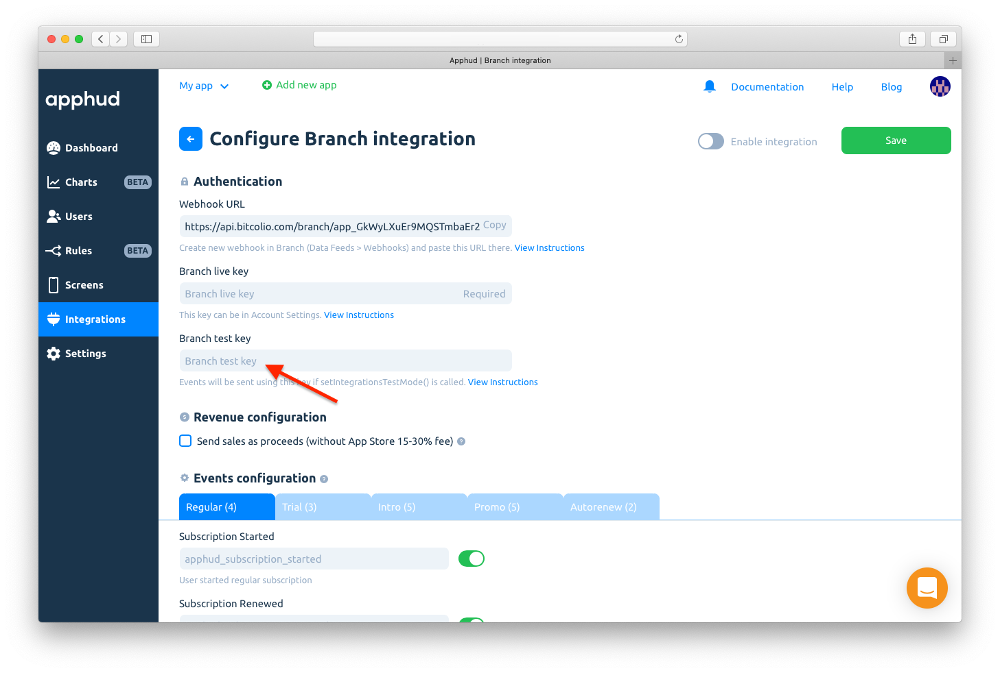
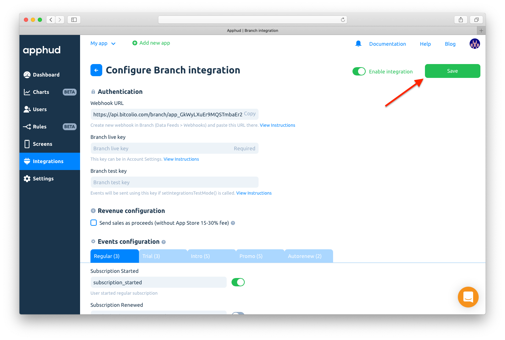
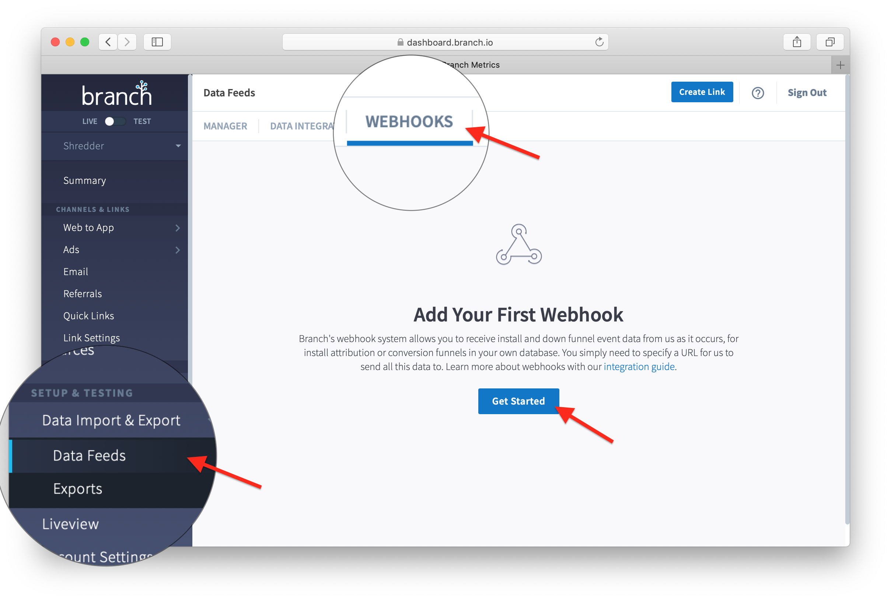
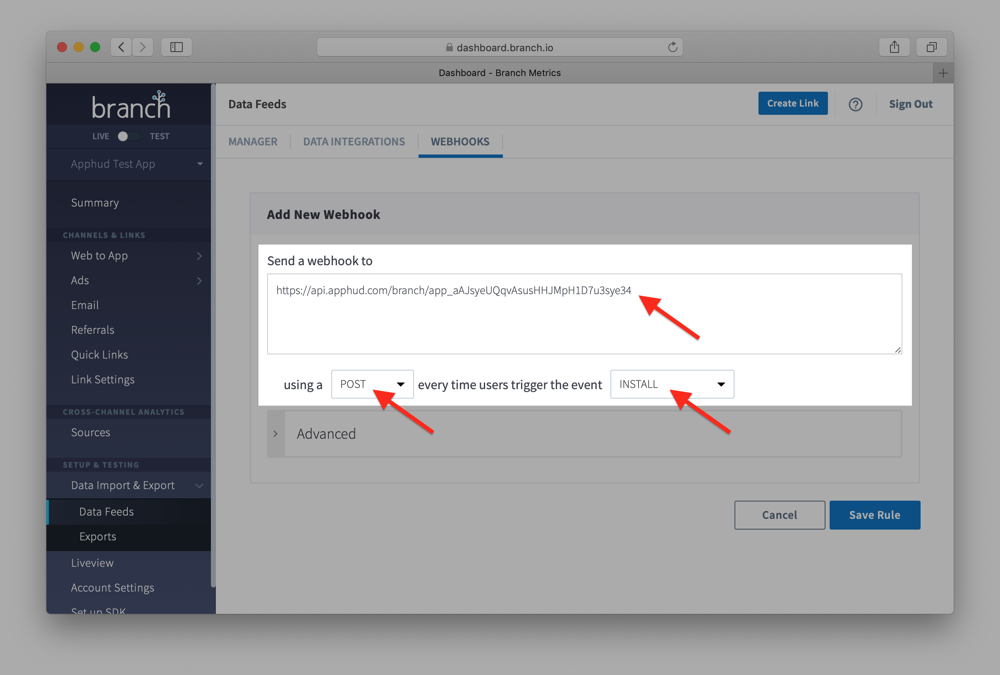

# Branch

[Branch](https://branch.io/) is a platform to increase mobile revenue with enterprise-grade links built to acquire, engage, and measure across all devices, channels, and platforms.

## How to Add Integration? <a href="#how-to-add-integration" id="how-to-add-integration"></a>

Please follow **all steps** below:



* [Integrate](https://help.branch.io/developers-hub) Branch SDK into your app
* Match Apphud Device ID with Branch by **Device ID** (**not User ID!**):

```
Branch.getInstance().setIdentity(Apphud.deviceID())
```

* [Enable User's Geo Country Breakdown](branch.md#enable-users-geo-country-breakdown) (recommended)
* [Receive Attribution Data](branch.md#receive-attribution-data) for Apphud charts (optional)



At [Apphud](https://app.apphud.com/) go to _"Integrations"_ section and add Branch:&#x20;

.png>)




Make sure you are in **LIVE** environment in Branch.


Open _"Account Settings"_ in Branch and copy_"Branch Key"_ :&#x20;


Paste copied key into _"Branch live key"_ field in integration settings:

.png>)



Return to Branch end switch to **TEST** environment.

Copy test _Branch Key_ and paste into _"Branch test key"_ field in Apphud:





You can enter your custom event names or disable some.


Please, use only lower-case alpha-numeric characters (a-z and 0-9) for your in-app event names.


.png>)



**Enable** integration and **Save** changes:





## Enable User's Geo Country Breakdown (recommended)


By default, all data in Branch dashboard show events country as US, because our servers are located in United States. Unfortunately, there is no technical way to automatically show correct country in Branch dashboard, because Branch doesn't allow to override correct country in their events.

The only way is to write email to Branch Support from your account and ask them to whitelist recording user's country instead of server's country.

So in order to view correct user's country in country breakdown please [submit a ticket ](https://help.branch.io/using-branch/page/submit-a-ticket)to Branch Support with the following text replaced with your real Branch App ID:

**Subject:**\
`Whitelist recording User IP address`

**Body:**\
`Dear Branch Team!`\


`We kindly ask you to whitelist app [BRANCH APP ID] for recording User's IP Address instead of Server's IP Address as we are using Apphud service that sends our app's events server side.`\


`Kind regards`



## Receive Attribution Data (optional)

Receive attribution data from Branch using Webhooks in order to show it in Apphud Charts.


Branch webhooks are only available on paid **Data Feeds** plan.


Please follow these steps:



In your Branch integration page, please **copy** Webhook URL:

.png>)



Sign in to [Branch](https://dashboard.branch.io/), go to _"Data Feeds"_ in _"Data Import & Export"_ section. Open _"Webhooks"_  and add new webhook:





Using copied URL create two webhooks:

1. `POST` webhook for every `INSTALL` event.
2. `POST` webhook for every `OPEN` event.





As a result, you should have 2 webhooks configured in Branch: for `INSTALL` and `OPEN` events:

.png>)



Now you will see the data for users that Branch was able to attribute.

In Charts section you can filter your chart by campaign, ad set or ad.

.png>)




In order to receive Branch attribution data from Facebook, you should accept Facebook’s "Advanced Mobile Measurement Agreement" using [this link](https://www.facebook.com/ads/manage/advanced\_mobile\_measurement/app\_based\_tos/).


## Request IDFA Consent (required)

Starting iOS 14.5 access to IDFA requires user consent. You should request IDFA manually using _AppTrackingTransparency framework_ and pass it to Apphud. Read more [here](../../getting-started/idfa-ios-14.md).

## Events Cheat Sheet

This is a list of all possible events and their parameters that are being sent to Branch.&#x20;


You can read more about subscription events [here](../../events/events.md) and parameters [here](../../events/parameters-and-properties.md).




### Trial period started

_Event name:_ `START_TRIAL`

_Default event alias:_ `apphud_trial_started`

_Parameters:_

* `content_items[0].$sku`: String
* `content_items[0].$price`: Float
* `content_items[0].$quantity` = 1
* `unit`: String
* `units_count`: Integer

### Successful conversion from trial period to regular subscription

_Event name:_ `PURCHASE`

_Default event alias:_ `apphud_trial_converted`

_Parameters:_

* `content_items[0].$sku`: String
* `content_items[0].$price`: Float&#x20;
* `content_items[0].$quantity` = 1
* `revenue`: Float
* `currency`: String

### Failed conversion from trial period to regular subscription

_Default event name and alias:_ `apphud_trial_expired`

_Parameters:_

* `product_id`: String
* `reason`: String



### Trial Canceled

&#x20;_Default event name and alias:_ `apphud_trial_canceled`

_Parameters:_

* `product_id`: String

### Subscription Canceled

&#x20;_Default event name and alias:_ `apphud_subscription_canceled`

_Parameters:_

* `product_id`: String

### Autorenew disabled (Deprecated)

&#x20;_Default event name and alias:_ `apphud_autorenew_disabled`

_Parameters:_

* `product_id`: String

### Autorenew enabled

_Default event name and alias:_ `apphud_autorenew_enabled`

_Parameters:_

* `product_id`: String



### Introductory offer started

_Event name:_ `PURCHASE`

_Default event alias:_ `apphud_intro_started`

_Parameters:_

* `content_items[0].$sku`: String
* `content_items[0].$price`: Float&#x20;
* `content_items[0].$quantity` = 1
* `revenue`: Float
* `currency`: String
* `offer_type`: String
* `unit`: String
* `units_count`: Integer

### Introductory offer renewed

_Event name:_ `PURCHASE`

_Default event alias:_ `apphud_intro_renewed`

_Parameters:_

* `content_items[0].$sku`: String
* `content_items[0].$price`: Float&#x20;
* `content_items[0].$quantity` = 1
* `revenue`: Float
* `currency`: String
* `offer_type`: String
* `unit`: String
* `units_count`: Integer

### Successful conversion from introductory offer to regular subscription

_Event name:_ `PURCHASE`

_Default event alias:_ `apphud_intro_converted`

_Parameters:_

* `content_items[0].$sku`: String
* `content_items[0].$price`: Float&#x20;
* `content_items[0].$quantity` = 1
* `revenue`: Float
* `currency`: String
* `offer_type`: String

### Failed conversion from introductory offer to regular subscription or failed renew

_Default event name and alias:_ `apphud_intro_expired`

_Parameters:_

* `product_id`: String
* `reason`: String
* `offer_type`: String

### Refund during introductory offer

_Event name:_ `PURCHASE`

_Default event alias:_ `apphud_intro_refunded`

_Parameters:_

* `content_items[0].$sku`: String
* `content_items[0].$price`: Float&#x20;
* `content_items[0].$quantity` = 1
* `revenue`: Float
* `currency`: String
* `reason`: String
* `offer_type`: String



### Subscription started

_Event name:_ `PURCHASE`&#x20;

_Default event alias:_ `apphud_subscription_started`

_Parameters:_

* `content_items[0].$sku`: String
* `content_items[0].$price`: Float&#x20;
* `content_items[0].$quantity` = 1
* `revenue`: Float
* `currency`: String

### Subscription renewed

_Event name:_ `PURCHASE`

_Default event alias:_ `apphud_subscription_renewed`

_Parameters:_

* `content_items[0].$sku`: String
* `content_items[0].$price`: Float&#x20;
* `content_items[0].$quantity` = 1
* `revenue`: Float
* `currency`: String

### Subscription expired

_Default event name and alias:_ `apphud_subscription_expired`

_Parameters:_

* `product_id`: String
* `reason`: String

### Subscription refunded

_Event name:_ `PURCHASE`

_Default event alias:_ `apphud_subscription_refunded`

_Parameters:_

* `content_items[0].$sku`: String
* `content_items[0].$price`: Float&#x20;
* `content_items[0].$quantity` = 1
* `revenue`: Float
* `currency`: String
* `reason`: String



### Promotional offer started

_Event name_: `PURCHASE`&#x20;

_Default event alias:_ `apphud_promo_started`

_Parameters:_

* `content_items[0].$sku`: String
* `content_items[0].$price`: Float&#x20;
* `content_items[0].$quantity` = 1
* `offer_id`: String
* `revenue`: Float
* `currency`: String
* `offer_type`: String
* `unit`: String
* `units_count`: Integer

### Promotional offer renewed

_Event name:_ `PURCHASE`

_Default event alias:_ `apphud_promo_renewed`

_Parameters:_

* `content_items[0].$sku`: String
* `content_items[0].$price`: Float&#x20;
* `content_items[0].$quantity` = 1
* `offer_id`: String
* `revenue`: Float
* `currency`: String
* `offer_type`: String
* `unit`: String
* `units_count`: Integer

### Successful conversion from promotional offer to regular subscription

_Event name:_ `PURCHASE`

_Default event alias:_ `apphud_promo_converted`

_Parameters:_

* `content_items[0].$sku`: String
* `content_items[0].$price`: Float&#x20;
* `content_items[0].$quantity` = 1
* `offer_id`: String
* `revenue`: Float
* `currency`: String
* `offer_type`: String

### Failed conversion from promotional offer to regular subscription or failed renew

_Default event name and alias:_ `apphud_promo_expired`

_Parameters:_

* `product_id`: String
* `offer_id`: String
* `reason`: String
* `offer_type`: String

### Refund during promotional offer

_Event name:_ `PURCHASE`

_Default event name:_ `apphud_promo_refunded`

_Parameters:_

* `content_items[0].$sku`: String
* `content_items[0].$price`: Float&#x20;
* `content_items[0].$quantity` = 1
* `offer_id`: String
* `revenue`: Float
* `currency`: String
* `reason`: String
* `offer_type`: String



### Non renewing purchase

_Event name:_ `PURCHASE`&#x20;

_Default event alias:_ `apphud_non_renewing_purchase`

_Parameters:_

* `content_items[0].$sku`: String
* `content_items[0].$price`: Float&#x20;
* `content_items[0].$quantity` = 1
* `revenue`: Float
* `currency`: String

### Non renewing purchase refunded

_Event name:_ `PURCHASE`

_Default event alias:_ `apphud_non_renewing_purchase_refunded`

_Parameters:_

* `content_items[0].$sku`: String
* `content_items[0].$price`: Float&#x20;
* `content_items[0].$quantity` = 1
* `revenue`: Float
* `currency`: String
* `reason`: String

### Billing Issue

_Default event name and alias:_ `apphud_billing_issue`

_Parameters:_

* `product_id`: String

### Billing issue Resolved

&#x20;_Default event name:_ `[Apphud] billing_issue_resolved`

_Parameters:_

* `product_id`: String

### -- Any other custom events --

&#x20;_Default event name:_ `[Apphud] any_other_custom_event`



## Testing Integration <a href="#sending-test-event" id="sending-test-event"></a>

* Make sure Branch SDK is properly integrated in your app and Branch integration is configured in Apphud.
* Make sure `Branch.getInstance().setIdentity(Apphud.deviceID())` is called.
* If Branch's `setIntegrationsTestMode()` method is used, then use `TEST` environment in Branch.
* Open _"Liveview"_ tab in Branch and you will see Apphud events there.


