# Facebook

Configure this integration and analyze your app metrics right on Facebook Analytics. Send events to Facebook Ads Manager to build lookalike audiences based on subscription events (like renewals) and maximize your ROI.

## How to Add Integration? <a href="#how-to-add-integration" id="how-to-add-integration"></a>


Since iOS 14.5 integration works only for users that consented tracking. [Learn more](https://www.facebook.com/business/help/331612538028890?id=428636648170202).



Please make sure that you disabled Facebook Automatic Purchase Events Logging in app settings or consider changing event mapping so that native Facebook SDK events are not mixed with Apphud events. See step 7 for details.




* Create new Facebook app, if you don't have it.
* [Integrate](https://developers.facebook.com/docs/) or update Facebook SDK to the latest version.
* [Pass attribution data](facebook.md#pass-attribution-data-to-apphud-required) from Facebook to Apphud.&#x20;



Open your Facebook app settings and copy your **App ID**:

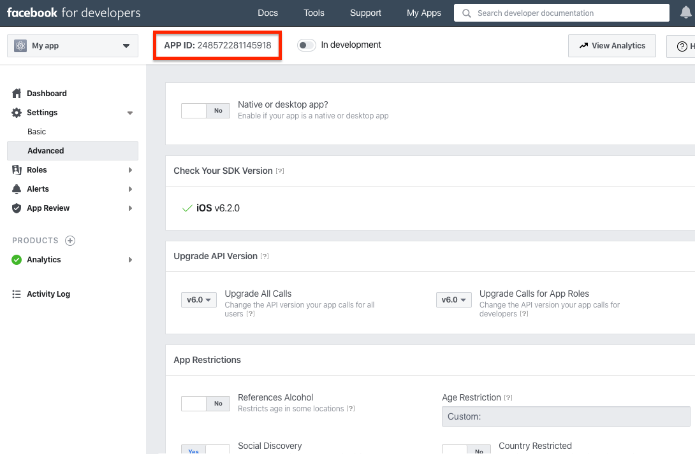



Under Advanced section copy **Client Token**:

 Apphud - Settings - Facebook for Developers 2021-01-24 15-40-02.png>)



Enter _App ID_ and _Client Token_ fields:

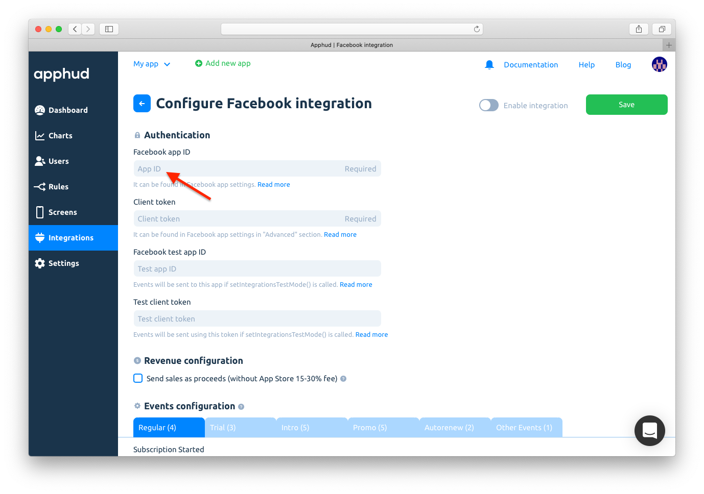



If you don't want to mix test and live data, create separate test app on Facebook. Paste test _App ID_ and _Client Token_ into corresponding fields.

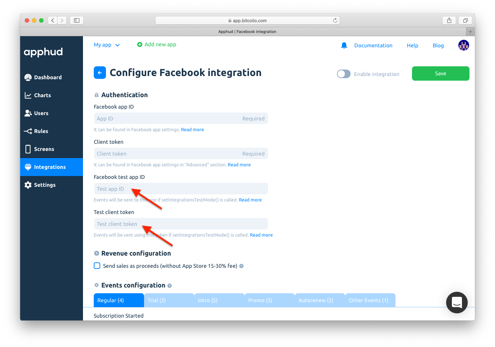



For both (live and test) apps disable Automatic Purchase Events Logging. This is required to prevent revenue double counting in Facebook Analytics and Ads Manager. The switch can be found in app _"Basic"_ settings:

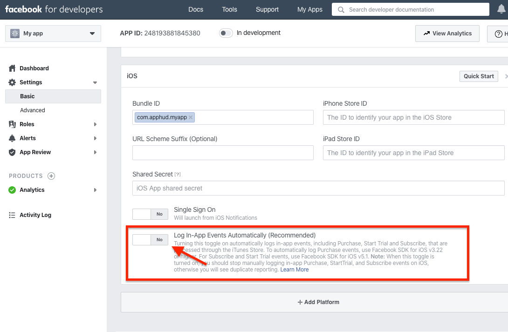



For some events, you can enter custom names. For others, you can choose between Facebook build-in events. You can also specify event aliases that will be sent as event properties under `alias` key. Please, use only letters (`a..z`), numbers (`0..9`), underscore (`_`) for event names and aliases. You can also disable sending some events using switches.

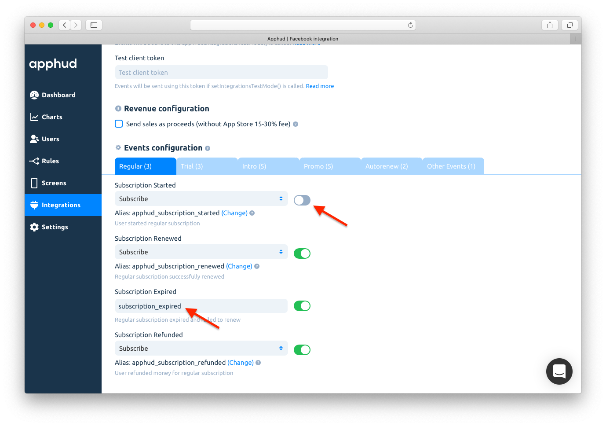



Enable Integration and save changes:

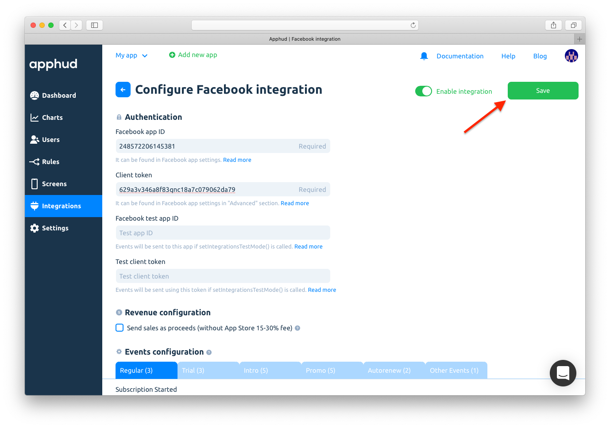



## Pass attribution data to Apphud (required):

In case of Facebook attribution, you should pass empty data:



```swift
func application(_ application: UIApplication, didFinishLaunchingWithOptions launchOptions: [UIApplication.LaunchOptionsKey: Any]?) -> Bool {
    
    // Initialize ApphudSDK
    Apphud.start(apiKey: "APPHUD_API_KEY")
    
    // Initialize Facebook
    ApplicationDelegate.shared.application(application, didFinishLaunchingWithOptions: launchOptions)
    
    // Pass empty attribution data from Facebook to Apphud
    Apphud.addAttribution(data: [:], from: .facebook, callback: nil)
}

func applicationDidBecomeActive(_ application: UIApplication) {
    // manually track install in Facebook SDK
    AppEvents.activateApp()
}
```



```objectivec
// Initialize Apphud
// ...
// Initialize Facebook
// ...
[Apphud addAttributionWithData:@{} from:ApphudAttributionProviderFacebook identifer:nil callback:^(BOOL result) {}];
// ...

- (void)applicationDidBecomeActive:(UIApplication *)application {
    [FBSDKAppEvents activateApp];
}
```



```kotlin
// Initialize Apphud
// ...
// Initialize Facebook
// ...
Apphud.addAttribution(ApphudAttributionProvider.facebook)
// track installs manually
AppEventsLogger.activateApp(this)
```




While configuring integration you can also choose between sending revenue as sales or proceeds (without Apple / Google 15%-30% commission).



&#x20;You can read more how Apple calculates commission [here](https://developer.apple.com/app-store/subscriptions/#revenue-after-one-year).


## Request IDFA Consent (required)

Starting iOS 14.5 access to IDFA requires user consent. You should request IDFA manually using _AppTrackingTransparency framework_ and pass it to Apphud. Read more [here](../../getting-started/idfa-ios-14.md).

## Events Cheat Sheet <a href="#events-cheat-sheet" id="events-cheat-sheet"></a>

This is a list of all possible events and their parameters that are being sent to AppsFlyer.


You can read more about subscription events [here](https://docs.apphud.com/events/events) and parameters [here](../../events/parameters-and-properties.md).




### Trial period started

_Default event name:_ `StartTrial`

_Parameters:_

* `alias`: String
* `fb_content_id`: String
* `_valueToSum`: Float
* `fb_currency`: String
* `fb_num_items` = 1
* `offer_type` = "trial"

### Successful conversion from trial period to regular subscription

_Default event name:_ `Subscribe`

_Parameters:_

* `alias`: String
* `fb_content_id`: String
* `_valueToSum`: Float
* `fb_currency`: String
* `fb_num_items` = 1
* `offer_type` = "trial"

### Failed conversion from trial period to regular subscription

_Default event name:_ `apphud_trial_expired`

_Parameters:_

* `alias` = "apphud\_trial\_expired"
* `fb_content_id`: String
* `reason`: String



### Trial Canceled

&#x20;_Default event name:_ `apphud_trial_canceled`

_Parameters:_

* `alias` = "apphud\_trial\_canceled"
* `fb_content_id`: String

### Subscription Canceled

&#x20;_Default event name:_ `apphud_subscription_canceled`

_Parameters:_

* `alias` = "apphud\_subscription\_canceled"
* `fb_content_id`: String

### Autorenew disabled (Deprecated)

&#x20;_Default event name:_ `apphud_autorenew_disabled`

_Parameters:_

* `alias` = "apphud\_autorenew\_disabled"
* `fb_content_id`: String

### Autorenew enabled

_Default event name:_ `apphud_autorenew_enabled`

_Parameters:_

* `alias`= "apphud\_autorenew\_enabled"
* `fb_content_id`: String



### Introductory offer started

&#x20;_Default event name:_ `Subscribe`

_Parameters:_

* `alias`: String
* `fb_content_id`: String
* `_valueToSum`: Float
* `fb_currency`: String
* `fb_num_items` = 1
* `offer_type`: String

### Introductory offer renewed

_Default event name:_ `Subscribe`

_Parameters:_

* `alias`: String
* `fb_content_id`: String
* `_valueToSum`: Float
* `fb_currency`: String
* `fb_num_items` = 1
* `offer_type`: String

### Successful conversion from introductory offer to regular subscription

_Default event name:_ `Subscribe`

_Parameters:_

* `alias`: String
* `fb_content_id`: String
* `_valueToSum`: Float
* `fb_currency`: String
* `fb_num_items` = 1
* `offer_type`: String

### Failed conversion from introductory offer to regular subscription or failed renew

_Default event name:_ `apphud_intro_expired`

_Parameters:_

* `alias` = "apphud\_intro\_expired"
* `fb_content_id`: String
* `reason`: Float
* `offer_type`: String

### Refund during introductory offer

_Default event name:_ `Subscribe`

_Parameters:_

* `alias`: String
* `fb_content_id`: String
* `_valueToSum`: Float
* `fb_currency`: String
* `fb_num_items` = 1
* `reason`: String
* `offer_type`: String



### Subscription started

&#x20;_Default event name:_ `Subscribe`

_Parameters:_

* `alias`: String
* `fb_content_id`: String
* `_valueToSum`: Float
* `fb_currency`: String
* `fb_num_items` = 1

### Subscription renewed

_Default event name:_ `Subscribe`

_Parameters:_

* `alias`: String
* `fb_content_id`: String
* `_valueToSum`: Float
* `fb_currency`: String
* `fb_num_items` = 1

### Subscription expired

_Default event name:_ `apphud_subscription_expired`

_Parameters:_

* `alias`= "apphud\_subscription\_expired"
* `fb_content_id`: String
* `reason`: Float

### Subscription refunded

_Default event name:_ `Subscribe`

_Parameters:_

* `alias`: String
* `fb_content_id`: String
* `_valueToSum`: Float
* `fb_currency`: String
* `fb_num_items` = 1
* `reason`: String



### Promotional offer started

&#x20;_Default event name:_ `StartTrial` or `Subscribe` depending on promo offer type.

_Parameters:_

* `alias`: String
* `fb_content_id`: String
* `_valueToSum`: Float
* `fb_currency`: String
* `fb_num_items` = 1
* `offer_id`: String
* `offer_type`: String

### Promotional offer renewed

_Default event name:_ `StartTrial` or `Subscribe` depending on promo offer type.

_Parameters:_

* `alias`: String
* `fb_content_id`: String
* `_valueToSum`: Float
* `fb_currency`: String
* `fb_num_items` = 1
* `offer_id`: String
* `offer_type`: String

### Successful conversion from promotional offer to regular subscription

_Default event name:_ `Subscribe`

_Parameters:_

* `alias`: String
* `fb_content_id`: String
* `_valueToSum`: Float
* `fb_currency`: String
* `fb_num_items` = 1
* `offer_id`: String
* `offer_type`: String

### Failed conversion from promotional offer to regular subscription or failed renew

_Default event name:_ `apphud_promo_expired`

_Parameters:_

* `alias` = "apphud\_promo\_expired"
* `fb_content_id`: String
* `reason`: Float
* `offer_id`: String
* `offer_type`: String

### Refund during promotional offer

_Default event name:_ `Subscribe`

_Parameters:_

* `alias`: String
* `fb_content_id`: String
* `_valueToSum`: Float
* `fb_currency`: String
* `fb_num_items` = 1
* `reason`: String
* `offer_id`: String
* `offer_type`: String



### **Non renewing purchase**

_Default event name:_ `fb_mobile_purchase`

_Parameters:_

* `alias`: String
* `fb_content_id`: String
* `_valueToSum`: Float
* `fb_currency`: String
* `fb_num_items` = 1

### **Non renewing purchase refunded**

_Default event name:_ `fb_mobile_purchase`

_Parameters:_

* `alias`: String
* `fb_content_id`: String
* `_valueToSum`: Float
* `fb_currency`: String
* `fb_num_items` = 1
* `reason`: String

### Billing Issue

_Default event name:_ `apphud_billing_issue`

_Parameters:_

* `alias` = "apphud\_billing\_issue"
* `fb_content_id`: String

### Billing issue Resolved

&#x20;_Default event name:_ `[Apphud] billing_issue_resolved`

_Parameters:_

* `product_id`: String
* `alias` = "apphud\_billing\_issue\_resolved



## How to Use these Events?

You may use events coming from Apphud to Facebook to:

* view cost per app event on Facebook Ads Manager and Facebook Ad Reports;
* create Facebook Lookalike audiences based on events.

### Facebook Ads and Ad Reports

View subscription metrics right on Facebook Ads Manager. Open [Facebook Ads Manager](https://business.facebook.com/adsmanager), click on _"Columns"_ and select _"Customize Columns..."_:

.png>)

Add necessary columns. For example, subscriptions and trials total count, value and cost:

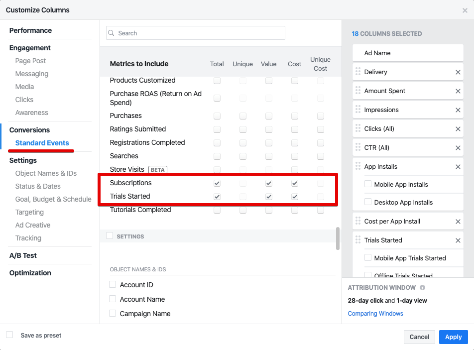

You may optionally save this customized view as a preset. Since now, you will be able to see these metrics right on Facebook Ads Manager:

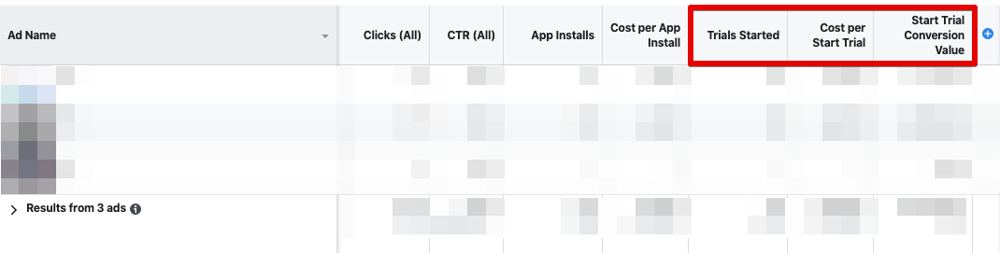

You can also add subscription metrics to Facebook Ads report:

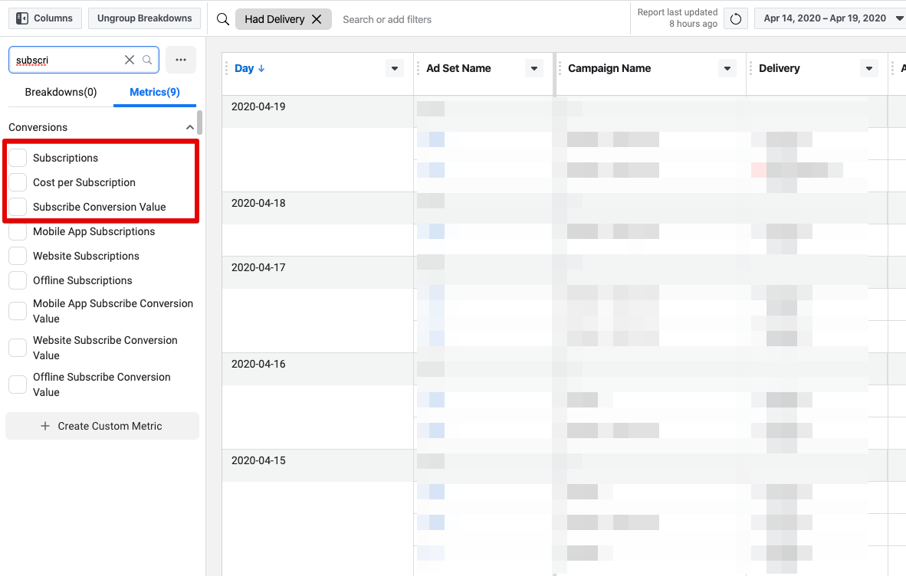

### Facebook Lookalike Audience

Create Lookalike audience and launch Facebook Ads targeted on people who most likely will perform desired event. For example, create Lookalike audience based on people who recently purchased a subscription.



Open [Facebook Audiences Tool](https://facebook.com/adsmanager/audiences) and select your Facebook Ads account in the dropdown in the top left corner.



Select _“Create Audience”_ > _“New Lookalike audience”_:

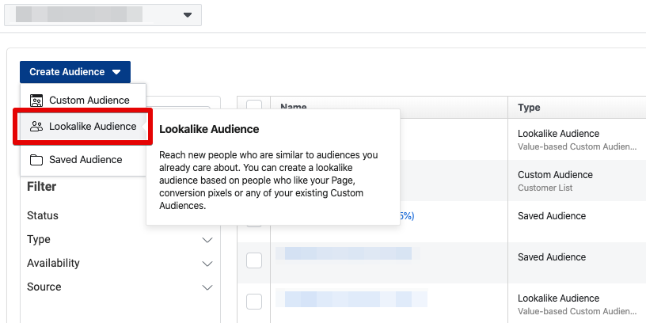



Click on _“Create New Source”_ > _“Custom Audience”_:

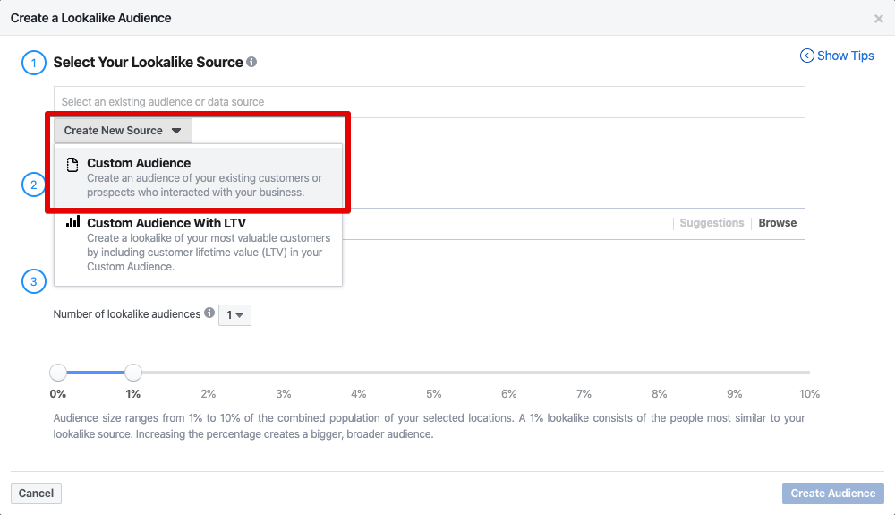



Select _“App Activity”_:

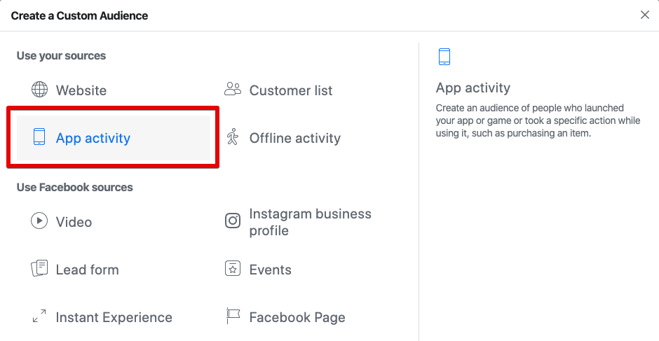



Select your app and `Subscribe` event. You may optionally choose a date range to include only users who made a purchase recently:

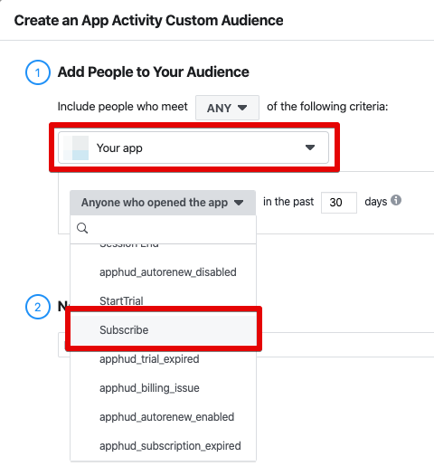



Name your audience and save.



Select location of people of your future audience and define audience size. Audience size ranges from 1% to 10%, where 1% is the closes to the target audience.

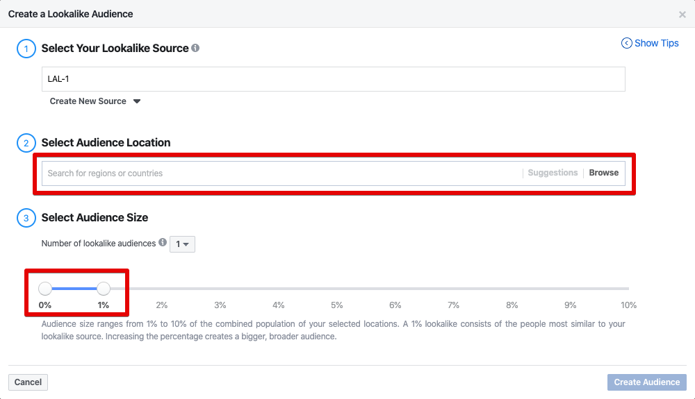



Once created, you will be able to choose this Lookalike audience while setting up Ad Set:

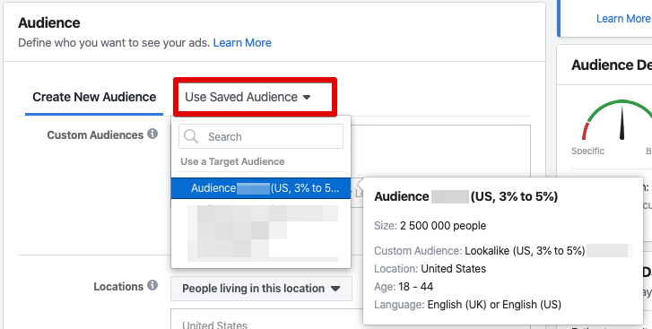




Read a post called ["4 tricks on launching Facebook Ads for iOS app with subscriptions"](https://blog.apphud.com/4-hacks-on-launching-facebook-ads-for-ios-apps-with-subscriptions/) in our blog, where we desribe several tactics to launch successful Facebook ad campaigns.


## Troubleshooting

If you don't see events in your Facebook Analytics and Ads Manager, please check the following:

* If you run SKAdNetwork campaigns make sure your target app event is in top priority of SKAdNetwork App Events configuration. If your main goal is `Purchase` event, then it should have the greatest conversion value. You can view and edit your App Events configuration for SKAdNetwork in your app's settings in [Events Manager](https://business.facebook.com/events\_manager2).


* Keep in mind that integration works only for users that consented tracking. In other words IDFA is required for App Event to be processed by Facebook. [Learn more](https://www.facebook.com/business/help/331612538028890?id=428636648170202).
* If you have low number of installs, then SKAdNetwork may report null conversion values due to Apple Privacy Threshold. The more app installs you get, the more accurate SKAdNetwork campaign will be. [Learn more](https://www.appsflyer.com/resources/guides/inside-skan/#chapter-2).
* Try to wait a few more hours, sometimes events appear in Events Manager / Ads Manager after up to 24 hours.
* Make sure you are viewing events in correct category. Events that are being sent by Apphud are mapped to Facebook Standard events, like `Purchase`, `Subscribe`, etc. You can view and edit events mapping in Facebook Integration page in Apphud. In the given example, `Trial Converted` event is mapped to `Subscribe` standard event in Facebook

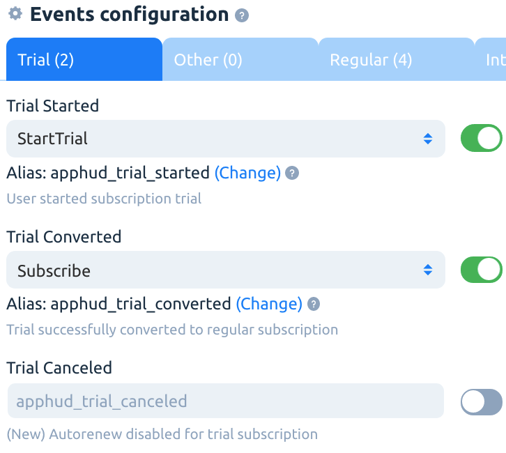

* Verify that events are sent in Apphud Events page. Click "`Integrations: sent`" link and view event logs:

.png>)

* Make sure you are using latest [Facebook iOS SDK](https://github.com/facebook/facebook-ios-sdk/releases) or [Facebook Android SDK](https://github.com/facebook/facebook-android-sdk).
* &#x20;In Overview tab in the Events Manager you can see Recent Activity of your events, like Subscribe:

.png>)

* View Detailed information about the last 100 events received, including parameters that were sent by Apphud:

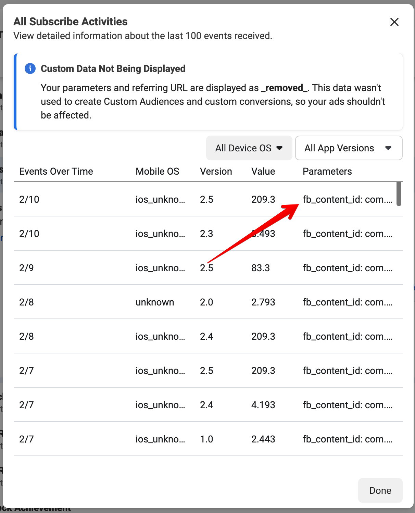

* View your app events Diagnostics:

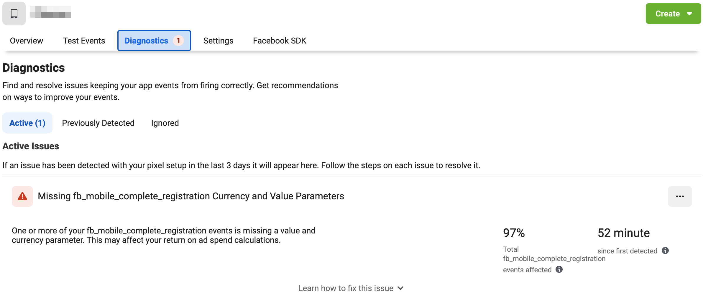
