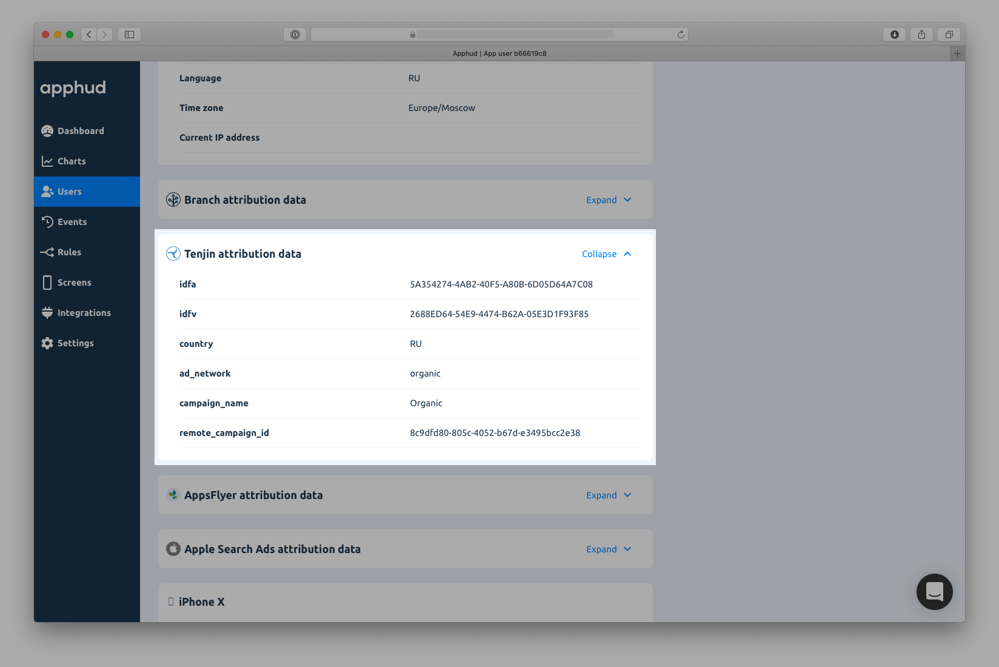
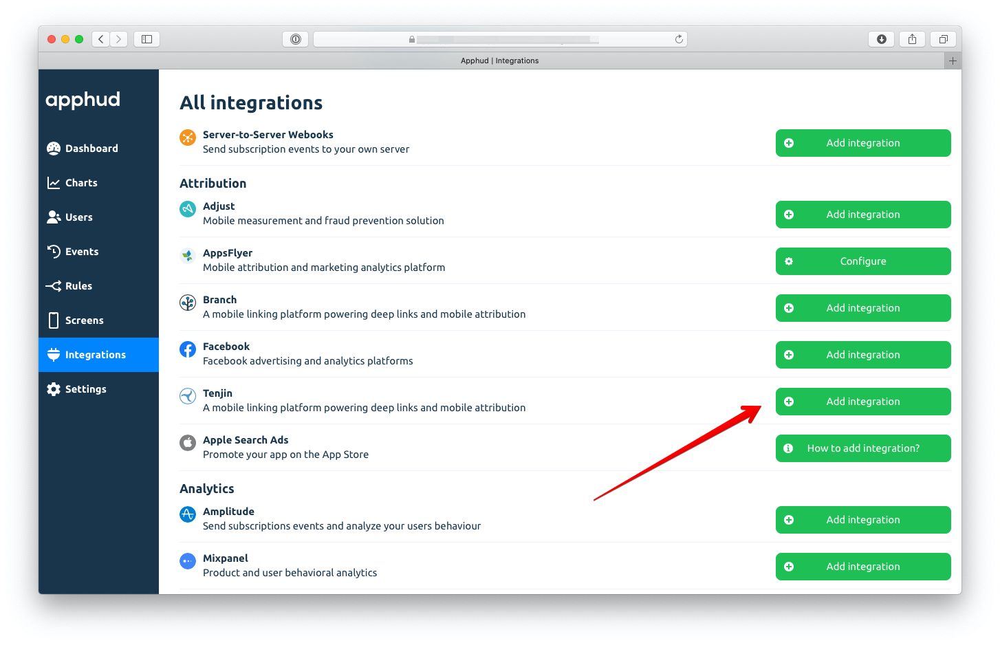
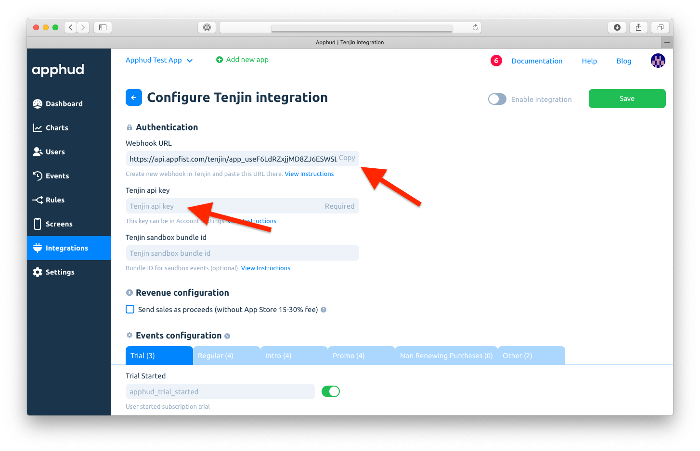
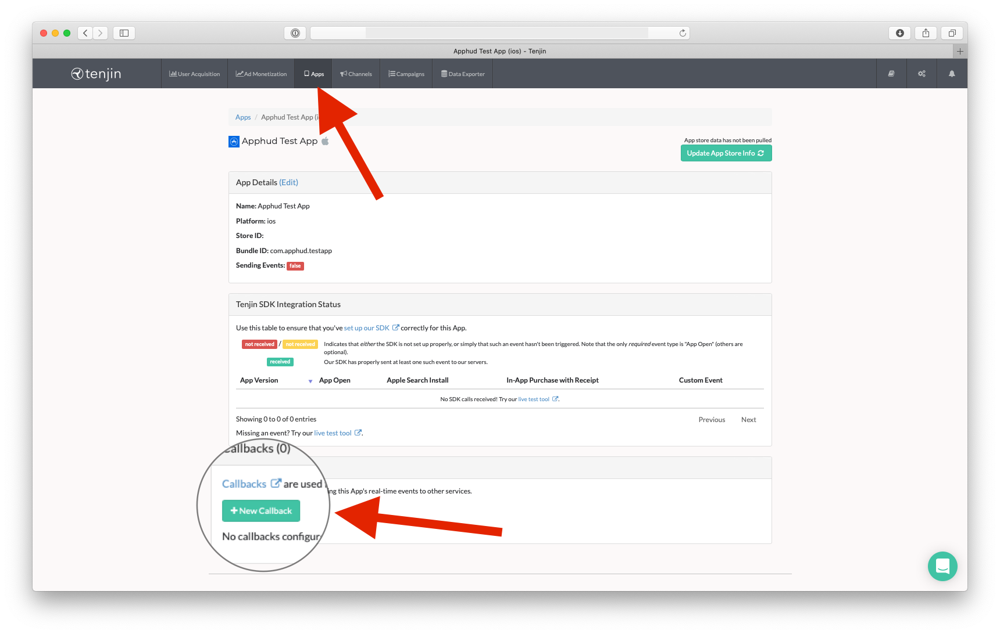
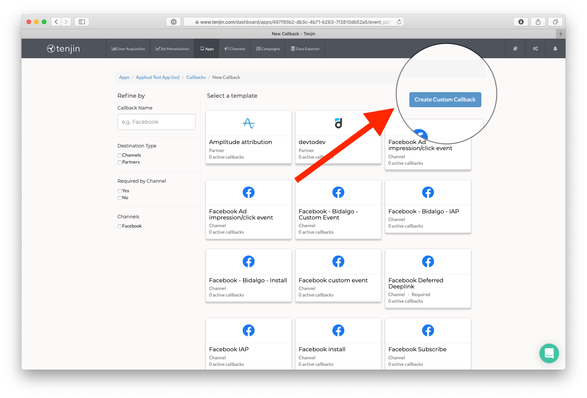
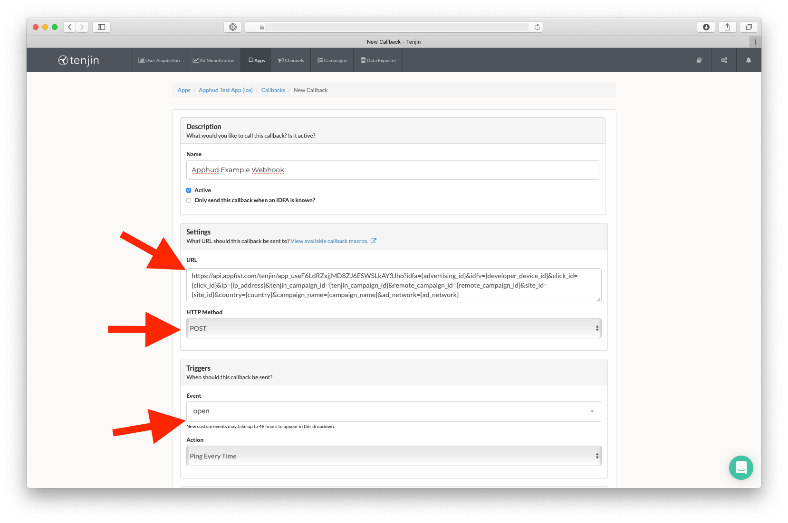
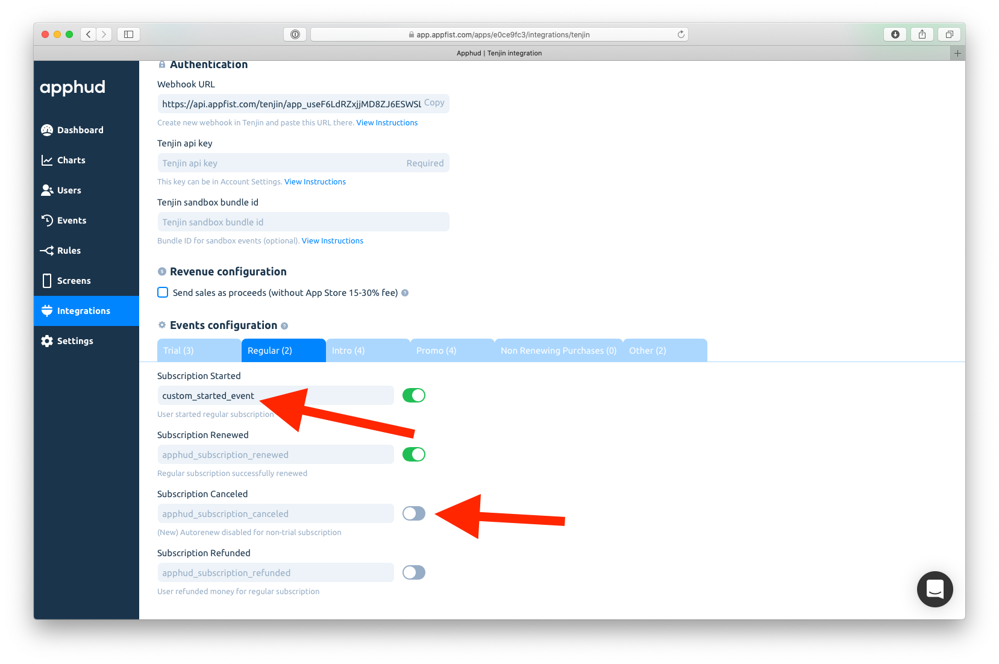
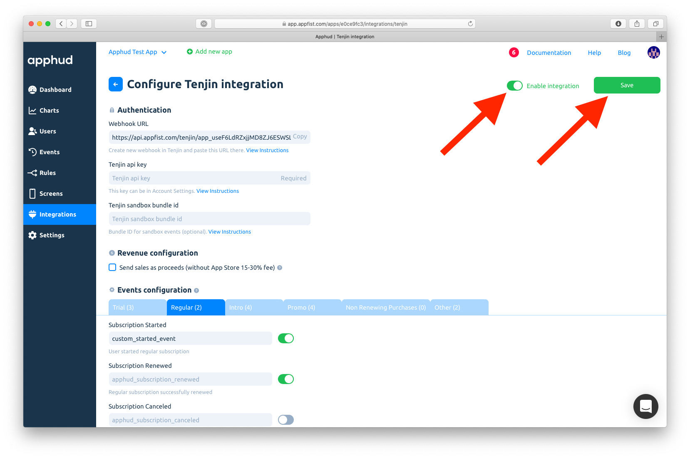

# Tenjin

Tenjin is a mobile measurement platform that gives you everything you need to test user acquisition for your game or app and then scale it.

## How does Integration Work?

This integration works in two ways.

### 1. Receive Attribution Data from Tenjin

Once you successfully configured Tenjin integration, Apphud will receive attribution data from it. You can view this data on user's page:

### 2. Send Subscription Events to Tenjin

Apphud can also send all subscription events to Tenjin. So you could view these events in Tenjin dashboard and Tenjin could pass this data to their partners. This will help to measure efficiency of your ad campaigns.

## How to Add Integration? 



[Integrate](https://github.com/tenjin) Tenjin SDK into your app.



At [Apphud](https://app.apphud.com/) go to _"Integrations"_ section and add Tenjin:&#x20;




In Tenjin Configuration page do the following:

* Paste Tenjin API Key (the same as you use in Tenjin SDK).
* Copy Webhook URL.




Sign in to [Tenjin](https://tenjin.com), go to app settings in _"Apps"_  tab and click on "_New Callback_" (if you didn't yet add Tenjin app, add it):




Click on "_Create Custom Callback_":&#x20;




In Custom Callback Creation Page:

* Enter your Webhook name.
* Paste Webhook URL copied from Apphud in URL field.
* Select HTTP Method as `POST`.
* Select Trigger Event as `open`.
* Save Callback.




Go back to Apphud and review your integration. You can enter your custom event names or disable some.


Please, use only lower-case alpha-numeric characters (a-z and 0-9) for your in-app event names.





Enable Integration and Save:




## Request IDFA Consent (required)

Starting iOS 14.5 access to IDFA requires user consent. You should request IDFA manually using _AppTrackingTransparency framework_ and pass it to Apphud. Read more [here](../../getting-started/idfa-ios-14.md).

## Testing Integration 

You can enter your production bundle id or package in test field. However your sandbox events will be sent into production Tenjin.

In order to test Tenjin without touching your production account, you need:

* Create a new app in Tenjin with different test bundle id / package name.
* Enter `sandbox bundle id/package name` in Tenjin configuration page in Apphud.
* Change bundle id / package name of your app to a test one.
* Create a new app in App Store Connect / Google Play Console with test bundle id / package name.
* Create subscriptions for test app.
* Delete the app, reset advertising identifier.
* Run the app and make test purchase.
