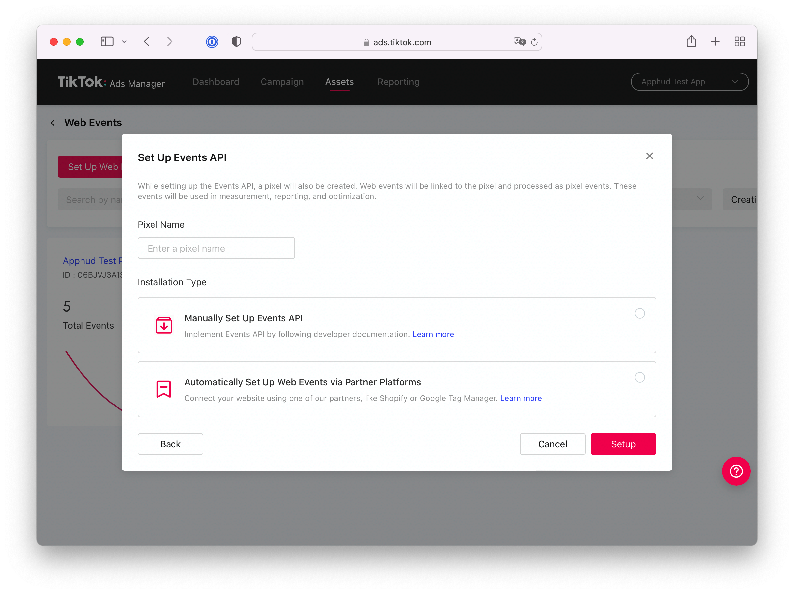
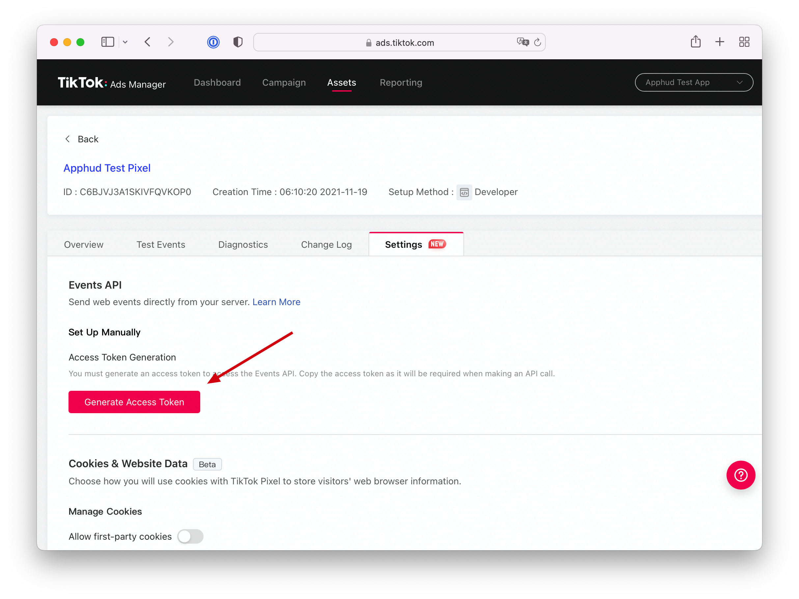
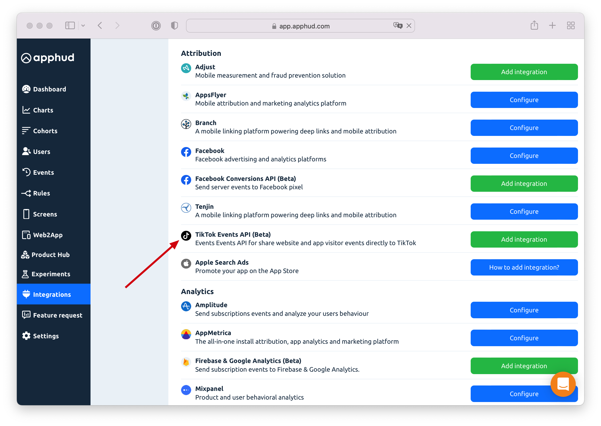
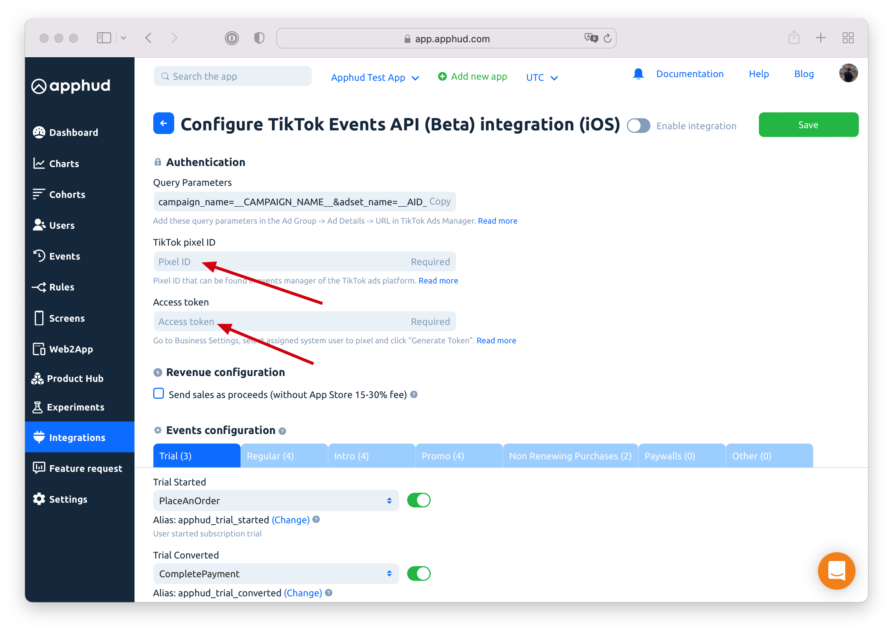
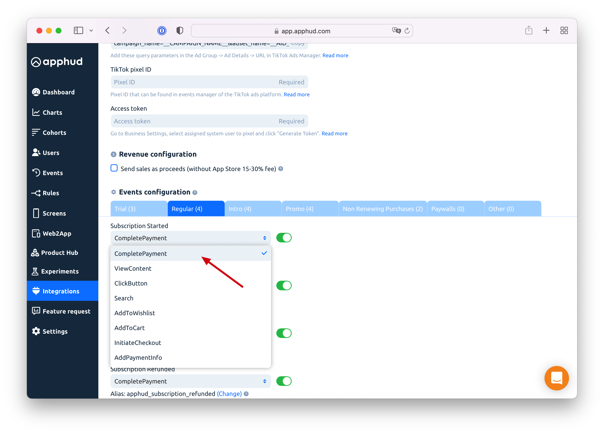
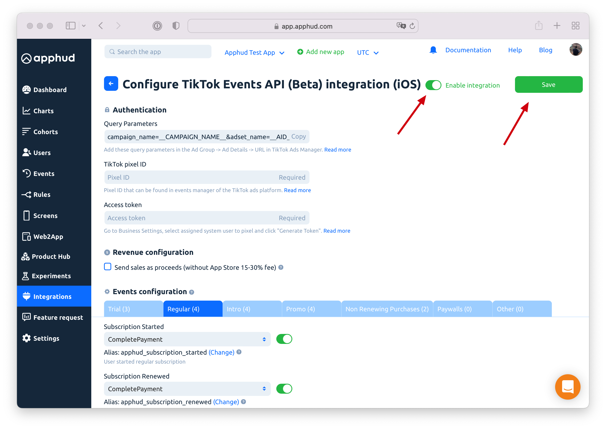
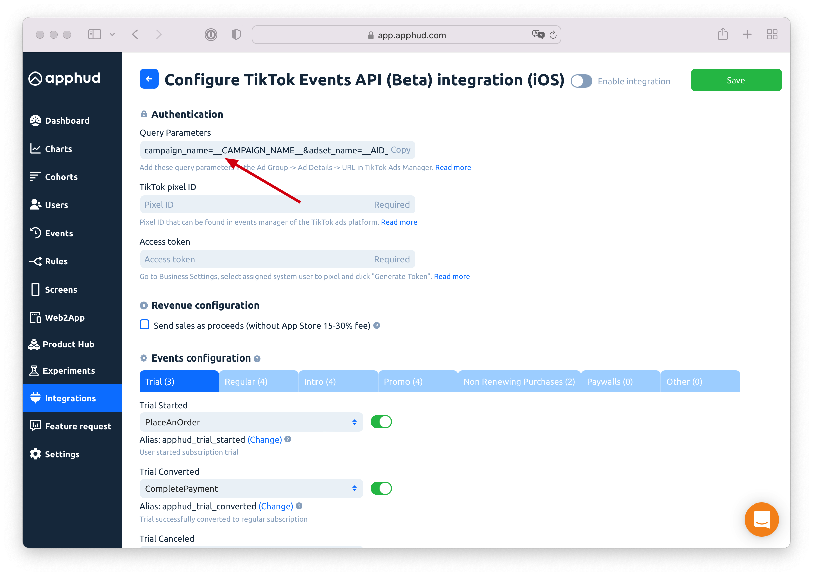

# TikTok Events API

The TikTok Events API is a Server-to-Server (S2S) integration that allows you to share website and app visitor events directly with TikTok. Integration is designed to use for Web-to-App (Web2App) campaigns.

## Using TikTok Events API for Web-to-App campaigns

TikTok Events API is useful when running **Web-to-App** (or Web2App) campaigns in TikTok with event optimization.

> Web-to-App campaign is a web campaign targeted to your app’s landing page which has a link to the App Store.

## Getting Started

Integration is a part of Web-to-App solution. Please follow [this](../../web-to-app/introduction.md#step-by-step-guide) link for details.

## Requirements

1. TikTok [Pixel](https://ads.tiktok.com/help/article?aid=10021).
2. [Access Token](https://ads.tiktok.com/marketing\_api/docs?rid=p41a33fdhon\&id=1727537566862337) for TikTok Pixel.
3. Landing page with installed TikTok and Apphud scripts.

## How to add integration?



In TikTok Ads Manager create a Pixel as per [documentation](https://ads.tiktok.com/help/article?aid=10021) in a _developer_ mode:





In Pixel settings generate an [Access Token](https://ads.tiktok.com/marketing\_api/docs?rid=p41a33fdhon\&id=1727537566862337):





Go to Apphud integrations page and select TikTok Events API:





Enter Pixel ID and Access Token:





Edit your events configuration by disabling unnecessary ones or changing event names:





Click on **Enable integration** and **Save**:





When creating a campaign in TikTok Ads Manager, you must add [URL query parameters](tiktok-events-api.md#track-attribution-data) that are displayed in TikTok integration page in Apphud:





## Track Attribution Data

Adding **URL Query parameters** to your advertising URL is mandatory. See the last step in [How to Add Integration?](tiktok-events-api.md#how-to-add-integration) for details.

`campaign_name=__CAMPAIGN_NAME__&adset_name=__AID_NAME__&ad_name=__CID_NAME__&ttclid=__CLICKID__`

In case you're using our landing page the final ad URL should look like this:

```
https://yourapp.siiites.com/?campaign_name=__CAMPAIGN_NAME__&adset_name=__AID_NAME__&ad_name=__CID_NAME__&ttclid=__CLICKID__
```

In case you're using your own landing the final ad URL should look like this:

```
https://yourownwebsite.com/?campaign_name=__CAMPAIGN_NAME__&adset_name=__AID_NAME__&ad_name=__CID_NAME__&ttclid=__CLICKID__
```

For more information visit [this](https://ads.tiktok.com/help/article?aid=9654) (the very bottom) and [this](https://ads.tiktok.com/marketing\_api/docs?id=1739584860883969) links.

<figure><figcaption><p>Add Query Parameters to your ad URL</p></figcaption></figure>

## Analyze TikTok campaigns in Apphud

Since integration is a part of Web-to-App solution, analytics is described in [this](../../web-to-app/ad-analytics.md) guide.
