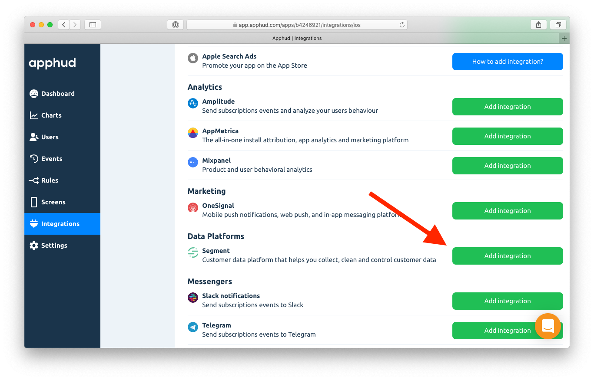
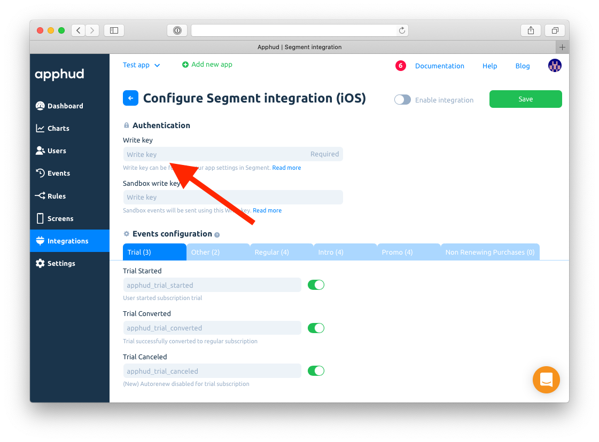
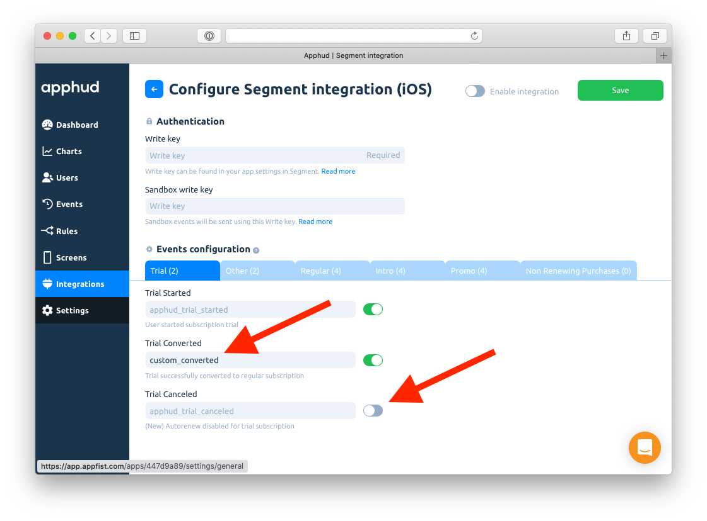
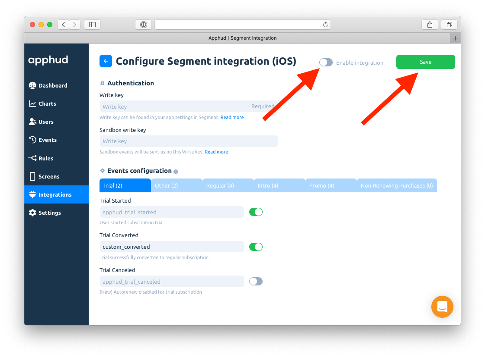

# Segment

## About Integration

Apphud can send events to Segment. From there you can resend them to any of Segment's integration partners.

## How to Add Integration?



At [Apphud](https://app.apphud.com) go to _"Integrations"_ section and add Segment:





Enter _Write Key_ and _Sandbox Write Key (optional)._ You can enter the same key as we include environment field in the payload.





You can enter your custom event names or disable some:





Enable integration and click Save:





## Data Payload

Apphud sends the following payload in each event:

```
{
  "context": {
    "environment": "sandbox",
    "library": {
      "name": "apphud",
      "version": "1.0"
    }
  },
  "event": "subscription_started",
  "integrations": {},
  "messageId": "api-1hgkJuoUuv76lwoJE1n5nAJHh9r",
  "originalTimestamp": "2020-09-18T14:40:53Z",
  "properties": {
    "currency": "USD",
    "local_price": 17.99,
    "product_id": "com.apphud.weeklytrial",
    "usd_price": 17.99
  },
  "receivedAt": "2020-09-18T14:40:53.445Z",
  "timestamp": "2020-09-18T14:40:53.000Z",
  "type": "track",
  "userId": "test_user_id"
}
```

And sends the following payload for each subscriber:

```
{
  "context": {
    "environment": "sandbox",
    "library": {
      "name": "apphud",
      "version": "1.0"
    }
  },
  "integrations": {},
  "messageId": "api-1hgkJsgDKPp9GyIxMTUVqFXKiCd",
  "originalTimestamp": "2020-09-18T14:40:52Z",
  "receivedAt": "2020-09-18T14:40:53.223Z",
  "timestamp": "2020-09-18T14:40:52.000Z",
  "traits": {
    "age": null,
    "email": null,
    "gender": null,
    "name": null
  },
  "type": "identify",
  "userId": "test_ren6_4"
}
```

You can set `age`, `email`, `gender` and `name` properties using User Properties features – check mobile SDK documentation.
