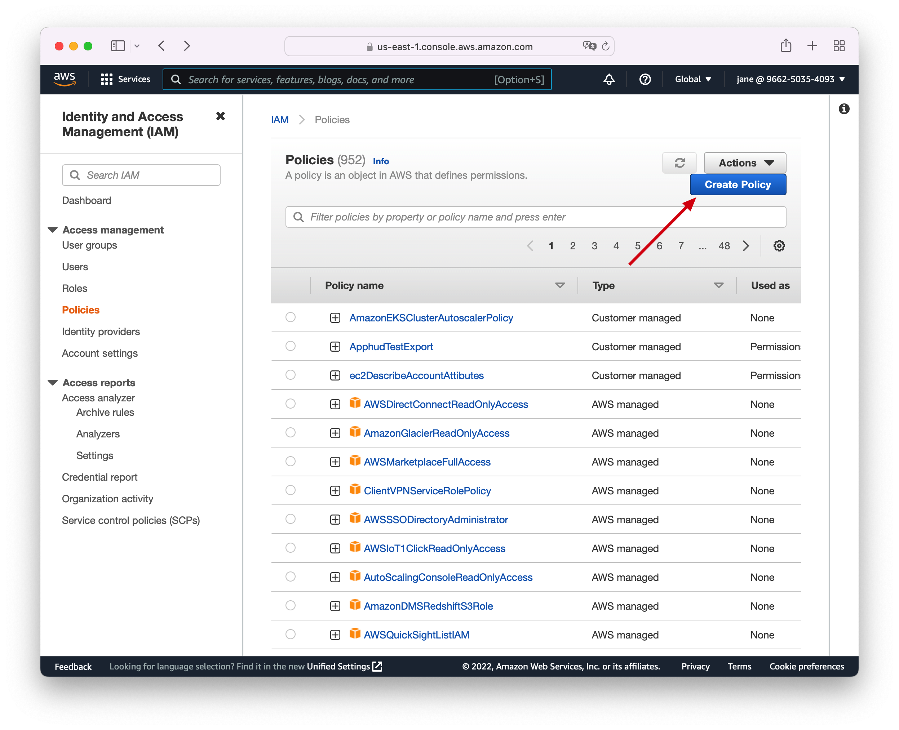
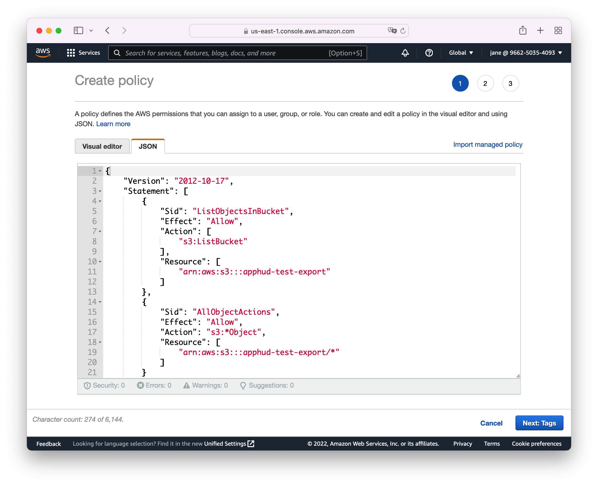
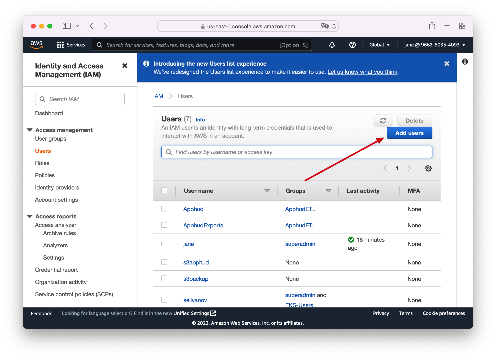
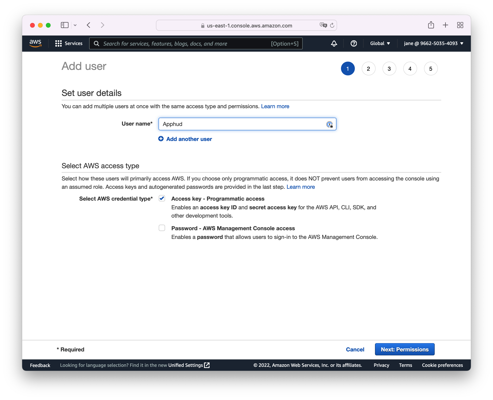
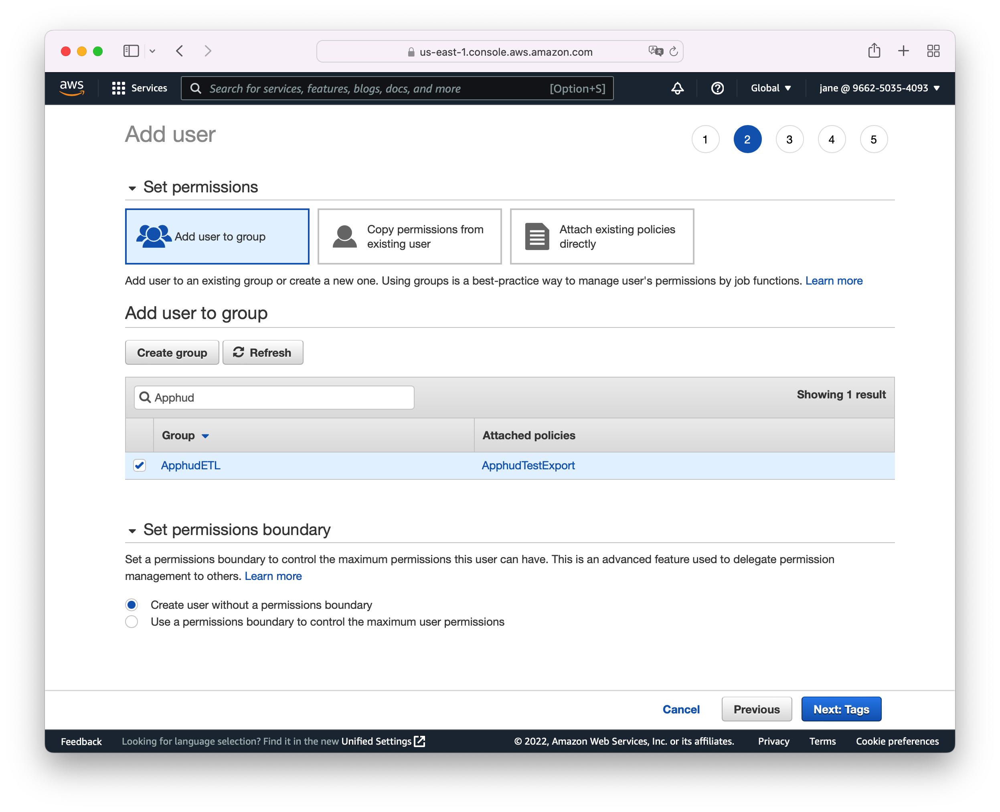
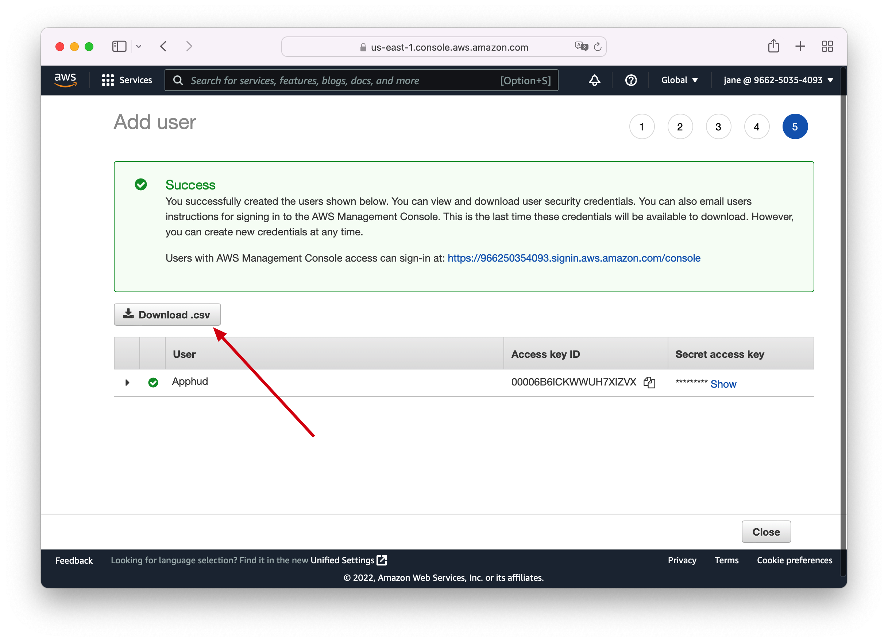
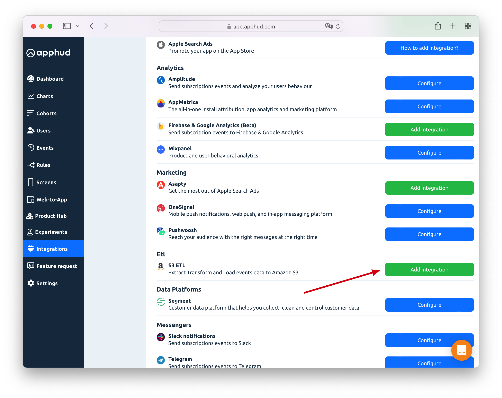
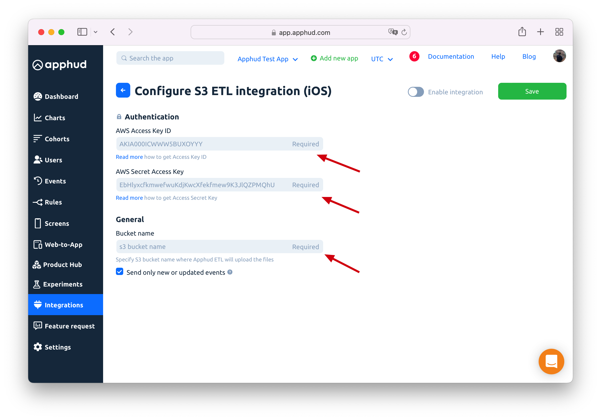
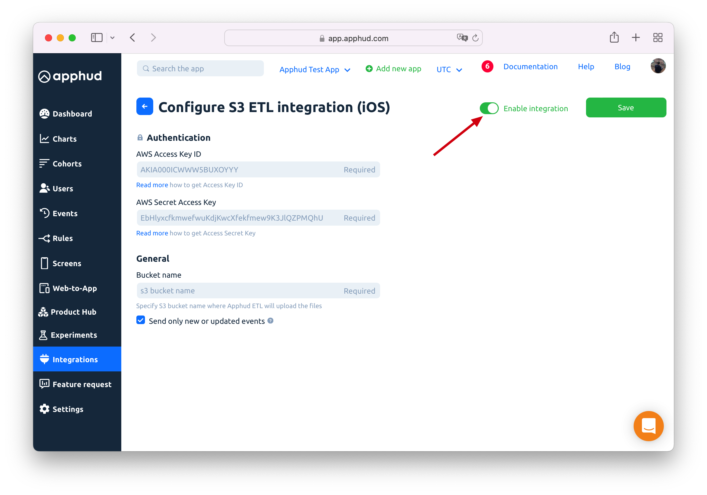

# Amazon S3

Amazon S3 is one of the largest cloud storage providers. Set up your own bucket and receive daily gzip compressed `.csv` files there.

## How to Add Integration?



Sign in to your [Amazon Console](https://console.aws.amazon.com) and navigate to Identity and Access Management (IAM).

Go to Policies section and click on **Create Policy:**





Copy contents of the following JSON to JSON tab of the policy permissions and **replace** `apphud-test-export` with your custom **bucket name**:

```json
{
    "Version": "2012-10-17",
    "Statement": [
        {
            "Sid": "ListObjectsInBucket",
            "Effect": "Allow",
            "Action": [
                "s3:ListBucket"
            ],
            "Resource": [
                "arn:aws:s3:::apphud-test-export"
            ]
        },
        {
            "Sid": "AllObjectActions",
            "Effect": "Allow",
            "Action": "s3:*Object",
            "Resource": [
                "arn:aws:s3:::apphud-test-export/*"
            ]
        }
    ]
}
```

&#x20;****&#x20;



Here is how policy permissions should look like:





Now it's time to create a User for this policy. Go to Users section and click on **Add Users:**





Enter user name (for example, **Apphud**) **** and **** select **Programmatic access** type:





Create a group with recently created Policy and add your user to this group:





After creating a user download csv credentials or copy **Access Key ID** and **Secret Key**:







In Apphud in Integrations Page find Amazon S3 ETL and click **Add integration**:





Fill in all fields with credentials obtained in the previous steps:





Finally, **Enable** **integration** and click **Save.** Once enabled, allow up to **24 hours** for the first delivery to appear.





## Get New or Updated Events Only

You can receive only new and updated transactions from the last export instead of all data. The default value of this option is `on`. This is recommended value.&#x20;
