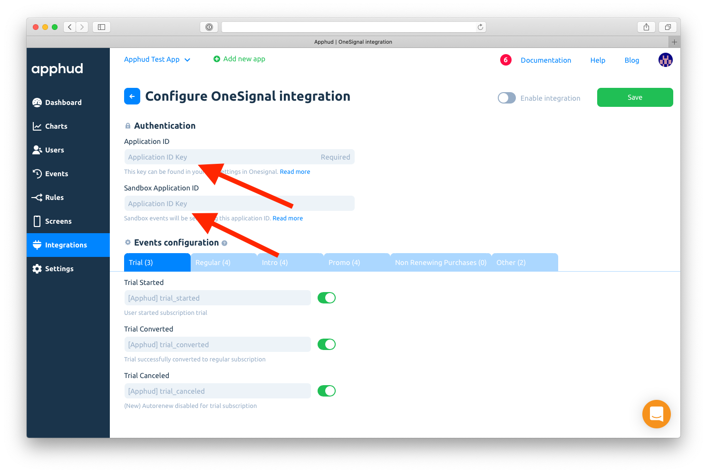
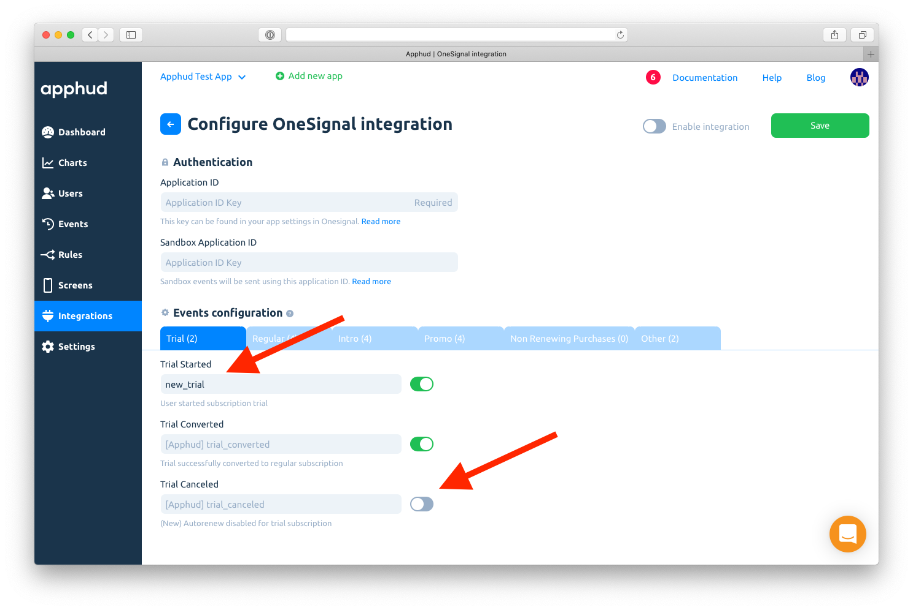
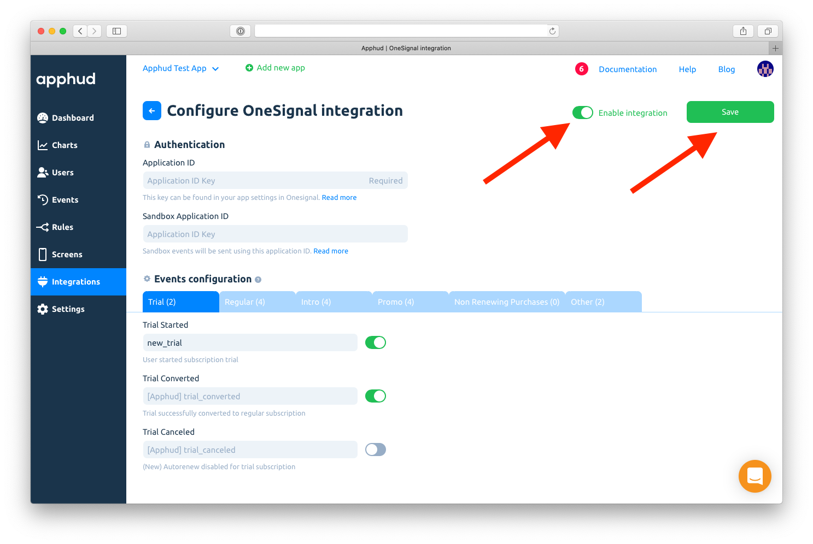

# OneSignal

## About Integration

Apphud can update User Tags in OneSignal. Tags are key-value attributes that allow you to target specific users or groups using [Segments](https://documentation.onesignal.com/docs/segmentation) and send personalized messages with [Tag Substitution](https://documentation.onesignal.com/docs/personalization).

## How to Add Integration?



* [Integrate](../../getting-started/sdk-integration/#configure-apphud-sdk) Apphud SDK on iOS or Android.
* [Integrate](https://documentation.onesignal.com/docs/mobile-sdk-setup) OneSignal.
* [Match User IDs](onesignal.md#match-user-ids) between OneSignal and Apphud.



At [Apphud](https://app.apphud.com) go to _"Integrations"_ section and add OneSignal:





Enter _Application ID_ and _Sandbox Application ID (optional)_:





You can enter your custom event names or disable some:





Enable integration and click Save:





## Match User IDs

You should set Apphud User ID property to OneSignal's `externalUserID` property:



```swift
// assuming both Apphud and OneSignal SDKs are initialized:
OneSignal.setExternalUserId(Apphud.userID())
```



```objectivec
// assuming both Apphud and OneSignal SDKs are initialized:
[OneSignal setExternalUserId:Apphud.userID];
```



```kotlin
// assuming both Apphud and OneSignal SDKs are initialized:
OneSignal.setExternalUserId(Apphud.userID())
```



```java
// assuming both Apphud and OneSignal SDKs are initialized:
OneSignal.setExternalUserId(Apphud.userID());
```



## Data Tags

Apphud sends the following payload in each event. Despite default tags, there are advanced tags, which are only being sent when Advanced Tags option is enabled in integration settings.

### Default Tags

| Key         | Description                                                                                                                                                                                           |
| ----------- | ----------------------------------------------------------------------------------------------------------------------------------------------------------------------------------------------------- |
| `ah_event`  | Event Name                                                                                                                                                                                            |
| `ah_status` | <p>Subscription Status. Possible Values:</p><p> <code>trial</code>, <code>intro</code>, <code>regular</code>, <code>promo</code>, <code>refunded</code>, <code>expired</code>, <code>grace</code></p> |

JSON example of event with Default Tags:

```
{
    "ah_event": "apphud_subscription_renewed",
    "ah_product": "com.product.id"
}
```

### Advanced Tags

If you enable Advanced Tags option in One Signal integration page, then additional tags will be sent:

| `Key`              | Description                                              |
| ------------------ | -------------------------------------------------------- |
| `ah_spent`         | Total amount of money that user has been charged, in USD |
| `ah_payments`      | Number of transactions user has been charged             |
| `ah_country`       | User's App Store Country                                 |
| `ah_autorenew`     | Subscription auto-renew state. "1" or "0"                |
| `ah_billing_issue` | Whether subscription has billing issue.  "1" or "0"      |
| `ah_product`       | Product ID of the subscription                           |

JSON example of event with Advanced Tags enabled:

```
{
    "ah_event": "apphud_subscription_renewed",
    "ah_product": "com.product.id",
    "ah_billing_issue": "0",
    "ah_autorenew": "1",
    "ah_country": "UK",
    "ah_status": "regular",
    "ah_spent": "9.99",
    "ah_payments": "1"
}
```

## Using both OneSignal and Apphud Push Notifications on iOS

On iOS, if you are using Apphud Rules, you will need incoming push notifications to be handled by either Apphud or OneSignal. However, without necessary changes OneSignal doesn't let notifications go through.

#### Let Apphud to handle incoming push notifications in OneSignal callback:

```swift
OneSignal.setNotificationOpenedHandler { result in
    if Apphud.handlePushNotification(apsInfo: result.notification.rawPayload) {
        // Push Notification was handled by Apphud, probably do nothing
    } else {
        // Handle other types of push notifications
    }
}
OneSignal.setNotificationWillShowInForegroundHandler { notif, completion in
    if Apphud.handlePushNotification(apsInfo: notif.rawPayload) {
        // Push Notification was handled by Apphud, probably do nothing
    } else {
        // Handle other types of push notifications
    }
    completion(notif)
}
```

#### Modify OneSignal's `UINotificationServiceExtension` so that it will pass Apphud Notifications through:


```swift
override func didReceive(_ request: UNNotificationRequest, withContentHandler contentHandler: @escaping (UNNotificationContent) -> Void) {
   self.receivedRequest = request;
   self.contentHandler = contentHandler
   bestAttemptContent = (request.content.mutableCopy() as? UNMutableNotificationContent)
        
   // (!) --> add this line -->
   bestAttemptContent?.userInfo.merge(["custom": ["i": NSUUID().uuidString]], uniquingKeysWith: {old, new in return old})    
        
   if let bestAttemptContent = bestAttemptContent {
       OneSignal.didReceiveNotificationExtensionRequest(self.receivedRequest, with: self.bestAttemptContent)
       contentHandler(bestAttemptContent)
   }
}
```

