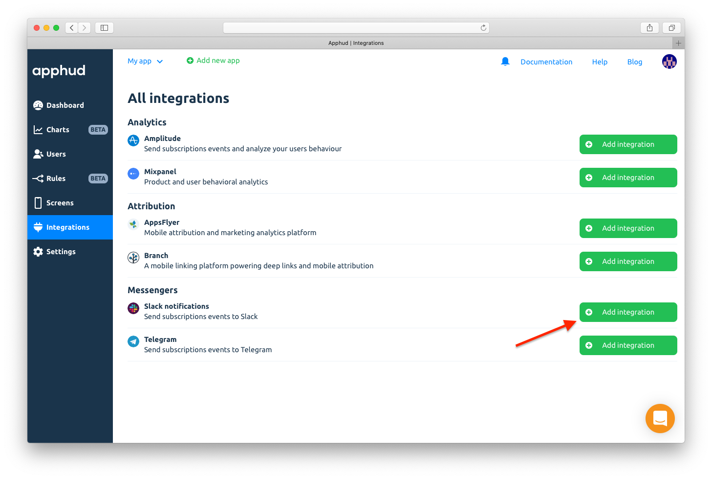
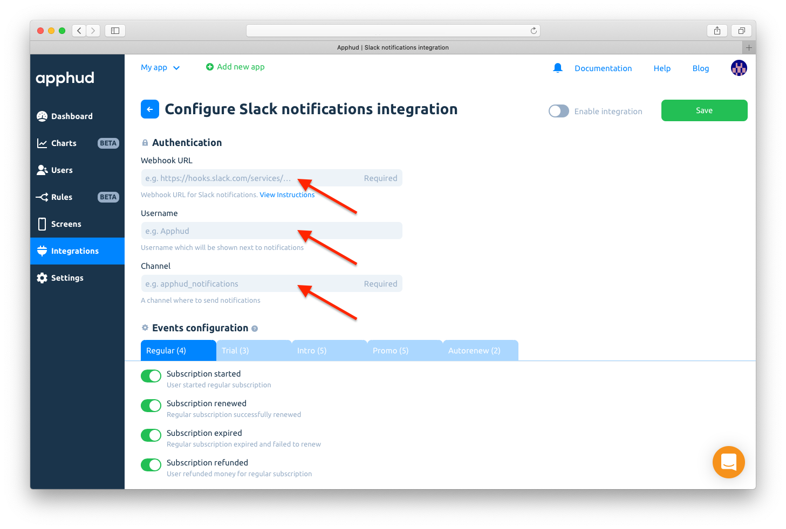
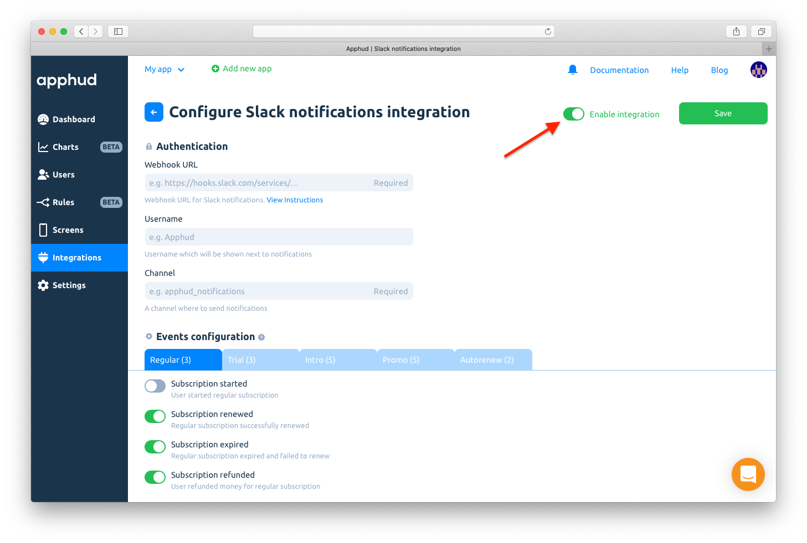

# Slack

Receive notifications about subscription events to [Slack](https://slack.com/).

## How to Add Integration?



Add [incoming webhook](https://slack.com/apps/A0F7XDUAZ-incoming-webhooks) in your Slack account.



Copy given _Webhook URL_.



At [Apphud](https://app.apphud.com/) go to _"Integrations"_ and add Slack:&#x20;




Paste _Webhook URL_ into _"Webhook"_ field. Enter username which will be shown in notifications and channel name:




You can disable events you don't need:

.png>)



Make sure _"Enable this integration"_ is checked:




Save changes:

.png>)



## Events

This is a table of all possible events that are being sent to Slack.


You can read more about events [here](../../events/events.md).


| Event                                                                             | Default Name                     |
| --------------------------------------------------------------------------------- | -------------------------------- |
| **TRIAL PERIOD**                                                                  |                                  |
| Trial period started                                                              | `Trial Started`                  |
| Successful conversion from trial period to regular subscription                   | `Trial Converted`                |
| Failed conversion from trial period to regular subscription                       | `Trial Expired`                  |
| **INTRODUCTORY OFFER**                                                            | ****                             |
| Introductory offer started                                                        | `Intro Started`                  |
| Introductory offer renewed                                                        | `Intro Renewed`                  |
| Successful conversion from introductory offer to regular subscription             | `Intro Converted`                |
| Failed conversion from introductory offer to regular subscription or failed renew | `Intro Expired`                  |
| Refund during introductory offer                                                  | `Intro Refunded`                 |
| **REGULAR SUBSCRIPTION**                                                          | ****                             |
| Subscription started                                                              | `Subscription Started`           |
| Subscription renewed                                                              | `Subscription Renewed`           |
| Subscription expired                                                              | `Subscription Expired`           |
| Subscription refunded                                                             | `Subscription Refunded`          |
| **PROMOTIONAL OFFER**                                                             | ****                             |
| Promotional offer started                                                         | `Promo Started`                  |
| Promotional offer renewed                                                         | `Promo Renewed`                  |
| Successful conversion from promotional offer to regular subscription              | `Promo Converted`                |
| Failed conversion from promotional offer to regular subscription or failed renew  | `Promo Expired`                  |
| Refund during promotional offer                                                   | `Promo Refunded`                 |
| **CANCELLATIONS**                                                                 | ****                             |
| Trial Canceled                                                                    | `Trial Canceled`                 |
| Subscription Canceled                                                             | `Subscription Canceled`          |
| Autorenew disabled (Deprecated)                                                   | `Autorenew Disabled`             |
| Autorenew enabled                                                                 | `Autorenew Enabled`              |
| **OTHER EVENTS**                                                                  |                                  |
| Non renewing purchase                                                             | `Non Renewing Purchase`          |
| Non renewing purchase refunded                                                    | `Non Renewing Purchase Refunded` |
| Billing Issue                                                                     | `Billing Issue`                  |

## Send Test Event

You can test Slack integration by clicking _"…"_ and then in dropdown click on _"Send test event"_:

.png>)
