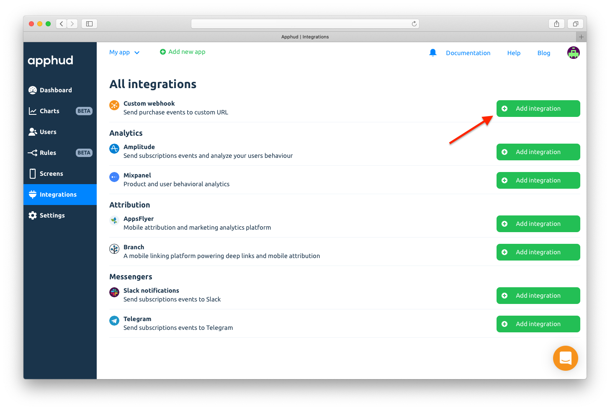
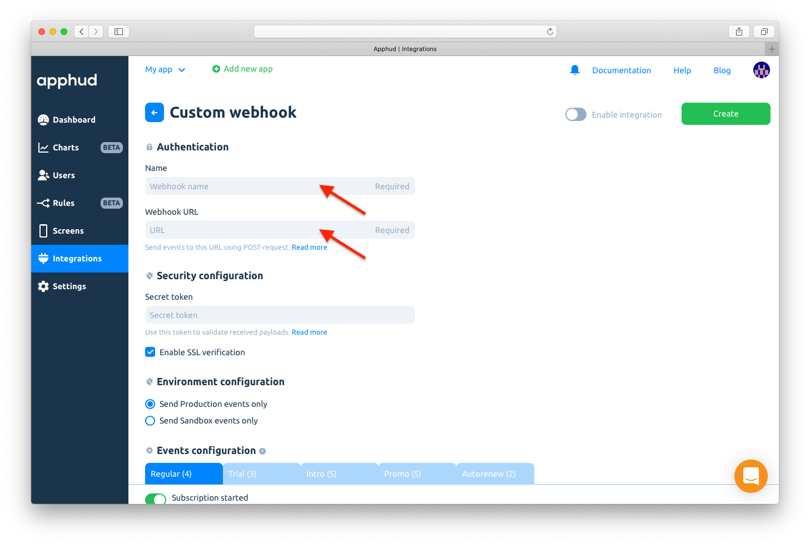
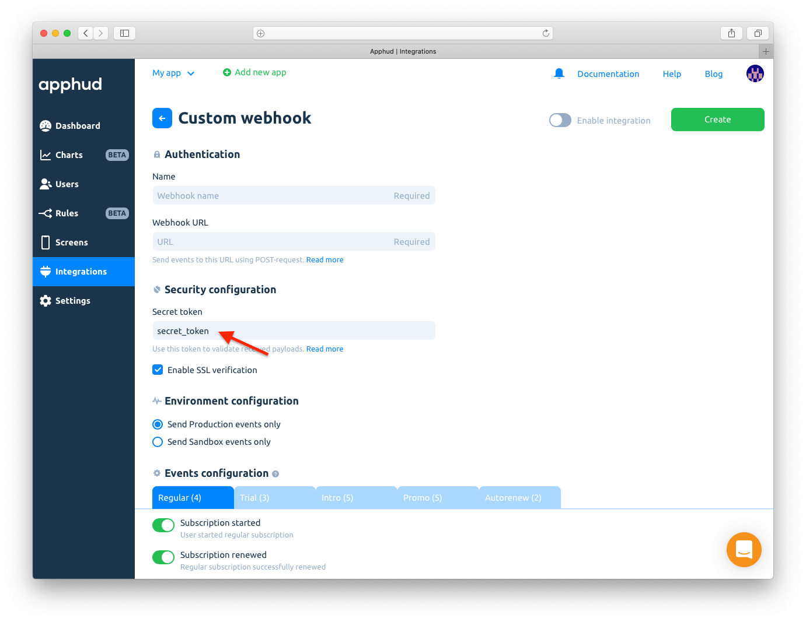
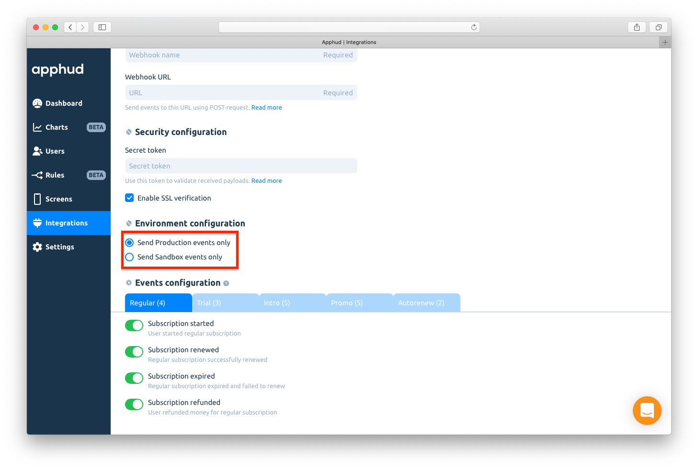
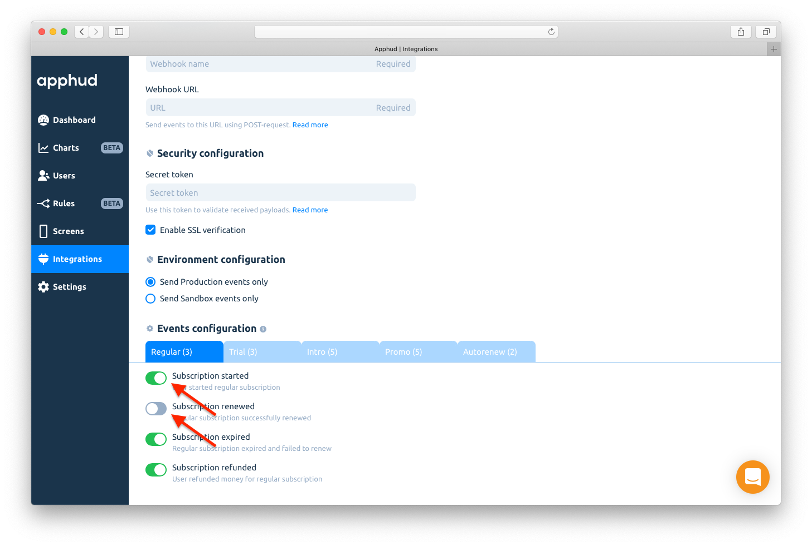
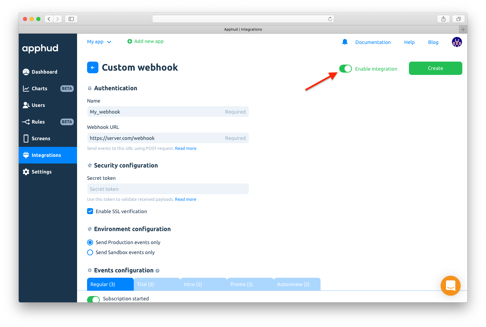
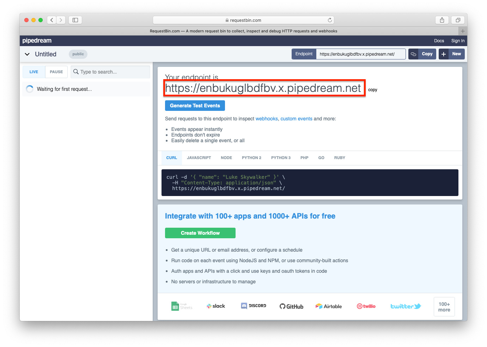
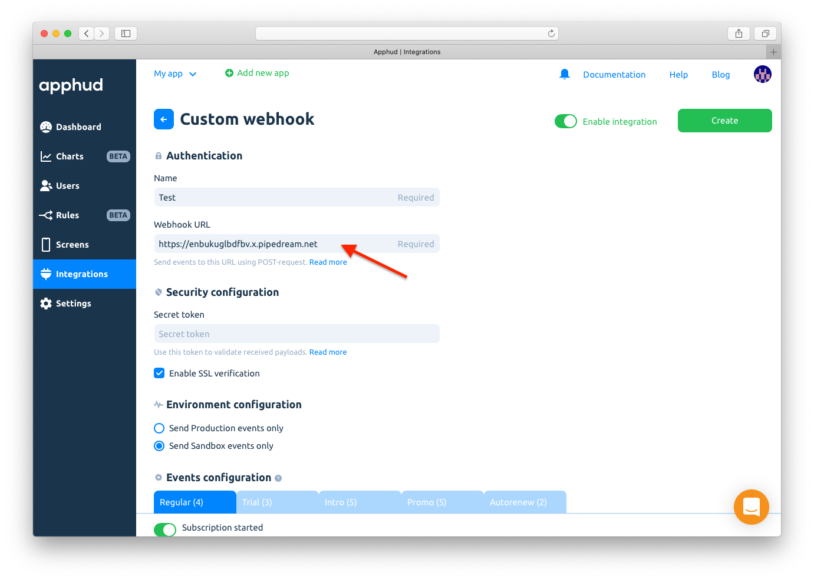
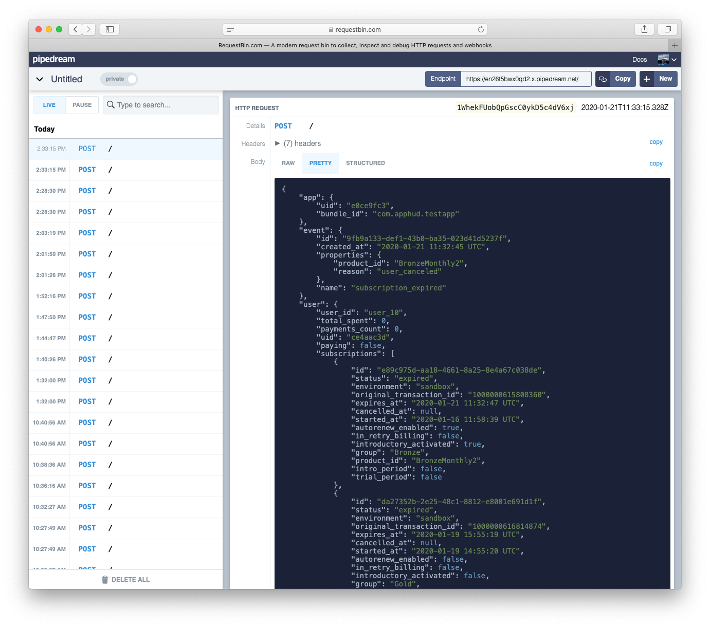

# Server-to-Server Webhooks



Server-to-server webhooks is a premium feature and available on Launch and Grow plans.


Apphud's webhook system for subscriptions allows you to catch the moment when a subscription event occurs. You can use this data to implement custom logic or analytics on your own server. You simply need to specify a URL for POST-request.

Webhooks are being sent as POST request to specified URL.

## How to Add Webhook?



* [Integrate](../getting-started/sdk-integration/) Apphud SDK.
* Configure [App Store Server Notifications URL](../getting-started/creating-app.md#app-store-server-notifications).



At [Apphud](https://app.apphud.com/) go to _"Integrations"_ section and add Custom webhook:





Enter webhook name and specify webhook URL. Events will be sent to this URL using POST-request:





You may optionally specify Secret token that will be sent with the webhook request in the `X-Apphud-Token` HTTP header. Use this token to validate received payloads.





Choose which between Production and Sandbox events to be sent via webhook:&#x20;





Enable events on which you would like to receive webhook:





Enable integration:





Save changes:






Apphud sends only one request per webhook without retries.


## Webhook Structure

The POST body for all webhooks follows the same structure:

```swift
{
    "app": {},
    "event": {},
    "user": {}
}
```

Let's look through each component of this structure.

### App

This dictionary contains information about the app.

| Field              | Type   | Description           |
| ------------------ | ------ | --------------------- |
| `app.uid`          | String | Apphud app ID.        |
| `app.bundle_id`    | String | iOS Bundle ID.        |
| `app.package_name` | String | Android Package Name. |

### Event

This dictionary contains information about events.

| Field              | Type       | Description                                                                  | Possible values        |
| ------------------ | ---------- | ---------------------------------------------------------------------------- | ---------------------- |
| `event.id`         | String     | Apphud event ID.                                                             |                        |
| `event.created_at` | Date       | Date when this event was created by Apphud.                                  |                        |
| `event.name`       | String     | Event name.                                                                  | `e.g. "trial_started"` |
| `event.properties` | Dictionary | A dictionary containing event properties. View the description below.        |                        |
| `event.receipt`    | Dictionary | Apphud receipt information related to the event. View the description below. |                        |
| `event.stor`       | String     | Purchase store type                                                          |                        |

#### event.properties

`event.properties` may contain fields below.

| Field                                | Type    | Description                                                                                    | Possible values                                                                                                                                                                                                                                              |
| ------------------------------------ | ------- | ---------------------------------------------------------------------------------------------- | ------------------------------------------------------------------------------------------------------------------------------------------------------------------------------------------------------------------------------------------------------------ |
| `event.properties.product_id`        | String  | Product ID.                                                                                    |                                                                                                                                                                                                                                                              |
| `event.properties.reason`            | String  | Depending on the event: the reason of an expiration of a subscription or the reason of refund. | <p><code>user_canceled</code> <code>billing_issue</code> <code>declined_price_increase</code></p><p><code>unavailable_product</code></p><p><code>unknown_error</code></p><p><code></code></p><p><code>app_issue</code></p><p><code>another_reason</code></p> |
| `event.properties.currency`          | String  | Local currency ISO code.                                                                       |                                                                                                                                                                                                                                                              |
| `event.properties.usd_price`         | Float   | Price in USD.                                                                                  |                                                                                                                                                                                                                                                              |
| `event.properties.local_price`       | Float   | Price in local currency.                                                                       |                                                                                                                                                                                                                                                              |
| `event.properties.offer_type`        | String  | Introductory or promotional offer payment mode (iOS only).                                     | <p><code>pay_up_front</code></p><p><code>pay_as_you_go</code></p><p><code>trial</code></p>                                                                                                                                                                   |
| `event.properties.offer_id`          | String  | Promotional offer ID.                                                                          |                                                                                                                                                                                                                                                              |
| `event.properties.unit`              | String  | The increment of time that a subscription period is specified (iOS only).                      | <p><code>day</code></p><p><code>week</code></p><p><code>month</code></p><p><code>year</code></p>                                                                                                                                                             |
| `event.properties.units_count`       | Integer | The number of units per subscription period (iOS only).                                        |                                                                                                                                                                                                                                                              |
| `event.properties.family_shared`     | Bool    | If purchase was used for family sharing option                                                 |                                                                                                                                                                                                                                                              |
| `event.properties.product_bundle_id` | String  | internal purchase indentifier                                                                  |                                                                                                                                                                                                                                                              |

#### event.receipt

`event.receipt` may contain the fields below.


This is an internal Apphud receipt model.


| Field                                   | Type    | Description                                                          |
| --------------------------------------- | ------- | -------------------------------------------------------------------- |
| `event.receipt.id`                      | String  | Apphud receipt ID.                                                   |
| `event.receipt.product_id`              | String  | Product ID.                                                          |
| `event.receipt.purchased_at`            | Date    | Transaction date.                                                    |
| `event.receipt.intro_period`            | Boolean | Is subscription in an introductory period.                           |
| `event.receipt.trial_period`            | Boolean | Is subscription in the trial period.                                 |
| `event.receipt.transaction_id`          | String  | App Store transaction ID / Google Play Order ID                      |
| `event.receipt.original_transaction_id` | String  | App Store original transaction ID / Google Play Purchase Token.      |
| `event.receipt.price_usd`               | Float   | Price in USD.                                                        |
| `event.receipt.proceeds_usd`            | Float   | Revenue in USD after Apple / Google commission deduction.            |
| `event.receipt.price`                   | Float   | Price in local currency.                                             |
| `event.receipt.proceeds`                | Float   | Revenue in local currency after Apple / Google commission deduction. |
| `event.receipt.currency`                | String  | Local currency ISO code.                                             |
| `event.receipt.quantity`                | Integer | Always 1.                                                            |
| `event.receipt.apple_share`             | Float   | Apple commission. It can be 0.15 or 0.3.                             |

### User

This dictionary contains information about the user.

| Field                   | Type    | Description                                                                                      |
| ----------------------- | ------- | ------------------------------------------------------------------------------------------------ |
| `user.user_id`          | String  | User ID.                                                                                         |
| `user.uid`              | String  | Apphud user ID.                                                                                  |
| `user.paying`           | Boolean | Is the user currently paying or not.                                                             |
| `user.payments_count`   | Integer | User payments count.                                                                             |
| `user.total_spent`      | Float   | User total spent in USD.                                                                         |
| `user.idfv`             | String  | User IDFV.                                                                                       |
| `user.subscriptions[]`  | Array   | An array containing information about all subscriptions of the user. View the description below. |
| `user.created_at`       | String  | User created date                                                                                |
| `user.variations`       | Array   | Array of Experimets(A/B Tests) in which user was involved                                        |
| `user.country_iso_code` | String  | User country code                                                                                |
| `user.time_zone`        | String  | User's current timezone                                                                          |
| `user.launguage`        | String  | User's current language                                                                          |
| `user.properties`       | Array   | Array of custom user properties which have been assigned with Apphud SDK                         |
| `user.devices`          | Array   | Array of user deices                                                                             |

#### user.subscriptions\[]

`user.subscriptions` is an array containing user's subscriptions. Each element of this array is a dictionary with the following structure:

| Field                                          | Type    | Description                                                    | Possible values                                                                                                                                               |
| ---------------------------------------------- | ------- | -------------------------------------------------------------- | ------------------------------------------------------------------------------------------------------------------------------------------------------------- |
| `user.subscriptions[].id`                      | String  | Apphud subscription ID                                         |                                                                                                                                                               |
| `user.subscriptions[].product_id`              | String  | Product ID                                                     |                                                                                                                                                               |
| `user.subscriptions[].group`                   | String  | Group name                                                     |                                                                                                                                                               |
| `user.subscriptions[].status`                  | String  | Current status                                                 | <p><code>trial</code></p><p><code>intro</code></p><p><code>promo</code></p><p><code>regular</code></p><p><code>refunded</code></p><p><code>expired</code></p> |
| `user.subscriptions[].intro_period`            | Boolean | Is subscription in an introductory period.                     |                                                                                                                                                               |
| `user.subscriptions[].trial_period`            | Boolean | Is subscription in the trial period.                           |                                                                                                                                                               |
| `user.subscriptions[].started_at`              | Date    | Subscription start date.                                       |                                                                                                                                                               |
| `user.subscriptions[].expires_at`              | Date    | Subscription expiration date.                                  |                                                                                                                                                               |
| `user.subscriptions[].cancelled_at`            | Date    | Subscription cancellation date.                                |                                                                                                                                                               |
| `user.subscriptions[].autorenew_enabled`       | Boolean | Is auto-renew enabled for the subscription.                    |                                                                                                                                                               |
| `user.subscriptions[].in_retry_billing`        | Boolean | Is subscription in retry billing period.                       |                                                                                                                                                               |
| `user.subscriptions[].introductory_activated`  | Boolean | Is intro (including trial) was user by the user.               |                                                                                                                                                               |
| `user.subscriptions[].environment`             | String  | Subscription environment                                       | <p><code>sandbox</code></p><p><code>production</code></p>                                                                                                     |
| `user.subscriptions[].original_transaction_id` | String  | App Store original transaction ID / Google Play Purchase Token |                                                                                                                                                               |

## Webhooks Examples



```swift
{
  "app": {
    "uid": "89a413f4",
    "bundle_id": "com.apphud.testapplication",
    "package_name": "com.apphud.app"
  },
  "event": {
    "id": "a2472593-f6c5-4d4c-b3e3-5b1214651242",
    "created_at": "2022-05-05T07:24:02.000Z",
    "properties": {
      "currency": "USD",
      "usd_price": 2.49,
      "product_id": "com.apphud.test.trial1",
      "local_price": 2.49,
      "family_shared": false,
      "product_bundle_id": "bfb739d2"
    },
    "store": "play_store",
    "name": "subscription_started",
    "receipt": {
      "id": "106103fc-2eaa-4f9d-98ff-e91a08715252",
      "intro_period": false,
      "price_usd": 2.49,
      "purchased_at": "2022-05-05T07:24:02.000Z",
      "transaction_id": "GPA.3314-7278-3237-55030",
      "original_transaction_id": "mjngdagogcmgmfhcpldfegha.AO-J1Oz1Lvab6xCW5-LOdPU7tKu_xvo3NstnbPmKwinbqfXTh24h-XmqZFhWUn5RxEJOXoi1v8oYajJd2Ptxq3oaiG6eSm7gXA",
      "trial_period": false,
      "price": 2.49,
      "quantity": 1,
      "apple_share": 0.15,
      "proceeds_usd": 2.1165000000000003,
      "proceeds": 2.1165000000000003,
      "product_id": "com.apphud.test.trial1",
      "currency": "USD"
    }
  },
  "user": {
    "created_at": "2022-05-05T07:23:18.941Z",
    "user_id": "9b62fe05-f2b3-4876-a30c-61a2528d3c68",
    "total_spent": 0,
    "payments_count": 0,
    "uid": "36c21695",
    "idfv": null,
    "variations": [],
    "country_iso_code": "RU",
    "time_zone": "Europe/Moscow",
    "language": "en",
    "paying": false,
    "email": "some@example.com",
    "phone": null,
    "name": "",
    "age": null,
    "gender": null,
    "properties": [
      {
        "name": "$name",
        "value": ""
      },
      {
        "name": "$email",
        "value": "some@example.com"
      }
    ],
    "subscriptions": [
      {
        "id": "800e21d3-f111-4f0b-8d70-a5e7cda7ca7c",
        "status": "regular",
        "environment": "sandbox",
        "original_transaction_id": "mjngdagogcmgmfhcpldfegha.AO-J1Oz1Lvab6xCW5-LOdPU7tKu_xvo3NstnbPmKwinbqfXTh24h-XmqZFhWUn5RxEJOXoi1v8oYajJd2Ptxq3oaiG6eSm7gXA",
        "expires_at": "2022-05-05T07:30:59.000Z",
        "cancelled_at": null,
        "started_at": "2022-05-05T07:24:02.000Z",
        "autorenew_enabled": true,
        "in_retry_billing": false,
        "introductory_activated": false,
        "store": "play_store",
        "group": "Test_Experiment",
        "product_id": "com.apphud.test.trial1",
        "intro_period": false,
        "trial_period": false
      }
    ],
    "devices": [
      {
        "id": "c4c0613b-7eec-4506-b917-4f944dfd28c7",
        "device_id": "9b62fe05-f2b3-4876-a30c-61a2528d3c68",
        "device_type": "SM-A515F",
        "device_family": "samsung",
        "platform": "android",
        "app_version": "2.2.0",
        "sdk_version": "1.6.0",
        "os_version": "10",
        "idfa": "7b273674-4883-45b7-b171-ee1b33af38e1",
        "start_app_version": "2.2.0",
        "carrier": null,
        "push_token": null,
        "idfv": null
      }
    ]
  }
}
```



## How to Test Webhook

You can test webhooks using any service that may receive HTTP events, for example, [RequestBin.com](https://requestbin.com/).



Open [RequestBin.com](https://requestbin.com/) and click the "Create Request Bin" button.



Copy Endpoint URL:





Create new Webhook in Apphud using this URL. Make sure you selected "Sandbox" environment while configuring webhook.





Make a test purchase on your device using Sandbox environment. You can read how to do this [here](../testing/ios.md). Now whenever webhook is triggered, you will see a full report on RequestBin:




