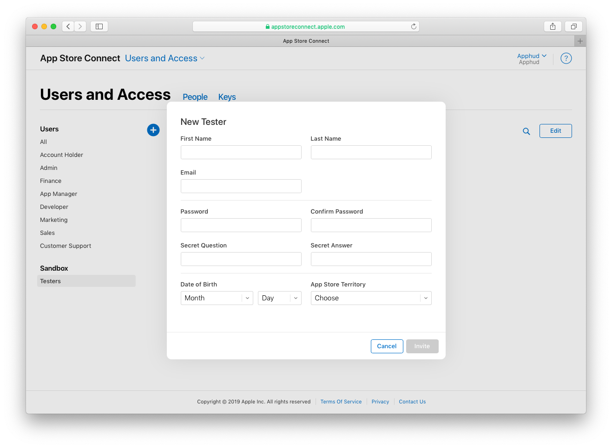
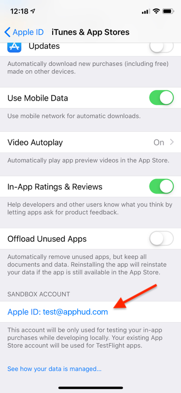

# Testing & Troubleshooting (iOS)

## Testing Environments

There are two ways to test purchases in iOS: using Local StoreKit Testing (Xcode builds only) or Sandbox Testing (Xcode or TestFlight builds).

You can read more about differences and limitations between Sandbox and StoreKit Testing in this [documentation](https://developer.apple.com/documentation/storekit/original\_api\_for\_in-app\_purchase/testing\_at\_all\_stages\_of\_development\_with\_xcode\_and\_sandbox).

## Local StoreKit Testing

Apphud supports receipts made using **StoreKit Configuration File**. No need to update SDK and no additional code is required. With StoreKit Configuration File enabled in your scheme, you can make purchases in iOS Simulator (or real device) as usual by calling `Apphud.purchase(product){...}` method. You can read more about StoreKit Configuration File set up in our [blog post](https://blog.apphud.com/testing-purchases-using-local-storekit-configuration-file/).&#x20;

Note, that receipt generated by Local StoreKit is limited, and doesn't contain many fields that are available when verifying receipts through Apple. For example, `trial period` field is missing, as well as `pending_renewal_info`, which is a special sub-json containing important fields about the state of subscription, like auto-renew, in billing retry, etc.

### **Limitations**

* Unable to detect `trial` status of the subscription. That means after purchasing subscription with trial period, you will get `ApphudSubscripton` model with `regular` status in the response. But don't worry, that is only local receipt issue, everything will work fine in production!
* &#x20;`ApphudSubscripton` models generated from local receipts will always have `isInRetryBilling` = `false` and `isAutorenewEnabled` = `true`, unless expired.
* Simplified renewals logic. Local receipt is just a snapshot and we are unable to detect renewals of such receipts, until a fresh local receipt is sent to our backend. Which means that subscription will move to `expired` state after the first transaction is expired. When launching the app again in simulator, a new receipt will be automatically sent to Apphud, and subscriptions data will be updated. No actions required on developer side. Again, everything will work just fine in production.
* Apphud doesn't create transactions and events of local receipts. In Apphud User page, subscription will only have status and expiration date.
* Testing promotional offers using Xcode generated Subscription Offers key will be supported soon.
* Testing eligibilities is not supported.
* Testing Apphud Rules is not supported.


We don't validate local receipts with the StoreKit certificate at the moment (you can test without them, everything would work fine). The certificates required for testing automation scenarios. Will be added later.


## Sandbox Testing

Sandbox testing requires creating Sandbox User if testing in Xcode build. TestFlight builds use real Apple ID. You can read more about differences and limitations between Sandbox and StoreKit Testing in this [documentation](https://developer.apple.com/documentation/storekit/original\_api\_for\_in-app\_purchase/testing\_at\_all\_stages\_of\_development\_with\_xcode\_and\_sandbox).

### Create Sandbox User

Creating a sandbox test user is required for making purchases in Xcode build. You can create as many sandbox users as you want in App Store Connect. In most cases one sandbox user is enough, but you may want to create a new sandbox user in order to clear purchases history.


You can read more about testing and setting up auto-renewable subscriptions in [our blog](https://blog.apphud.com/swift-tutorial-subscriptions/).


To test in app purchases you need to create sandbox user. Go to [App Store Connect](https://appstoreconnect.apple.com/) and open _"Users and Access"_, then – _"Sandbox Testers":_



You can sign in to Sandbox account separately from your App Store account since iOS 12. Sign in to sandbox here:




You can read more about creating sandbox testers [here](https://help.apple.com/app-store-connect/#/dev8b997bee1).


### Sandbox Purchasing

Purchasing process is the same as real in-app purchases. The only difference is accelerated time and impossibility to cancel subscription manually. Subscriptions in sandbox renew 6 times per day maximum.

| **Real duration** | **Duration in sandbox** |
| ----------------- | ----------------------- |
| 1 week            | 3 minutes               |
| 1 month           | 5 minutes               |
| 2 months          | 10 minutes              |
| 3 months          | 15 minutes              |
| 6 months          | 30 minutes              |
| 1 year            | 1 hour                  |

### Which Events Can Be Tested?

You can test following all events in sandbox except _REFUNDED_ events.

However, _REFUNDED_ events can still be tested using Local StoreKit Testing.


You can read more about events [here](../events/events.md).


## Eligibilities


Testing Eligibilities is **not** supported in Local StoreKit Testing mode. Use Sandbox testing instead.


Apphud checks whether the given user is eligible for purchasing introductory or promotional offer by searching for transactions in ANY of current user's subscriptions. This means that if your Apphud user has several app store receipts from previous sandbox Apple IDs, you may get unexpected result.

Apphud User may have several subscriptions with the same product from different Apple ID account, if you were changing sandbox Apple ID without deleting Apphud User. In this case Apphud will merge multiple subscriptions under the same user. That is why it is recommended to delete your Apphud User from Apphud Dashboard when testing the app from another Apple ID.

### Testing Eligibility for Trial / Introductory Offer

To correctly use `checkEligibilityForIntroductoryOffer` method please do the following:

1. Please make sure that your Apphud User doesn't contain multiple App Store receipts from previous test Apple IDs. If so, delete your user.
2. Note that "Reset Eligibility" option (Settings > App Store > Sandbox Account > Manage > Your App) is **not supported.** Apple doesn't delete old trial transactions from the receipt, so there is no technical way to correctly determine introductory eligibility after you pressed "Reset Eligibility" button.
3. Test on clean Apple ID account. [Create](ios.md#how-to-change-sandbox-apple-id) a fresh sandbox Apple ID account.
4. When running the app at the first time after deleting (i.e. fresh install), keep in mind that you would need to submit App Store Receipt to Apphud either by calling `Apphud.migratePurchasesIfNeeded{}` or by tapping restore purchases button in your App's UI. This is required only in Sandbox, because apps running from Xcode/TestFlight initially don't have App Store Receipts and Apphud doesn't automatically refresh missing App Store receipts to avoid Apple ID password prompt. At production, however, everything will work okay, because App Store receipts always exist in apps downloaded from the App Store.
5. Now you can test your eligibility method: method will return `true` because you didn't yet use introductory offer. After you have used introductory offer, method will return `false`.

### Testing Eligibility for Promotional Offer

To correctly use `checkEligibilityForPromotionalOffer` method please do the following:

1. Please make sure that your Apphud User doesn't contain multiple App Store receipts from previous test Apple IDs. If so, delete your user.
2. When running the app at the first time after deleting (i.e. fresh install), keep in mind that you would need to submit App Store Receipt to Apphud either by calling `Apphud.migratePurchasesIfNeeded{}` or by tapping restore purchases button in your App's UI. This is required only in Sandbox, because apps running from Xcode/TestFlight initially don't have App Store Receipts and Apphud doesn't automatically refresh missing App Store receipts to avoid Apple ID password prompt. At production, however, everything will work okay, because App Store receipts always exist in apps downloaded from the App Store.
3. Now you can test your promo eligibility method: method will return `true` if Apphud User has any subscription and `false` if user doesn't have any subscriptions.

## Test a Fresh Install

In order to test a fresh install in Apphud you need to:

* Delete your user in Apphud.
* Delete the app.
* \[Optional] [Clear purchases history](ios.md#clear-purchases-history).

### Clear Purchases History

If you make purchases in _Local StoreKit Testing_, deleting the app and Apphud User will be enough, since it will reset the receipt.

However, when making purchases using _Sandbox / TestFlight_ mode, you will also need to [change sandbox Apple ID](ios.md#create-sandbox-user).

## Troubleshooting

### Payment cancelled but `Apphud.hasActiveSubscription` method still returns `true`

Please check your Apphud user's purchases history. Probably, you made purchases earlier for this user. Try testing with a [fresh install](ios.md#test-a-fresh-install).

### Payment completed but it does not appear in Apphud / `Apphud.hasActiveSubscription` returns `false`

In case you experience any issues with in-app purchases in Apphud, please check the following steps:

* Make sure you have entered correct [Shared Secret](../getting-started/creating-app.md#app-store-shared-secret).
* View debug logs in Xcode. To enable debug logs call: `Apphud.enableDebugLogs()` before SDK initialisation. If you have any issues with in-app purchase, the error will populate in console.
* Make sure you have entered correct iOS Bundle ID.

### Errors during purchase

When you make purchases using Apphud, in response you get `ApphudPurchaseResult` object. If purchase failed, you get error that may be of three classes:

* &#x20; `SKError` from StoreKit with `SKErrorDomain` codes. This is a system error when purchasing transaction. Apphud is not responsible for `SKError` domain codes, because they are returned directly from App Store.
* &#x20;`NSError` from HTTP Client with `NSURLErrorDomain` codes. This is a network/server issue when uploading receipt to Apphud.
* Custom `ApphudError` without codes. For example, if couldn't sign promo offer or couldn't get App Store receipt. This is SDK level error.

### "Cannot connect to iTunes Store" / `SKError.code`  = `unknown`

If you experience issues like "Cannot connect to iTunes Store" or your `SKPaymentTransaction` fails with `SKError.code` = `unknown`, it is a generic error message that App Store generates. This may be one of:

* Transaction is interrupted by Ask to Buy feature
* Transaction is interrupted due to Strong Customer Authentication
* There was another problem with user's Apple ID account.

Apphud SDK is unable to fix the issue and developer is responsible to handle these types of errors. The best practice is to check the error code, and if it is `SKError.code` = `paymentCancelled`, then the payment was cancelled by user, do nothing in this case. In other cases you may want to display the error message to user.

Another case of high percentage of `failed` transactions is [Strong Customer Authentication](https://developer.apple.com/support/psd2/) (SCA) for European Economic Area, which requires all payments to be verified. In this case current transaction goes to `failed` state, and once payment is approved, a new transaction with `purchased` state is created. Apphud SDK automatically handles interrupted purchases for this case as well, you have nothing to do about it.

### **Failed to get App Store Receipt**

This error means that App Store receipt is missing on device even after successful purchase. Apphud SDK automatically tries to recover receipt with `SKReceiptRefreshRequest` , but if receipt is still missing _"Failed to get App Store Receipt"_ error will be thrown. Apphud SDK is unable to recover this issue and due to iOS / Sandbox bug. Unfortunately, this often happens to Apple Reviewers.

### App was rejected due to purchase problems

If your app got rejected that worked fine in Xcode / TestFlight builds during test, don't worry – your app probably works fine, but reviewers are having issues with their devices. They may experience following issues:

* Transaction failed with `SKError.code = unknown`
* Transaction complete, but **Failed to get App Store Receipt** error is thrown in case App Store receipt is missing on device even after purchase.
* Transaction complete, but Sandbox server is down. In this case Apphud SDK will throw an error.

The first thing you need to do, is to determine, whether `SKProducts` were actually loaded in reviewer's paywall screen. In most cases reviewer attaches a screenshot of their error / paywall screen.

If products did load correctly and prices were displayed, then it is probably payment issue. The next thing is to try to find reviewer's error in your product analytics, if available.

**Workaround**:

* Just re-submit the same build and send reviewer a message about Sandbox issue.
* Add a code workaround for Sandbox only by letting users to go through the paywall screen if transaction's state is purchased. Here is example:

```swift
extension ApphudPurchaseResult {
    var success: Bool {
        subscription?.isActive() ?? false ||
            nonRenewingPurchase?.isActive() ?? false ||
            (Apphud.isSandbox() && transaction?.transactionState == .purchased)
    }
}
```

### Apple reviewer provided tips regarding validating receipt in sandbox environment

Sometimes, reviewer provides a tip with the following message:

> When validating receipts on your server, your server needs to be able to handle a production-signed app getting its receipts from Apple’s test environment. The recommended approach is for your production server to always validate receipts against the production App Store first. If validation fails with the error code "Sandbox receipt used in production," you should validate against the test environment instead.

This tip is useless, since Apphud automatically handles sandbox and production environments.

### App was rejected due to use of ASIdentifierManager (IDFA)

Since Apphud SDK `2.1.0` `ASIdentifierManager` is no longer used as well as `AdSupport` framework:

```swift
pod update 'ApphudSDK'
```

### "Failed to load SKProducts from the App Store" error

`Failed to load SKProducts from the App Store, because product identifiers are invalid` error means that Product IDs provided in Apphud Product Hub are invalid. Please check the following:

* Check that Product ID is correct and doesn't contain hidden spaces, tabs, etc.
* You agreed to the latest Apple Developer Program License Agreement.
* You completed all the financial agreements as described in the [Agreements, Tax, and Banking](https://help.apple.com/itunes-connect/developer/#/devb6df5ee51).
* You use correct bundle ID and signing credentials.

For more information please read the [following](https://developer.apple.com/documentation/storekit/skproductsresponse/1505985-invalidproductidentifiers).

### **"**`Attempted to decode store response`**" error** while fetching products

If you encounter decoding error `Failed to load SKProducts from the App Store, error` with reason `Attempted to decode store response` **** , that probably means that you are running the app in iOS Simulator which doesn't support App Store features. Try running on physical device instead.\
On iOS Simulator you can test App Store features using [Local StoreKit configuration file](ios.md#local-storekit-testing).

### Products are not appearing in Paywall screen

Keep in mind, that StoreKit products are not appearing immediately after the first app launch. The network request is made to App Store to fetch the products. And if your app displays paywall screen immediately after launch, be ready to handle case, when products are fetched after the screen is shown.\
You can do any of the following:

* Add observer for `Apphud.didFetchProductsNotification()`
* Implement `func productsDidFetchCallback(_ callback: @escaping ([SKProduct]) -> Void)`
* Implement `func apphudDidFetchStoreKitProducts(_ products: [SKProduct])` delegate method.

Once products are fetched, update your UI.

#### Products Loading Tip (Advanced)


As you may know, at the launch of the app Apphud SDK fetches product identifiers from server and then fetches SKProducts from App Store. If you wish to improve products loading speed, you can skip request to Apphud by hardcoding product identifiers, using `func apphudProductIdentifiers() -> [String]` delegate method. See `ApphudDelegate` for details.


### Purchases are ready for sale, but not available in the app

When your app update is approved with new in-app purchases, they may not be available for purchase for the first few hours after approval. This is App Store cache issue and not related to Apphud SDK (or any other SDKs). In most cases your in-app purchases are ready immediately after approval, however it may take up to 24 hours.
