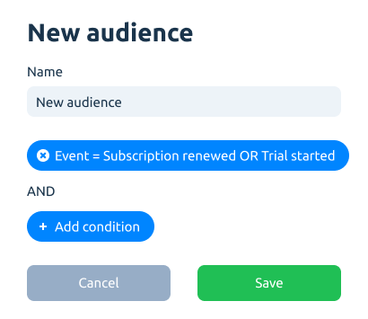

# Audiences

Apphud allows analyzing user profiles, joined by variety of parameters. We call it "Audiences".

### Default user segments (audiences)

By default, for each app within Apphud we have a dozen of predefined user segments (audiences).

**All users**\
****Includes every single app user.

**New users**\
****Users, who have installed the app less than 24 hours ago.

**Non-paying users**\
****Users, who have never paid within the app (including new and existing ones).

**Existing non-paying users**\
****Users, who have never paid in the app (excluding new users).

**Paying users**\
****Users, who have paid within the app at least one time (doesn’t matter, whether they paid before or have active subscription at the moment).

**Trial subscribers**\
****Users, who have started trial (doesn’t matter if they converted or not).

**Trial cancelled**\
****Users, who have cancelled trials, but it’s not expired yet.

**Trial expired**\
****Users with expired trial.

**Subscription cancelled**\
Users, who have cancelled subscription, but it’s not expired yet.

**Subscription expired**\
****Users with expired subscription.

### Custom audiences

It's possible to create a custom audience in addition to default ones. It may be useful for experiments targeting and can be used as rules audience (coming soon).
