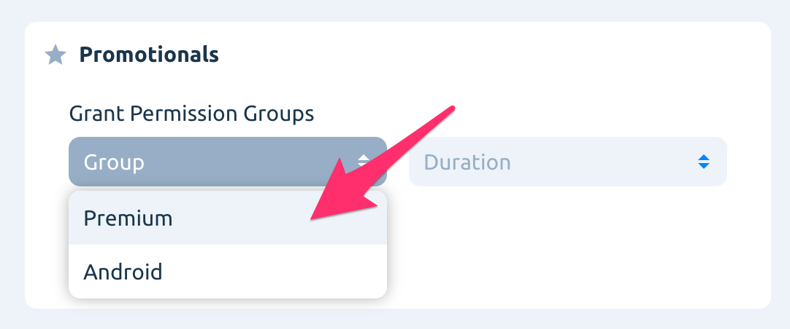
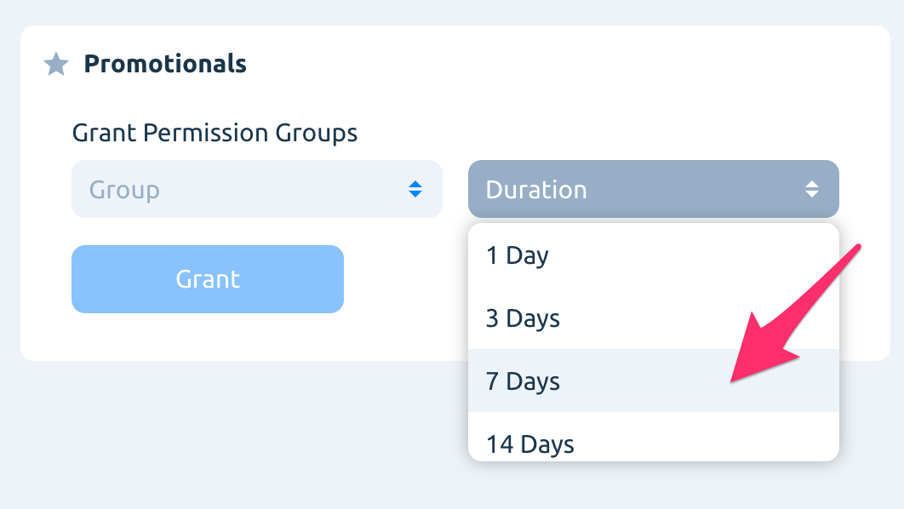

# Promotionals

Sometimes you will want to give some of your apps users special privilege, unlock premium content.

It might be useful in order to prevent user churn, to motivate the most active users for their contribution, or just to emulate premium user behavior in a release build of the app.

Go to _Users_ in left side-menu, find and open a user's profile. In the top right corner you will see _Promotionals_ section.


Easily find all users with granted promotionals in the _Users_ list with a filter. Choose _In-App Purchase Status_ and select _Promotional_ option.


**Grant permission**

Select desired permission group and subscription duration.

Available periods are:

* 1 Day
* 3 Days
* 7 Days
* 14 Days
* 1 Month
* 3 Months
* 6 Months
* 1 Year
* Lifetime

**Revoke permission**

Just click on the cross icon on the granted promotional to revoke it.

