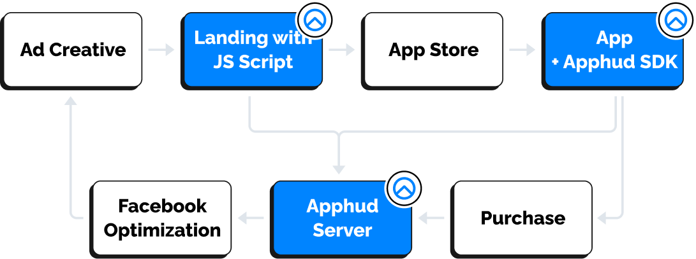

# Introduction


Web-to-App Solution is available on Paid plan.


## What is a Web-to-App campaign?

Web-to-App campaign is a web campaign targeted to your app’s landing page which has a link to the App Store.

Our Web-to-App Solution overcomes IDFA limitations in the post iOS 14.5 era. Using this solution you can run paid campaigns in Facebook or TikTok and get real-time attribution with nearly 100% accuracy.

## Benefits of Using Web-to-App Advertising

* Real time attribution for matched users. Apphud handles this for you.
* Lower CPA. Web acquisition costs in most cases are less then app acquisition costs.
* Ability to test web payments before app install. Some app owners may want to test web payments instead of In-App purchases.
* Optimize for purchase events the same way as app events.
* Web onboardings. You can test different onboardings and other user journeys on-the-fly, without the need of the app resubmission.

## Supported Advertising Networks

Currently, the following Ad Networks are supported for Web-to-App campaigns:

* Facebook via [Conversions API](../integrations/attribution/facebook-conversions-api.md) integration.
* TikTok via [Events API](../integrations/attribution/tiktok-events-api.md) integration.

## Step by Step Guide

In order to use **Web-to-App Solution**, follow these steps:

1. Create desired integration from the list of [Supported Advertising Networks](introduction.md#supported-advertising-networks).
2. Do **one** of the two options: \
   \* Install [Apphud Script](script-install.md) if you are using your own landing page.\
   \* Create landing page in Apphud [Landing Page Editor](landing-page-editor.md). It will contain all necessary scripts.
3. Create ad campaign in Facebook / TikTok Ads Manager. Don't forget to add URL query parameters for attribution tracking.
4. [Analyze](ad-analytics.md) your Web-to-App campaigns.
