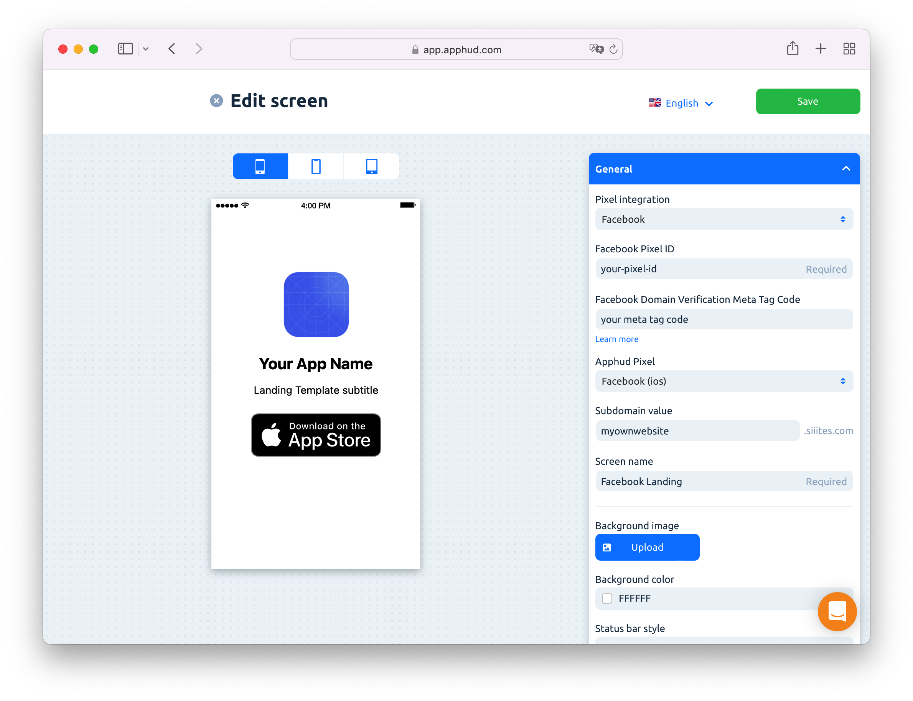

# Landing Page Editor

Go to Screens > Build New Screen and select **Landing Page** tab.

Select your landing page template. Currently the following templates are available:\
\
\* **Empty Page** with auto-redirect. This is blank page which automatically redirects to the specified URL.\
\* **Template with App Name and Icon.** This is generic template that can be edited.

\
In the editor page you need to choose you pixel integration: Facebook or TikTok.&#x20;

### Landing Page for Facebook

* **Facebook Pixel ID**. This is your Pixel ID from Facebook Events Manager. It should match one from Facebook Conversions API integration.
* **Facebook Domain Verification Meta Tag Code**. The meta tag content value which is displayed when you add a domain in Facebook Business Settings. Copy the **content** value.

* **Apphud Pixel**. Choose Facebook.
* **Subdomain value.** Enter subdomain for your landing page URL. The final URL will look like: `https://YOURSUBDOMAIN.siiites.com`
* **Screen name.** A name of the screen displayed in Apphud.
* **URL**. It is located in _Button_ or _Redirect_ set up blocks. This is URL where Apphud should navigate. Typically it should be App Store link, but you can also specify another URL, for example, an AppsFlyer's OneLink URL.
* **Other set up fields**. There are plenty of other fields for landing page set up, like title, subtitle, background image, etc. Their meaning is straightforward and filling in all the fields shouldn't cause any difficulties.
* Click on **Save.** Your landing page will be published at the following URL: `https://YOURSUBDOMAIN.siiites.com`
* After that go back to Facebook Business Manager and click on **Verify domain** to complete the verification.
* Set up complete.

### Landing Page for TikTok

* **TikTok Pixel ID**. This is your Pixel ID from TikTok Ads Manager. It should match one from TikTok Events API integration.
* **Apphud Pixel**. Choose TikTok.
* **Subdomain value.** Enter subdomain for your landing page URL. The final URL will look like: `https://YOURSUBDOMAIN.siiites.com`
* **Screen name.** A name of the screen displayed in Apphud.
* **URL**. It is located in _Button_ or _Redirect_ set up blocks. This is URL where Apphud should navigate. Typically it should be App Store link, but you can also specify another URL, for example, an AppsFlyer's OneLink URL.
* **Other set up fields**. There are plenty of other fields for landing page set up, like title, subtitle, background image, etc. Their meaning is straightforward and filling in all the fields shouldn't cause any difficulties.
* Click on **Save.** Your landing page will be published at the following URL: `https://YOURSUBDOMAIN.siiites.com`
* Set up complete.

